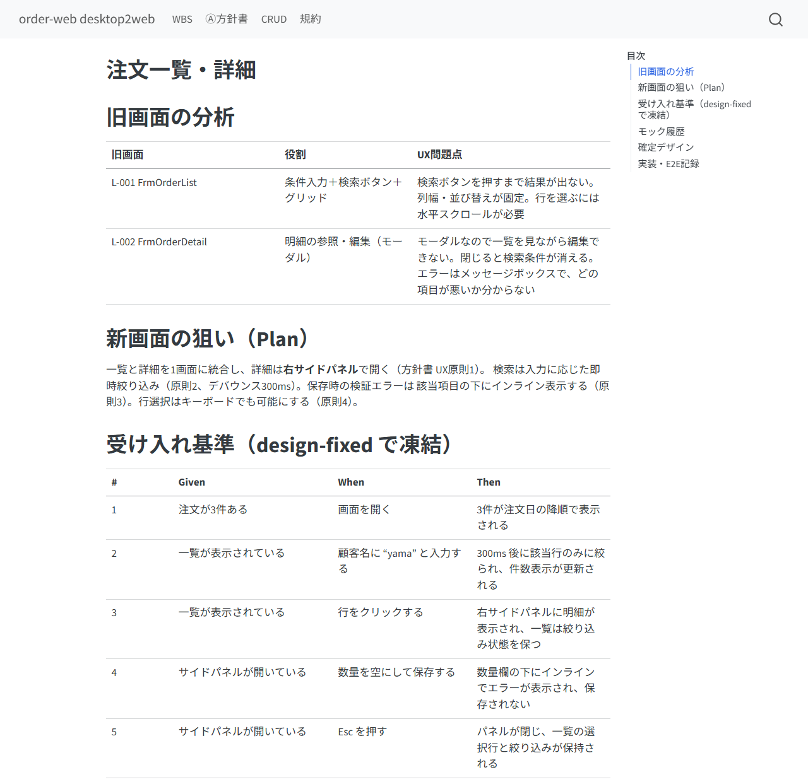

# このパイプラインは何か

C# WinForms のデスクトップアプリを Web アプリへ派生開発するための Claude Code skill 群です。
**2つのレーンを並走させます。**

| レーン | 対象 | 方針 | 単位 |
|--------|------|------|------|
| **画面レーン** | UI | **作り直し**（デスクトップ制約から解放してUXを上げる） | 1画面 = 1イタレーション |
| **機能・DBレーン** | ビジネスロジック・データ | **鏡移し**（挙動は変えない） | 1関数 = 1イタレーション |

全体の流れは次のとおりです。

> ⓪解析 → Ⓐ方針決定 → （画面レーン：モック→レビュー→確定→実装→E2E ／
> 機能レーン：①仕様書→②テスト仕様→③テストコード→④実装→⑤テスト） → ⑥完了検証 → ⑦分析・改善

機能・DBレーンは **legacy-reverse skill をそのまま流用**します（C#→Python の規約だけ差し替え）。
そのため機能側の操作は legacy-reverse のマニュアルと同一です。

## 技術スタック（確定値）

| 層 | 技術 |
|----|------|
| レガシー | C# WinForms（Designer.cs＋イベントハンドラ＋ADO.NET/ORM を解析） |
| バックエンド | Python（機能の鏡移し先） |
| フロントエンド | React + TypeScript + Tailwind CSS（Vite） |
| E2E | Playwright（画面ごと） |

## 設計の柱

1. **画面は N:M で再編してよい** — 旧画面1枚＝新画面1枚に縛られません。
   「一覧＋詳細モーダル」を「一覧＋サイドパネル」に統合するなど、Webに合う形へ組み替えます。
2. **画面レーンはビジネスロジックを1行も書かない** — バリデーション・計算・絞り込み条件は
   すべて機能レーン（Python）の担当です。フロントで「仮実装」したくなったら、それは⓪の
   抽出漏れなので機能として追加起票します。この境界を機構で守ることで、UXを自由に変えても
   業務ロジックは鏡移しのまま保たれます。
3. **試行錯誤は安く、確定だけ重く** — モックは静的HTMLで何版でも作り、承認は不要。
   `design-fixed`（デザイン確定）だけが承認ゲートです。指摘は必ず画面票に残ります。
4. **プル型スケジューリング** — 画面が使う機能が⑤passするまで、その画面の実装には入りません
   （モック・デザイン確定までは並行可）。WBSに「⏳機能待ち」と出ます。

**あなた（人）の仕事は「トリガを引く」「方針を決める」「モックをレビューして確定させる」
「質問に答える／裁定する」**です。コードやドキュメントを直接書く必要は基本的にありません。


# セットアップ

## 1. skill の配置

```bash
cp -r skills/desktop2web      <project>/.claude/skills/
cp -r skills/legacy-reverse   <project>/.claude/skills/
cp -r skills/desktop2web/skills/*      <project>/.claude/skills/
cp -r skills/legacy-reverse/skills/*   <project>/.claude/skills/
```

機能レーンは legacy-reverse の資産（スクリプト・hook・MCP）をそのまま使うため、
**両方を配置する**必要があります。

## 2. hook の登録（必須）

`legacy-reverse/hooks/settings-example.json` を `<project>/.claude/settings.json` にマージします。
④⑤中の `backend/tests/` 編集を機械的に拒否する安全装置です（E2E freeze 後は
`frontend/e2e/` も同じ扱いになります）。

## 3. MCP サーバの登録（推奨）

`mcp-servers/legacy-reverse-mcp` を `.mcp.json` に登録すると、台帳操作やテスト実行が
型付きツールになり許可プロンプトが減ります。

## 4. ツール類

- Quarto（HTML/PDF）: 未導入なら quarto-typst-pdf skill の `qtpdf.py install`
- Python: `pip install pytest sphinx sphinx-rtd-theme`（⑦は `radon ruff bandit pip-audit`）
- Node: React（Vite）と Playwright（`npm i -D @playwright/test && npx playwright install`）

## 5. 開始

`/desktop2web` で状態を確認 → 未セットアップなら `/d2w-0-analyze` から。

# フェーズ別ガイド — 各フェーズで人がやること

| フェーズ | コマンド | 人がやること |
|---------|---------|-------------|
| ⓪ 解析 | `/d2w-0-analyze` | 対象・DB・パッケージ名を答える。規約を確定。CRUD検出事項（孤児テーブル等）を裁定 |
| Ⓐ 方針 | `/d2w-policy` | **概案（2〜3案）を比較して決める**。新画面マップ・UXの原則・APIコントラクト |
| 画面 | `/d2w-screen S-xxx` | モックをレビューして確定させる。E2E fail の裁定 |
| 機能 | `/legacy-1-spec` 〜 `/legacy-5-test` | ①②の承認、⑤fail の裁定（legacy-reverse と同じ） |
| ⑥ 検証 | `/d2w-6-check` | 不備リストを見て差し戻し先を判断 |
| ⑦ 改善 | `/legacy-7-analyze` | 代表ワークロードを教える。施策票を承認 |

## ⓪ 解析 — 事実の記録に徹する

AIは画面（Form/UserControl・遷移・スクリーンショット採取）、機能、DBスキーマ、CRUDを洗い出します。
このフェーズで**新画面の設計はしません**（それはⒶ）。

人が答えるべきこと：対象ソリューションの場所、DBの種類とDDLの所在、新パッケージ名。

⓪の重要な副産物が **CRUDマトリクス**です。「どの機能からも触られていないテーブル」「どの画面からも
呼ばれない機能」が出てくるので、死蔵か抽出漏れかをあなたが裁定します。


**イベントハンドラ直書きのロジック**（`btnSave_Click` の中に計算や検証が書かれている類）は、
⓪で関数として切り出され `origin: ui-embedded` として登録されます。これも鏡移しの対象です。

## Ⓐ 方針決定 — このプロジェクトで一番重い判断

AIが概案を2〜3案の比較で出します。あなたが決めるのは3つです。

1. **新画面マップ**（旧画面 N:M 対応）— 以後のWBSの行がここで決まります
2. **UXの原則** — 全モックの判断基準になる「このプロジェクトの憲法」です。
   例：モーダルの連鎖禁止／検索ボタン式→即時絞り込み／エラーはインライン表示
3. **APIコントラクト方針** — 機能をどうエンドポイントに束ねるか

旧画面の1:1コピーが既定にならないよう、AIは再編を検討した痕跡を必ず残します
（1:1のままにする場合も「なぜそれが最善か」を書きます）。承認すると方針書が `approved` になり、
画面票の骨子が自動生成されます。

## 画面イタレーション — あなたの主戦場

1画面につき票1枚（`docs/screens/S-xxx.md`）で、次の順に進みます。

### Plan：票を起票する

AIが旧画面のスクショとUX問題点、新画面の狙い、**受け入れ基準**（Given/When/Then）を書きます。
受け入れ基準は後で E2E テストの元ネタになるので、ここは目を通してください。
なお「計算結果が正しいか」は機能レーン⑤が担保済みなので、受け入れ基準は**画面としての振る舞い**
（表示・操作・遷移・エラー表示）に限定されます。



### Do：モックを見て指摘する（承認不要・何度でも）

AIが `frontend/mocks/S-xxx/v1.html`（静的HTML＋Tailwind CDN）を作ってブラウザに出します。
あなたは見て指摘するだけです。指摘は**必ず票のモック履歴表に転記**されるので、
口頭のやり取りが消えません。

| v | レビュー指摘（要約） | 対応 |
|---|--------------------|------|
| 1 | 詳細をモーダルで出していた（原則1違反）。列が旧画面のまま12列あって読めない | サイドパネル化。列を6列に絞る |
| 2 | 検索が「絞り込む」ボタン式のまま。件数が分からない | 即時絞り込み＋件数表示を追加 |
| 3 | 指摘なし。これで確定 | — |


### 確定：design-fixed（ここが承認ゲート）

「これで確定」と言うと、票が `design-fixed` になり**受け入れ基準が凍結**されます。
以後にデザインを変えたくなったら ISSUE → 承認 → モックレビューに差し戻し、が正規経路です
（版数は続きから）。

### Check / Act：実装と E2E

AIが React 実装 → Playwright E2E（受け入れ基準1行＝1テスト）を作って freeze → 実行します。
fail 時の裁定は機能レーン⑤と同型です。

| 分類 | 意味 | あなたの操作 |
|------|------|-------------|
| (a) 画面実装のバグ | 受け入れ基準を満たしていない | 何もしない（AIが直して再実行） |
| (b) E2Eが基準とズレ | テスト側の誤り | ISSUE を見て承認 → E2E再生成 |
| (c) 受け入れ基準・機能仕様が誤り | 上流の誤り | ISSUE で裁定 → 票または①へ差し戻し |

3回失敗すると自動でISSUEが起票され、WBSに ⛔ が出てあなたの裁定待ちになります。

## 機能・DBレーン — legacy-reverse と同じ

①仕様書のレビュー、②テスト仕様の承認、⑤fail の裁定（(a)実装／(b)テストコード／(c)仕様）まで、
操作は legacy-reverse マニュアルのとおりです。C# 特有の点だけ補足します。

- `decimal` は `Decimal` に（金額を float にしない）、`DataTable` は `list[dict]` か dataclass、
  `out`/`ref` 引数は戻り値タプルに——という型対応表を⓪で確定します
- `origin: ui-embedded` の機能は「UIから引き剥がしたロジック」です。UIへの参照を引数化した
  シグネチャになっているか、①のレビューで特に注意して見てください


## ⑥ 完了検証 — 「機能落ち」を機械で捕まえる

`/d2w-6-check` は次を検証します。

1. 方針書が approved／全画面が e2e-pass（E2Eが改変されていないことも照合）
2. 全機能が⑤pass（legacy-reverse の⑥基準）
3. **CRUD突合** — 旧側にあった 機能×テーブル 操作が新側に全部あるか（消えた操作＝機能落ち）、
   旧側になかった操作が増えていないか（増えた操作＝勝手な機能追加）を両方向でチェック
4. **旧画面カバレッジ** — 全ての旧画面がいずれかの新画面票に現れているか（拾い忘れ検出）
5. open ISSUE ゼロ

pass すると最終レンダリング（HTMLサイト＋PDF＋Sphinx API）まで進みます。

# 日常の関わり方

## WBS サイト

```bash
python -m http.server 8765 --directory docs/_site
```

トップがWBSです。上から順に：方針書の状態、進捗サマリ、**Open ISSUES（あなたへの質問）**、
画面イタレーション表、機能一覧。ナビバーから方針書・CRUD・規約・⑥完了検証へ行けます。

## モックのレビュー

```bash
python -m http.server 8767 --directory frontend/mocks
```

モックは静的HTMLなのでビルド不要で開けます。AIに「S-001のモックを見せて」と言えば
ブラウザに出します。

## あなたが直接書いてよいファイル

| ファイル | 手編集 | 説明 |
|---------|:---:|------|
| `docs/conventions.md`・`docs/domain-knowledge.md` | ⭕ | あなたが著者 |
| ISSUE の「回答（人が記入）」欄 | ⭕ | じっくり書きたい裁定はファイルで |
| `docs/policy.md` | ⭕ | 方針の追記・修正（画面票の判断基準が変わる点に注意） |
| `docs/screens/S-xxx.md` の受け入れ基準 | △ | design-fixed 前なら自由。後は ISSUE 経由 |
| `docs/specs/`（機能仕様書） | △ | 編集可。ハッシュ連鎖で②③が stale になり再確認が走る |
| WBS・CRUD・テスト結果・完了検証 | ❌ | 自動生成。再生成で消える |

ファイルに直接書いた内容は、次にどのフェーズを起動したときにAIが自動で拾います。

# トラブルシューティング

| 症状 | 意味 | 対処 |
|------|------|------|
| WBSに「⏳機能待ち」 | その画面が使う機能が⑤未達 | 機能レーンを先に回す（`/legacy-1-spec` から）。モック確定までは並行可 |
| WBSに ⛔ ISSUE-xxx | ループが上限到達、裁定待ち | ISSUEに回答 → unblock → 再トリガ |
| 機能一覧が stale⚠ | ①が改訂され②が古い | `/legacy-2-testspec` で再生成→再承認 |
| CRUDに孤児テーブル警告 | どの機能からも参照されないテーブル | 死蔵か抽出漏れかを裁定（ISSUE） |
| モックにロジックが書かれている | 画面レーンの越境 | 機能として追加起票させる（`functions.json`＋ISSUE） |
| `frontend/e2e/` の編集が拒否された | freeze 後の保護が正常動作 | ISSUE→承認→再生成が正規経路 |

# 付録

## 成果物の全体像

```
docs/
  index.qmd            WBS（自動生成・手編集禁止）
  policy.md            Ⓐ方針書（承認ゲート）
  crud.md              CRUDマトリクス（自動生成）
  screens/S-xxx.md     画面票（draft→mock-review→design-fixed→implemented→e2e-pass）
  specs/ test-specs/ test-results/ issues/   機能レーン（legacy-reverse と同一）
  conventions.md  domain-knowledge.md  completion-check.md
data/
  screens.json  functions.json  schema.json   ⓪の解析結果（正データ）
  ledger.json                                 機能レーンの台帳
backend/src/ , backend/tests/    ④実装 / ③テスト（hookで保護）
frontend/src/                    React 実装
frontend/mocks/S-xxx/v<N>.html   モック（試行錯誤用）
frontend/e2e/S-xxx.spec.ts       Playwright（design-fixed 後に freeze）
```

## コマンド早見表

```bash
python <d2w>/scripts/d2w_ledger.py wbs               # 画面＋機能の統合WBS
python <d2w>/scripts/d2w_ledger.py crud              # CRUDマトリクス
python <d2w>/scripts/d2w_ledger.py next              # 次にやる画面と待ち機能
python <d2w>/scripts/d2w_ledger.py screen-skeletons  # 画面票の骨子生成
python <lr>/scripts/ledger.py verify <func-id>       # 機能レーンのハッシュ連鎖検証
```

`<d2w>` = desktop2web skill のルート、`<lr>` = legacy-reverse skill のルート。

## 状態記号

✅=完了 ／ ☐=未着手 ／ ⏳=前提待ち ／ ⛔=裁定待ち ／ ⚠=要再確認 ／ —=対象外・未実行
