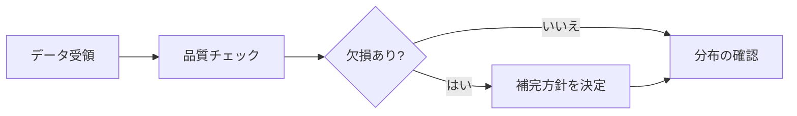
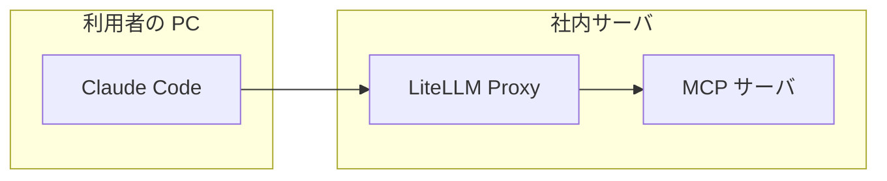
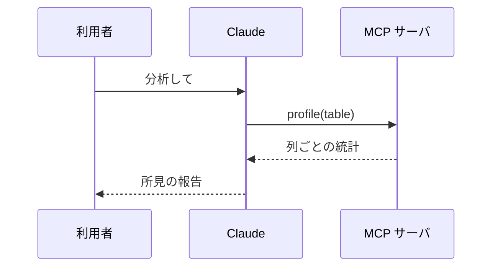
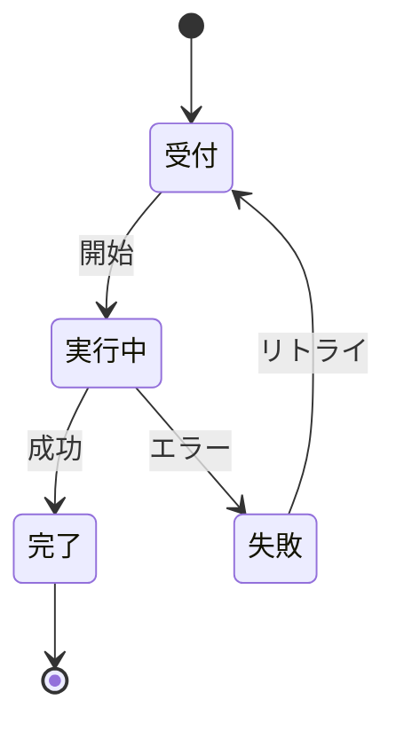
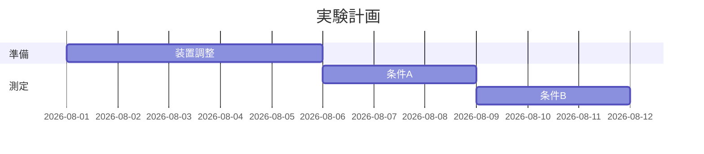
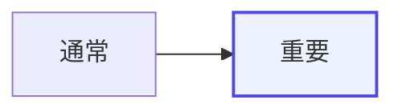

# Mermaid 記法パターン集

Markdown のコードブロック(```mermaid)に書く。GitHub・多くの Wiki・エディタが
そのまま描画する。日本語ラベルは `"..."` で囲むと記号混じりでも安全。

## フローチャート(処理の流れ)



- 向き: `LR`(左→右)/ `TD`(上→下)。横に長い流れは LR、階層は TD
- 形: `[四角]` 処理 / `{ひし形}` 分岐 / `([丸角])` 開始・終了 / `[(円筒)]` データ

## 構成図(subgraph で包含を表す)



## シーケンス図(登場者間のやり取り)



- `->>` 実線(呼び出し)/ `-->>` 破線(応答)

## 状態遷移図



## ガントチャート



## 強調(使いすぎない)


