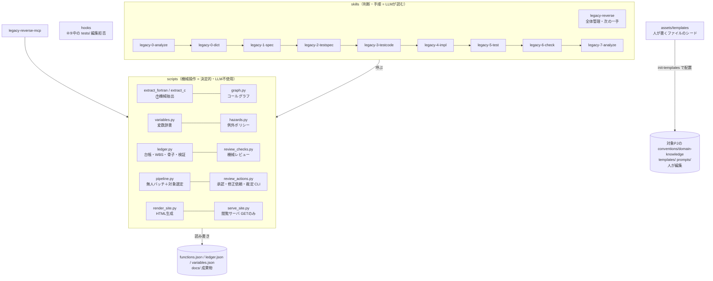

# legacy-reverse 構成と区分け

Skills とスクリプトが「どういう構成で、どう区分けされているか」の正。
使い方は [MANUAL.md](MANUAL.md)、設計判断の理由は [DESIGN.md](DESIGN.md)。

## 1. 4つの層



| 層 | 実体 | 役割 | してはいけないこと |
|---|---|---|---|
| **skills（判断層）** | SKILL.md ＋ skills/legacy-* | 「いつ・何を・どの順で」の手順書。LLM が読解・執筆・トリアージの判断を行う | 列挙・数え上げ・検証（機械層の仕事） |
| **scripts（機械層）** | scripts/*.py | 決定的な処理: 抽出・台帳・検証・レビュー・バッチ実行・レンダリング。単体でも動く | 意味の判断（仕様の解釈・語義の確定は LLM と人） |
| **hooks（強制層）** | hooks/guard_tests.py 等 | LLM の自制に頼らない物理的な禁止（④⑤中の tests/ 編集拒否・壊れた JSON の差し戻し） | — |
| **templates（シード）** | assets/templates/（`prompts/` 含む） | 対象プロジェクトへ配る初期テンプレと工程別プロンプトの雛形。配布後の正はプロジェクト側（下記 §3） | — |

MCP サーバ（mcp-servers/legacy-reverse-mcp）は scripts を型付きツール化した薄い皮で、判断は持たない。

## 2. scripts の責務一覧

| ファイル | 担当 | 一言でいうと |
|---|---|---|
| extract_fortran.py / extract_c.py | ⓪ | レガシー静的解析 → functions.json 生成/マージ（再実行=マージで再開安全） |
| graph.py | ⓪ | コールグラフの導出層（毎回構築・保存しない。依存ゼロ） |
| variables.py | ⓪ | 変数辞書（クラスタリング・根拠収集・検証・承認・伝搬） |
| hazards.py | ⓪ | 例外ポリシー（0割等の検知結果 × EP 登録簿の突合・質問キュー） |
| ledger.py | 全 | 台帳: WBS・骨子（テンプレ駆動）・ハッシュ連鎖・blocked・⑥検証・dict-gate・init-templates |
| review_checks.py | ①② | 機械レビュー（ハルシネーション・省略の検知。必須節はPJテンプレから導出）・一斉レビュー表・テンプレ契約チェック |
| pipeline.py | ①〜⑤ | 無人バッチドライバ（1関数=1 headless プロセス）＋対象選定（KINDS / _decide_kind / ⭐優先） |
| review_actions.py | ①②⑤ | 承認・修正依頼・裁定の実処理と **CLI**（機械レビューを再検証してから反映） |
| collect_results.py / tc_report_plugin.py | ⑤ | pytest 結果の収集 → 報告書自動生成（exit code が制御信号） |
| check_stubs.py | ④ | スタブ検出（空実装・NotImplementedError・TODO） |
| quant_analyze.py / profile_run.py | ⑦ | 定量計測（cProfile・radon・ruff・bandit・pip-audit。LLM不使用） |
| render_site.py | 表示 | docs/ → HTML サイト（差分レンダ。案内パネルの焼き込み） |
| serve_site.py | 表示 | ローカル配信（**GET のみ**。/pipeline.html はバッチ進捗の表示専用ビュー） |
| build_viewer.py | 配布 | サイト同梱の単体実行ファイル（EXE）化 |
| pdf_book.py | 出力 | 種別ごとの合本PDF（quarto-typst-pdf skill に委譲） |

## 3. 固定と可変（固変分離）

**ワークフローは skill 共有（固定）、項目立て・規約・工程別のプロンプト調整は
プロジェクトごと（可変・人が著者）。**

| | 固定（skill が持つ・共有） | 可変（対象プロジェクトが持つ・人が作る） |
|---|---|---|
| 実体 | 工程（⓪〜⑦）・情報遮断・ハッシュ連鎖・品質ゲート・ISSUE/承認規則（references/workflow.md）、scripts、skills の手順 | **項目立て**: `docs/templates/spec.md`・`test-spec.md` ／ **規約**: conventions.md ／ **工程別プロンプト調整**: `docs/prompts/{1-spec,2-testspec,3-testcode,4-impl}.md` ／ 業務知識 domain-knowledge.md、例外の決定 exception-policy.md、フロー定義 |
| 変え方 | skill リポジトリの改版 | 各プロジェクトで人が編集（⓪の最初に `ledger init-templates` が雛形を一式配置。記入状況は `ledger authored`） |
| 境界 | **固定契約**: テンプレの置換マーカー（LR:IO-TABLES 等）・契約見出し（機能詳細 / 例外・数値特異点 / トレーサビリティ…）・フロントマターのキー。`review_checks.py template` が機械検証 | 契約以外の節は追加・改名・削除が自由。必須節はテンプレの見出しから自動導出。**優先順位は 固定契約 ＞ skill の手順 ＞ PJ 個別指示**（契約を覆す指示には従わず人へ報告） |

## 4. ファイルの作成者区分

（正確な一覧は [references/workflow.md](references/workflow.md)「ファイルの作成者区分」）

| 区分 | ファイル | 原則 |
|---|---|---|
| **人だけが書く** | conventions.md / domain-knowledge.md / exception-policy.md / docs/templates/ / **docs/prompts/** / ISSUE 回答欄 / review-feedback.md | AI は読み・提案文の提示・シードの初期コピーまで。**書き込み・代筆はしない**（人の意思の一次記録を保つ） |
| **AI が書く** | ①仕様書・②テスト仕様・③tests/・④src/・⑤結果・⑦analysis.md・ISSUE 本文 | パイプライン成果物。機械レビュー＋人の承認ゲートを通る |
| **機械生成** | WBS・骨子・spec-review.md・testspec-review.md・completion-check.md・variables.qmd・data/*.json | 手編集禁止。再生成で消える |

## 5. 操作の入口（HTML は閲覧専用）

HTML サイトは**見せるだけ**。状態表示と「どう返答するか」の案内パネルだけを持ち、
実行・承認・裁定のボタンは無い。操作の入口は3つで、すべて同格:

| 入口 | 実行 | 承認・修正依頼・裁定 |
|---|---|---|
| チャット（skill） | `/legacy-1-spec F-0012` 等 | 「F-0012 OK」「修正: 〜」「ISSUE-004 は Yes」 |
| CLI | `pipeline.py spec / run / dict / priority` | `review_actions.py approve / request-changes / adjudicate`、`variables.py approve / revise`、`hazards.py add-policy`、`ledger unblock` |
| ファイル記入 | —（実行はできない） | ISSUE 回答欄・review-feedback.md に人が書く → 次の skill 起動時スキャンが反映 |

画面でできる「表示」: WBS・仕様書・機械レビュー結果・一斉レビュー表・変数辞書・
/pipeline.html（バッチのライブ進捗・残タスク・人待ち一覧）。
**画面専用機能は作らない**（表示に対応する操作は必ず CLI にある）。

## 6. skill 自体の保守（自己点検 → 自己修正ループ）

成果物に機械レビュー（`review_checks.py`）があるのと同じ理由で、**skill 自身にも
機械レビューがある**。改修でスクリプトを消した・サブコマンドを変えたのに文書が
古いまま、というドリフトを人のレビュー前に落とすための関門:

```bash
python <LR>/scripts/check_skill.py          # 人が読む形（file:line + 直し方の hint）
python <LR>/scripts/check_skill.py --json   # エージェントの自己修正ループ用
```

| 検査 | 検知するもの |
|---|---|
| missing-path | 文書が参照するファイル（scripts/*.py・references/*.md・Markdown リンク先）の不在＝削除・改名の取りこぼし |
| unknown-command | 文書のコマンド例のサブコマンドが、そのスクリプトの argparse に無い |
| unknown-option | 同じくオプション（--xxx）がスクリプトに無い |
| frontmatter | SKILL.md の name/description/user-invocable の欠落、name とディレクトリ名の不一致 |

**エージェントの直し方**（成果物の①と同じ形のループ）:

1. skill の文書・スクリプトを編集する
2. `check_skill.py --json` を実行する
3. NG があれば各指摘の `hint` に従って直す。方向の原則は
   **「スクリプトの argparse が正、文書を合わせる」**（文書側の機能が正しいなら
   スクリプトを実装する）
4. **exit 0 になるまで 2〜3 を繰り返す**。NG が残る状態で完了を報告しない

判定は静的走査（LLM 不使用・決定的）。散文中の言及をコマンドと誤認しないよう、
コマンドらしい文脈（行頭 / `python …` に続く / バッククォート内）だけを見る。
回帰テストは `scripts/selftest/test_skill_docs.py`——チェックを忘れても pytest で落ち、
検査器自体が「仕込んだ不整合を検知できるか」も検証している。

意味の正しさ（手順が実際に有効か）は機械では取れない。そちらは
[references/workflow.md](references/workflow.md)「エージェントへのフィードバックの経路」の
3段目——**同じ指摘が繰り返されたら検査を足して機械ゲートにする**——で受ける。

## 7. 関連ドキュメント

| 文書 | 内容 |
|---|---|
| [MANUAL.md](MANUAL.md) | 構成・参照関係と、人が書く MD（規約・テンプレ・工程別プロンプト）の手引き |
| [QUICKREF.md](QUICKREF.md) | 作業中のコマンド即引き |
| [DESIGN.md](DESIGN.md) | 設計判断の理由（5原則・品質ゲート・スケール） |
| [references/workflow.md](references/workflow.md) | 全フェーズ共通規則の正 |
| [references/schema.md](references/schema.md) | プロジェクト構成・データスキーマの正 |
| [references/graph-dict-design.md](references/graph-dict-design.md) | グラフ層・変数辞書・フロー・例外ポリシーの設計の正 |
