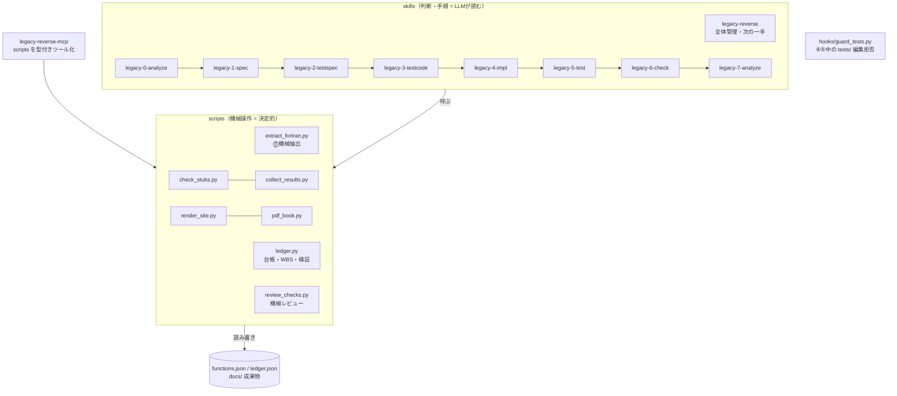
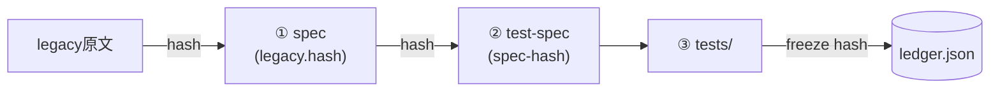

# 1. 目的と設計思想

レガシーコード（Fortran 等）を Python へ**仕様ベースで移植**するための Claude Code skill 群。
「レガシーを読んで直接書き写す」のではなく、仕様書という中間成果物を挟み、
独立に作ったテストと実装を突き合わせて品質を機械的に担保する。

設計判断の根っこは次の5つ。

| 原則 | 内容 | それで防ぐもの |
|------|------|--------------|
| クリーンルーム分業 | ②③はレガシー原文を見ない。③は②だけ、④は①だけを入力にする | 「レガシーの写経」による仕様の暗黙化。仕様書の穴は⑤で機械的に露見する |
| 状態はすべてファイル | 進捗の正は functions.json・ledger.json・成果物フロントマター。会話コンテキストに置かない | セッション切れ・コンテキスト枯渇による「1からやり直し」 |
| 機械が正、AIは意味づけ | 列挙・検証・台帳操作は決定的なスクリプト。AIは読解と執筆だけ | ハルシネーション・省略・数え漏れ。トークン消費 |
| 人の承認ゲート | 仕様確定・テスト承認・裁定は人。AIは「仮説＋Yes/No」で聞く | AIによる勝手な仕様確定 |
| 強制は仕組みで | テスト保護は hook、スタブ検知・引用検証はスクリプト | 「プロンプトで禁止」の不確実さ |

# 2. 全体構成

- **skills** は「いつ・何を・どの順で」を書いた手順書。実作業の判断（レガシー読解、
  仕様の執筆、トリアージ）だけを LLM が行う
- **scripts** は単体でも動く決定的な処理。skills からは MCP 経由（登録時）または
  直接実行で呼ばれる。二重管理はない（MCP サーバは scripts を import/subprocess するだけ）
- **hooks** は LLM の自制に頼らない強制層（フェーズ4/5中の tests/ 編集を物理的に拒否）

# 3. パイプラインと情報遮断

フェーズのトリガはすべて人。各フェーズが読んでよい入力を制限する（詳細は
[references/workflow.md](references/workflow.md) の遮断表が正）。

| フェーズ | 入力 | 出力 | 完了判定（機械） |
|---|---|---|---|
| ⓪ 解析 | legacy/ 全部 | functions.json・骨子・WBS・規約 | 抽出器の完全性突合 |
| ① 仕様書 | legacy/ 該当関数＋DK | docs/specs/*.md | status: reviewed（人OK） |
| ② テスト仕様 | ①(reviewed)＋規約 | docs/test-specs/*.md | status: approved かつ spec-hash 一致 |
| ③ テストコード | ②(approved)＋規約 | tests/ | ledger の freeze ハッシュ一致 |
| ④ 実装 | ①(reviewed)＋規約 | src/ | モジュール存在かつスタブ検知ゼロ |
| ⑤ テスト | 実行結果＋①② | docs/test-results/ | result: pass（実装率100%・失敗0） |
| ⑥ 完了検証 | 全成果物 | completion-check.md | ledger check ＋ review all が exit 0 |
| ⑦ 分析・改善 | src/・docs/・計測 | analysis.md・施策票 | テスト全pass維持（挙動保存） |

②と④が互いを見ないことが要点。**①仕様書だけを共通の親**とする2系統（テスト系・実装系）を
⑤で突き合わせるため、仕様書の曖昧さは必ずテスト失敗か spec-gap ISSUE として表面化する。

# 4. データ設計

スキーマの正は [references/schema.md](references/schema.md)。設計上の要点のみ:

- **functions.json が正データ**（⓪で機械抽出が生成・マージ）。WBS・骨子・Sphinx索引は
  すべてここから再生成される派生物。手書き修正は functions.json に対して行い、派生物は作り直す
- **完了状態は成果物自身が持つ**（フロントマターの status / ハッシュ）。別の進捗DBを
  持たない。したがって「ファイルが正しければ進捗も正しい」が常に成り立ち、再開が自明になる
- **ledger.json はスクリプト専用**の最小限の台帳（③freeze ハッシュ・blocked・attempt 基準時刻）。
  人も LLM も手編集しない
- ISSUE は全体通し番号。「仮説＋Yes/No」形式を強制し、人の判断コストを下げる

## 整合性: ハッシュ連鎖

上流が変わると下流のハッシュ照合が落ち、WBS に stale⚠/⚠改変 が自動表示される。
「①を直したのに②を直し忘れた」は構造的に起きない（`ledger verify` が⑤実行前に検査）。

# 5. 品質ゲート（ハルシネーション・省略の機械検知）

LLM 成果物は人に届く前に決定的スクリプトの検証を通る。

| ゲート | スクリプト | 検知対象 |
|---|---|---|
| ⓪ 完全性 | extract_fortran.py 内蔵 | 2系統カウント突合による数え漏れ |
| ① 仕様書 | review_checks.py spec | 実在しない `file:lines` 引用、🟢なのに根拠なし、プレースホルダ残存、必須節欠落、原本ハッシュ不一致 |
| ② テスト仕様 | review_checks.py testspec | 🟢仕様項目のケース漏れ、①に無いSPEC-ID参照（捏造）、宙に浮いたTC参照、⚠未確定残り |
| ③ 突合 | collect_results.py (exit 3) | ケースIDとテスト関数マーカーの過不足 |
| ④ スタブ | check_stubs.py | 空実装・NotImplementedError・TODO/FIXME |
| ⑤ 事前 | ledger verify | ②stale・freeze後のテスト改変・blocked |

機械で取れない「意味のすり替え」は、人の①レビューと⑤の突き合わせが受け持つ、という分担。

# 6. 主要コンポーネントの責務

| ファイル | 責務 | 設計メモ |
|---|---|---|
| scripts/extract_fortran.py | Fortran 静的解析 → functions.json 生成/マージ | 固定・自由形式、継続行、COMMON/USE/intent、call＋関数参照の呼出推定。**再実行=マージ（func_id不変・手修正保持）**が再開性の要 |
| scripts/ledger.py | 台帳・状態判定・WBS・骨子・検証・⑥check | 状態判定 `status_of()` が唯一の判定ロジック（WBS/next/check が共有）。200関数超で WBS を自動分割 |
| scripts/review_checks.py | ①②の機械レビュー | LLM不使用。書式はテンプレ（assets/templates）に依存 |
| scripts/render_site.py | docs/ → HTML サイト | Quarto が Mermaid を .qmd でしか描けないため影コピー(_sitework)方式。未生成ページはプレースホルダで**⓪時点でもリンク切れゼロ** |
| scripts/pipeline.py | ①の無人バッチドライバ | **1関数=1 headless Claude プロセス**（毎回まっさらなコンテキスト＝トークン上限に依存しない）。完了は LLM の申告でなくファイル状態で契約検証。中断安全・コスト集計・連続失敗停止 |
| scripts/collect_results.py | ⑤結果収集 → 報告書生成 | exit code が制御信号（0 pass / 1 fail / 2 blocked / 3 mismatch）。attempt 上限3で自動 block |
| scripts/pdf_book.py | 種別ごとの合本PDF | quarto-typst-pdf skill に委譲 |
| hooks/guard_tests.py | フェーズ4/5中の tests/ 編集拒否 | state.json（phase-start/end）を見て判定 |
| mcp-servers/legacy-reverse-mcp | scripts の型付きツール化（24個） | 判断は持たない。構造化された戻り値で許可プロンプトとシェル事故を減らす |

# 7. スケールと再開（2000関数級）

- **WBS**: 200関数以下は1ページ。超えるとトップが「要対応・次の一手・ファイル別進捗」の
  ダッシュボードになり、明細は docs/wbs/ にファイル別分割。人も LLM も全関数表を読まずに済む
- **軽量API**: `ledger status --summary`（数行のJSON要約）と `ledger next --all`
  （着手可能リスト）。再開時・状況把握でコンテキストに全リストを載せない
- **再開手順は常に同じ**: summary → next → review all。⓪の再抽出もマージなので安全
- 呼び出し推定は全 function 名を1本の交替正規表現に畳んで走査（O(n²) 回避）

# 8. 拡張ポイント

| 拡張 | 方法 |
|---|---|
| 新レガシー言語（C# 等） | extract_fortran.py と同じ出力契約（functions.json スキーマ＋ extract-report）で抽出器を追加し、MCP ツールに登録 |
| 完全自動運転の全フェーズ化 | ①は pipeline.py で実装済み。②〜⑤も同じ骨格（対象選定 `actionable()` → headless 実行 → ファイル状態で契約検証 → ログ）にフェーズ別の検証関数を足せば拡張できる。情報遮断はフェーズ別 permission deny に落とせる |
| 意味レベルのレビュー強化 | 別コンテキストのレビューアエージェント（①と legacy だけを読む）をドライバ段に挿入 |

# 9. 関連ドキュメント

| 文書 | 対象読者 |
|---|---|
| [slides/index.html](slides/index.html) | 初見の操作者（⓪→⑦チュートリアル） |
| [QUICKREF.md](QUICKREF.md) | 作業中の操作者（コマンド即引き） |
| [MANUAL.md](MANUAL.md) / MANUAL.pdf | 操作者（背景と操作の意味） |
| 本書 DESIGN.md | skill の開発者・保守者 |
| [references/workflow.md](references/workflow.md) | 全フェーズ skill（規則の正） |
| [references/schema.md](references/schema.md) | スクリプト開発者（データの正） |
