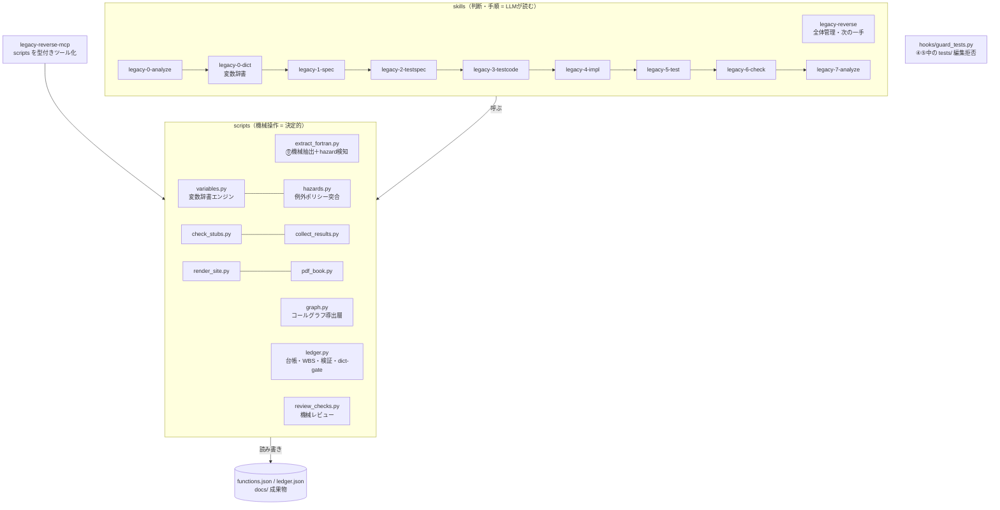
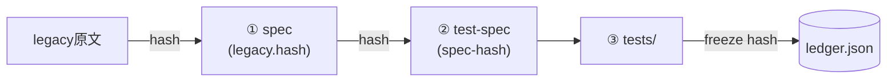

# 1. 目的と設計思想

レガシーコード（Fortran 等）を Python へ**仕様ベースで移植**するための Claude Code skill 群。
「レガシーを読んで直接書き写す」のではなく、仕様書という中間成果物を挟み、
独立に作ったテストと実装を突き合わせて品質を機械的に担保する。

設計判断の根っこは次の5つ。

| 原則 | 内容 | それで防ぐもの |
|------|------|--------------|
| クリーンルーム分業 | ②③はレガシー原文を見ない。③は②だけ、④は①だけを入力にする | 「レガシーの写経」による仕様の暗黙化。仕様書の穴は⑤で機械的に露見する |
| 状態はすべてファイル | 進捗の正は functions.json・ledger.json・成果物フロントマター。会話コンテキストに置かない | セッション切れ・コンテキスト枯渇による「1からやり直し」 |
| 機械が正、AIは意味づけ | 列挙・検証・台帳操作は決定的なスクリプト。AIは読解と執筆だけ | ハルシネーション・省略・数え漏れ。トークン消費 |
| 人の承認ゲート | 仕様確定・テスト承認・裁定は人。AIは「仮説＋Yes/No」で聞く | AIによる勝手な仕様確定 |
| 強制は仕組みで | テスト保護は hook、スタブ検知・引用検証はスクリプト | 「プロンプトで禁止」の不確実さ |

# 2. 全体構成

- **skills** は「いつ・何を・どの順で」を書いた手順書。実作業の判断（レガシー読解、
  仕様の執筆、トリアージ）だけを LLM が行う
- **scripts** は単体でも動く決定的な処理。skills からは MCP 経由（登録時）または
  直接実行で呼ばれる。二重管理はない（MCP サーバは scripts を import/subprocess するだけ）
- **hooks** は LLM の自制に頼らない強制層（フェーズ4/5中の tests/ 編集を物理的に拒否）
- **graph.py / variables.py / hazards.py は⓪の拡張層**。いずれも functions.json からの
  導出で、グラフとフロー到達集合は保存すらしない（再抽出に自動追随）。
  設計の正は [references/graph-dict-design.md](references/graph-dict-design.md)

## 変数辞書と dict-gate の設計判断

レガシーの変数名（`R8TBL`・`WKA`）はそのまま仕様書の IO 表に出る。語義が未確定のまま
①を書くと、同じ実体に関数ごとに違う説明が付き、後から直すと全仕様書へ波及する。
そこで**「1変数=1語義」を先に人が確定させる**層を⓪と①の間に挟んだ。5原則の適用は次のとおり:
クラスタリング・根拠収集・rank 判定・伝搬は決定的スクリプトが行い、LLM の仕事は
「機械が集めた根拠バンドルだけを読んで desc を書く」ことに限定される（**機械が正、AIは意味づけ**。
範囲逸脱は `verify-interp` が全件差し戻しで弾く）。語義の確定と例外ポリシーの決定は人
（**人の承認ゲート**）。そして「先に辞書」は文書での指示ではなく `dict-gate` という
機械的な対象選定で強制する（**強制は仕組みで**。`ledger next` と連続実行の対象選定
（pipeline._decide_kind）が同じ `dict_gate_blockers` を共有し、既に draft/reviewed の
関数だけ免除する）。
辞書の状態は data/variables.json とフロントマターの `dict-hash` に持ち、
別の進捗DBを作らない（**状態はすべてファイル**）。

# 3. パイプラインと情報遮断

フェーズのトリガはすべて人。各フェーズが読んでよい入力を制限する（詳細は
[references/workflow.md](references/workflow.md) の遮断表が正）。

| フェーズ | 入力 | 出力 | 完了判定（機械） |
|---|---|---|---|
| ⓪ 解析 | legacy/ 全部 | functions.json（call_sites・hazards・flows 込み）・骨子・WBS・規約 | 抽出器の完全性突合 |
| ⓪ 辞書 | 機械が集めた根拠バンドルのみ | data/variables.json・docs/variables.qmd | 全変数 approved（＝dict-gate が開く） |
| ① 仕様書 | legacy/ 該当関数＋DK | docs/specs/*.md | status: reviewed（人OK） |
| ② テスト仕様 | ①(reviewed)＋規約 | docs/test-specs/*.md | status: approved かつ spec-hash 一致 |
| ③ テストコード | ②(approved)＋規約 | tests/ | ledger の freeze ハッシュ一致 |
| ④ 実装 | ①(reviewed)＋規約 | src/ | モジュール存在かつスタブ検知ゼロ |
| ⑤ テスト | 実行結果＋①② | docs/test-results/ | result: pass（実装率100%・失敗0） |
| ⑥ 完了検証 | 全成果物 | completion-check.md | ledger check ＋ review all が exit 0 |
| ⑦ 分析・改善 | src/・docs/・計測 | analysis.md・施策票 | テスト全pass維持（挙動保存） |

②と④が互いを見ないことが要点。**①仕様書だけを共通の親**とする2系統（テスト系・実装系）を
⑤で突き合わせるため、仕様書の曖昧さは必ずテスト失敗か spec-gap ISSUE として表面化する。

# 4. データ設計

スキーマの正は [references/schema.md](references/schema.md)。設計上の要点のみ:

- **functions.json が正データ**（⓪で機械抽出が生成・マージ）。WBS・骨子・Sphinx索引は
  すべてここから再生成される派生物。手書き修正は functions.json に対して行い、派生物は作り直す
- **完了状態は成果物自身が持つ**（フロントマターの status / ハッシュ）。別の進捗DBを
  持たない。したがって「ファイルが正しければ進捗も正しい」が常に成り立ち、再開が自明になる
- **ledger.json はスクリプト専用**の最小限の台帳（③freeze ハッシュ・blocked・attempt 基準時刻）。
  人も LLM も手編集しない
- ISSUE は全体通し番号。「仮説＋Yes/No」形式を強制し、人の判断コストを下げる
- **導出層は保存しない**。コールグラフとフロー到達集合は functions.json から毎回構築する
  （graph.py。純標準ライブラリの BFS/Tarjan で依存追加ゼロ）。保存しないので
  再抽出との不整合が原理的に起きない
- **辞書（data/variables.json）は唯一の派生台帳**。functions.json を正として build し、
  approved の語義を `propagate` で IO/globals の desc に `[V-xxxx]` 付きで戻す。
  var_id は不変で、再 build は `evidence_hash` と occurrence 集合で承認を維持する
- **hazards / call_sites はソース完全導出**なので、再抽出時は手修正保持の例外として常に上書き。
  一方で「決定」（EP-xxx）は人の資産なので docs/exception-policy.md に別置きする

## 整合性: ハッシュ連鎖

上流が変わると下流のハッシュ照合が落ち、WBS に stale⚠/⚠改変 が自動表示される。
「①を直したのに②を直し忘れた」は構造的に起きない（`ledger verify` が⑤実行前に検査）。

辞書がある場合は **dict-hash** が同じ役割をもう1段担う: ①生成時の (var_id, desc) 集合の
ハッシュを spec フロントマターに刻み、承認後に語義が改訂されたら WBS に「⚠辞書stale」が出る。
ただし **reviewed 済みの仕様書は自動修正しない**——`variables.py conflicts` が
docs/dict-conflicts.md に矛盾候補を列挙するだけで、直すかどうかは人が決める
（自動書き換えは「人が承認した成果物」の意味を壊すため）。

# 5. 品質ゲート（ハルシネーション・省略の機械検知）

LLM 成果物は人に届く前に決定的スクリプトの検証を通る。

| ゲート | スクリプト | 検知対象 |
|---|---|---|
| ⓪ 完全性 | extract_fortran.py 内蔵 | 2系統カウント突合による数え漏れ |
| ⓪ 辞書解釈 | variables.py verify-interp | 対象 var_id の欠落・余剰、ev_id の捏造、根拠なし（rank D）の解釈 |
| ⓪→① ゲート | ledger.Project.dict_gate_blockers | 語義が未承認のまま①に着手すること（dict-gate。既定 ON） |
| ① 仕様書 | review_checks.py spec | 実在しない `file:lines` 引用、🟢なのに根拠なし、プレースホルダ残存、必須節欠落、原本ハッシュ不一致、hazard の検討漏れ・EP-ID の捏造・未決定のまま仕様化 |
| ② テスト仕様 | review_checks.py testspec | 🟢仕様項目のケース漏れ、①に無いSPEC-ID参照（捏造）、宙に浮いたTC参照、⚠未確定残り、挙動が変わる hazard の境界ケース漏れ |
| ③ 突合 | collect_results.py (exit 3) | ケースIDとテスト関数マーカーの過不足 |
| ④ スタブ | check_stubs.py | 空実装・NotImplementedError・TODO/FIXME |
| ⑤ 事前 | ledger verify | ②stale・freeze後のテスト改変・blocked |

機械で取れない「意味のすり替え」は、人の①レビューと⑤の突き合わせが受け持つ、という分担。

# 6. 主要コンポーネントの責務

| ファイル | 責務 | 設計メモ |
|---|---|---|
| scripts/extract_fortran.py | Fortran 静的解析 → functions.json 生成/マージ | 固定・自由形式、継続行、COMMON/USE/intent、call＋関数参照の呼出推定。**再実行=マージ（func_id不変・手修正保持）**が再開性の要 |
| scripts/extract_c.py | C/C++ 静的解析 → 同じ functions.json にマージ | Fortran の依存（数値ルーチン・I/Oラッパ）を同一スキーマで抽出。Fortran↔C の呼び出しはアンダースコア規約込みでマージ時に自動リンク（unresolved_calls 経由で実行順不問） |
| scripts/graph.py | functions.json → コールグラフの導出層（reachable/callers/between/dead/cycles/summary） | **依存ゼロ・LLM不使用・保存なし**（毎回構築）。ledger/variables/pipeline がライブラリとして import する。dead は列挙のみで自動 exclude はしない |
| scripts/variables.py | 変数辞書（build/verify-interp/list-targets/approve/revise/propagate/page/conflicts） | Union-Find のクラスタリングと根拠収集は機械。LLM が書けるのは interpretations.json だけ。rank は検証側がルーブリックで決める。再 build は evidence_hash と occurrence 集合で承認を維持 |
| scripts/hazards.py | 例外ポリシーの突合（match/add-policy/status） | 検知は⓪、決定は人（EP-xxx 登録簿）、突合は機械の3分割。適用範囲は 全体既定→関数→個別 で個別が勝つ。review_checks.py が import する |
| scripts/ledger.py | 台帳・状態判定・WBS・骨子（テンプレ駆動）・検証・⑥check・flow・dict-gate・init-templates | 状態判定 `status_of()` が唯一の判定ロジック（WBS/next/check が共有）。200関数超で WBS を自動分割。dict-gate/dict-hash は data/variables.json が無ければ完全に無効（後方互換） |
| scripts/review_checks.py | ①②の機械レビュー・一斉レビュー表・テンプレ契約チェック | LLM不使用。必須節は**プロジェクト所有のテンプレ**（docs/templates/。無ければ同梱シード）の見出しから導出。固定契約の欠落は「テンプレ不正」として検知 |
| scripts/review_actions.py | ①②の承認・修正依頼と⑤裁定（CLI） | どの入口（チャット/CLI）でも承認直前に機械レビューを再検証。反映後は WBS・レビュー表・サイトまで自動更新 |
| scripts/serve_site.py | 閲覧サーバ（GET のみ） | HTML は**閲覧専用**。/pipeline.html はバッチ進捗の表示専用ビュー（操作は CLI） |
| scripts/render_site.py | docs/ → HTML サイト | Quarto が Mermaid を .qmd でしか描けないため影コピー(_sitework)方式。未生成ページはプレースホルダで**⓪時点でもリンク切れゼロ** |
| scripts/pipeline.py | 無人バッチドライバ（spec / run / dict） | **1関数=1 headless Claude プロセス**（毎回まっさらなコンテキスト＝トークン上限に依存しない）。完了は LLM の申告でなくファイル状態で契約検証。中断安全・コスト集計・連続失敗停止。`dict` だけ単位が「変数のチャンク」で検証は verify-interp の exit code、既定モデルは sonnet |
| scripts/collect_results.py | ⑤結果収集 → 報告書生成 | exit code が制御信号（0 pass / 1 fail / 2 blocked / 3 mismatch）。attempt 上限3で自動 block |
| scripts/pdf_book.py | 種別ごとの合本PDF | quarto-typst-pdf skill に委譲 |
| hooks/guard_tests.py | フェーズ4/5中の tests/ 編集拒否 | state.json（phase-start/end）を見て判定 |
| mcp-servers/legacy-reverse-mcp | scripts の型付きツール化（45個） | 判断は持たない。構造化された戻り値で許可プロンプトとシェル事故を減らす |

# 7. スケールと再開（2000関数級）

- **WBS**: 200関数以下は1ページ。超えるとトップが「要対応・次の一手・ファイル別進捗」の
  ダッシュボードになり、明細は docs/wbs/ にファイル別分割。人も LLM も全関数表を読まずに済む
- **軽量API**: `ledger status --summary`（数行のJSON要約）と `ledger next --all`
  （着手可能リスト）。再開時・状況把握でコンテキストに全リストを載せない
- **再開手順は常に同じ**: summary → next → review all。⓪の再抽出もマージなので安全
- 呼び出し推定は全 function 名を1本の交替正規表現に畳んで走査（O(n²) 回避）

# 8. 拡張ポイント

| 拡張 | 方法 |
|---|---|
| 新レガシー言語（C# 等） | extract_fortran.py / extract_c.py と同じ出力契約（functions.json スキーマ＋ extract-report）で抽出器を追加し、MCP ツールに登録。既存の抽出結果とマージされ、実行順は問わない。call_sites / hazards も同じキーで出せば辞書・例外ポリシーがそのまま効く |
| 新しい hazard 検出器 | extract_fortran.py の `HAZARD_DETECTORS`（kind → 走査関数のテーブル）に1行足す。EP 登録簿・質問キュー・①②の機械レビューは kind 非依存なので変更不要 |
| 辞書の根拠の種類 | variables.py の `EV_KINDS` / `EV_LIMITS` に追加し、rank A 相当なら `RANK_A_KINDS` に入れる。LLM 側のプロンプトは「強い根拠/弱い根拠」の区別しか持たない |
| 工程ごとのモデル階層 | **採らない**。全工程 `claude -p` の既定モデルで回す。工程ごとに変えられる作りは、その指定が通らない環境で「その工程だけ応答が返らない」という切り分けの難しい失敗を生んだため撤去した。実験したいときだけ `--claude-args` で明示する |
| 完全自動運転の全フェーズ化 | ①は pipeline.py で実装済み。②〜⑤も同じ骨格（対象選定 `actionable()` → headless 実行 → ファイル状態で契約検証 → ログ）にフェーズ別の検証関数を足せば拡張できる。情報遮断はフェーズ別 permission deny に落とせる |
| 意味レベルのレビュー強化 | 別コンテキストのレビューアエージェント（①と legacy だけを読む）をドライバ段に挿入 |

# 9. 関連ドキュメント

| 文書 | 対象読者 |
|---|---|
| [slides/index.html](slides/index.html) | 初見の操作者（⓪→⑦チュートリアル） |
| [QUICKREF.md](QUICKREF.md) | 作業中の操作者（コマンド即引き） |
| [MANUAL.md](MANUAL.md) / MANUAL.pdf | 使う人・skill を触る人（構成・参照関係と、人が書く MD（規約・テンプレ・工程別プロンプト）の手引き） |
| [ARCHITECTURE.md](ARCHITECTURE.md) | 構成と区分け（層・固変・作成者区分・操作の入口）の正 |
| 本書 DESIGN.md | skill の開発者・保守者 |
| [references/workflow.md](references/workflow.md) | 全フェーズ skill（規則の正） |
| [references/schema.md](references/schema.md) | スクリプト開発者（データの正） |
| [references/graph-dict-design.md](references/graph-dict-design.md) | グラフ層・変数辞書・フロー・例外ポリシーの設計の正（本書 §2 の拡張層の詳細） |
