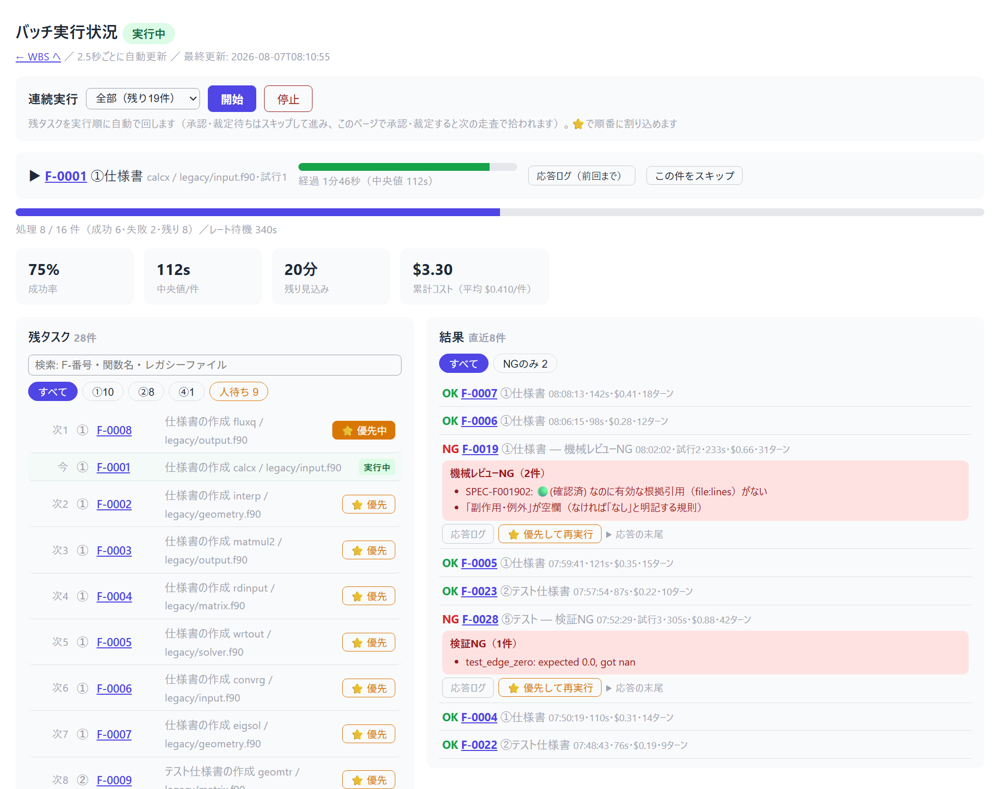
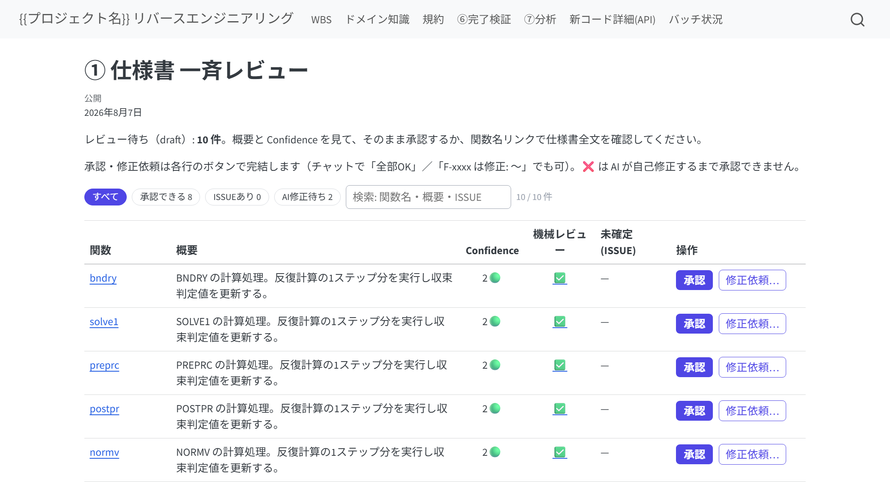

# このパイプラインは何か

レガシーコード（Fortran / C / C++ など）を Python へ**仕様ベースで移植**するための、
Claude Code skill 群です。関数を1つずつ、次の流れで進めます。

> **対応言語について**: ⓪の関数列挙を機械抽出できるのは現在 **Fortran と C/C++** です
> （両方が混在していても、同じ関数リストにマージされます）。それ以外の言語
> （COBOL・C# など）でも①以降の進め方は同じですが、⓪の関数列挙は
> AI と人で行うことになります。

> ⓪リポジトリ解析 → ①関数仕様書 → ②テスト仕様書 → ③テストコード → ④実装
> → ⑤テスト → ⑥完了検証 → ⑦分析・改善

設計の柱は5つあります。

1. **クリーンルーム分業** — ②③はレガシー原文を見ない。③は「②＋規約」だけ、
   ④は「①＋規約」だけを入力に作られる。独立に作ったテストと実装を⑤で突き合わせる
   ことで、仕様書の穴が機械的に炙り出される。
2. **ハッシュ連鎖** — ①→②→③の各成果物は上流のハッシュを記録している。
   上流が改訂されると下流が自動的に「要再生成（stale⚠）」になり、伝搬漏れが起きない。
3. **人の承認ゲート** — 仕様の確定・テスト仕様の承認・裁定は必ず人が行う。
   AIは「仮説＋Yes/Noの問い」の形で判断材料を出し、勝手に確定しない。
4. **機械が正、AIは意味づけ** — 関数の列挙（⓪）は静的解析プログラムが行い、
   AIの成果物（①②）は人に届く前に機械レビュー（根拠引用の実在検証・省略検知・
   トレーサビリティ突合）を通る。「もっともらしいが根拠のない記述」は
   あなたの目に触れる前に機械が落とす（詳細は「品質ゲート」の章）。
5. **挙動保存の改善（⑦）** — 移植完了後の高速化・リファクタリングは、
   ③のテスト資産を安全網に「テスト全pass維持」を絶対条件として行う。

**あなた（人）の仕事は「トリガを引く」「質問に答える」「承認する」「裁定する」の4つ**です。
コードや文書を直接書く必要は基本的にありません（書いてもよい場所は後述）。

> **前提: レガシーを動かせる環境は無くてよい**（あるならなお良い、という位置づけです）。
> このパイプラインは「レガシーを実行して出力を突き合わせる」方式ではありません。
> 正しさは **(1) 人が仕様書をレビューして確定する** ことと、
> **(2) その仕様書だけから独立に作ったテストと実装が⑤で一致する** ことで担保します。
> ②で「期待値が決められない」ケースが出てあなたに質問が来るのは、この前提のためです
> （レガシーを走らせて実測できるなら、そう答えてもらって構いません）。
>
> 裏を返すと、**最終的な品質の上限は①仕様書レビューの質**です。⑤の pass は
> 「あなたが承認した仕様どおりに実装されている」ことを保証しますが、
> 「仕様があなたの承認どおりレガシーと同じ」かどうかは、あなたのレビューが決めます。

> 初めての人は [slides/index.html](slides/index.html)（スライド版・ブラウザで開くだけ）で
> ⓪→⑦を順に体験しながら覚えるのが早道です。作業中に手元へ置くコマンド一覧は
> [QUICKREF.md](QUICKREF.md)（1枚）。本書は背景と操作の意味を説明する「ドキュメント版」です。


# セットアップ

## 0. 用意するもの（前提条件）

| 必要なもの | 確認方法 | 備考 |
|-----------|---------|------|
| **Claude Code**（CLI が PATH に通っていること） | `claude --version` | チャットからだけでなく**コマンドとして起動できる**必要があります。ブラウザ実行・無人バッチはこの CLI を裏で呼びます |
| **Python 3.10 以上** | `python --version` | スクリプト群の実行に使います |
| **移植先プロジェクトが git 管理下** | `git status` | 成果物の履歴管理と、事故ったときの復旧（`git checkout --`）に使います |
| skills リポジトリ | — | この文書が入っているリポジトリ。**セットアップ後も消さないでください**（MCP サーバがこの中を参照します） |

**この文書に出てくる書き方**:

| 表記 | 意味 |
|------|------|
| `<project>` | 移植先のプロジェクトのルート。レガシーコードと新実装を置く場所 |
| `<skills>` | skills リポジトリを clone した場所（例: `C:\work_space\skills`） |
| **`<LR>`** | **セットアップ後の skill のルート = `<project>/.claude/skills/legacy-reverse`** |

**コマンドは断りがない限り `<project>` の中（プロジェクトルート）で実行します。**
`--root .` が付いているのはそのためです。

## 1. skill の配置

skills リポジトリの中で、次の2つをコピーします（**cwd は skills リポジトリの中**）。

```bash
cd <skills>
cp -r legacy-reverse          <project>/.claude/skills/
cp -r legacy-reverse/skills/* <project>/.claude/skills/
```

PowerShell の場合:

```powershell
cd <skills>
Copy-Item -Recurse legacy-reverse          <project>\.claude\skills\
Copy-Item -Recurse legacy-reverse\skills\* <project>\.claude\skills\
```

**2行必要な理由**: 1行目は skill 本体一式（スクリプト・hook・テンプレート）を
`<LR>` に置きます。2行目はフェーズ別 skill を `.claude/skills/` の**直下**にも置きます
——Claude Code はここを見て `/legacy-1-spec` などのコマンドを認識するためです。
中身が重複しますが、これで正しい状態です。

配置後、Claude Code を開き直すと `/legacy-reverse` が使えるようになります。

## 2. hook の登録（必須）

`legacy-reverse/hooks/settings-example.json` の内容を `<project>/.claude/settings.json` に
マージします。2つの安全装置が入っており、どちらもプロンプト（お願い）ではなく
仕組みで事故を防ぎます。

| hook | 効くとき | 何を防ぐか |
|------|---------|-----------|
| `guard_tests.py`（PreToolUse） | ④⑤フェーズ中の `tests/` 編集 | AIがテストを書き換えて通す事故 |
| `guard_json.py`（PostToolUse） | `.json` を編集した直後 | AIが `functions.json` 等を壊してパイプラインが止まる事故 |

`guard_json.py` は、AIがJSONを編集した直後にその場で構文を検証し、壊れていれば
**AI本人に差し戻して直させます**（「1行37列: 末尾に余分なカンマ」のように位置つきで
返します）。`data/functions.json` は全スクリプトが毎回読む正データなので、
ここが壊れると無人バッチが途中で止まります。①〜⑦のどのフェーズでも効きます。

> すでに運用中のプロジェクトに後から入れる場合も、settings.json に `PostToolUse` の
> ブロックを追記するだけです（既存の `PreToolUse` はそのまま残してください）。

## 3. MCP サーバの登録（推奨）

**MCP（Model Context Protocol）** は、AI に外部のプログラムを「道具」として
渡すための仕組みです。ここで登録するのは、このパイプラインの機械処理
（台帳の読み書き・機械レビュー・テスト実行など）を AI から呼べるようにした
小さなサーバで、実体は skills リポジトリの中の Python スクリプト1本です。

`<project>/.mcp.json` に次を書きます（**ファイルが無ければ新規作成**）。

```json
{
  "mcpServers": {
    "legacy-reverse": {
      "command": "python",
      "args": ["C:/work_space/skills/mcp-servers/legacy-reverse-mcp/server.py"]
    }
  }
}
```

- `args` のパスは **`<skills>` の絶対パスに置き換えてください**（上は例）。
  `<LR>` ではなく**skills リポジトリ側**を指します——だからセットアップ後も
  リポジトリを消してはいけません
- 書いたら Claude Code を開き直します

**登録すると何が変わるか**: 登録しなくても動作は同じですが、登録すると AI が
スクリプトを「シェルコマンド」ではなく「型の決まった道具」として呼べるようになります。
その結果、**実行のたびに出る許可確認（このコマンドを実行していいですか、の
ダイアログ）が減り**、引用符やパスの取り違えによる失敗も起きにくくなります。

## 4. ツール類

- **Quarto**（必須。進捗サイトの HTML 生成に使います）— [quarto.org](https://quarto.org)
  のインストーラで入れてください。`quarto --version` が通れば OK です。

  > 管理者権限を使いたくない場合は、skills リポジトリ同梱のヘルパーで
  > ホームディレクトリ配下にポータブル導入もできます（PATH も変更しません）:
  > `python <skills>/quarto-typst-pdf/scripts/qtpdf.py install`

- **Python パッケージ**: `pip install pytest sphinx sphinx-rtd-theme`
  （⑦では追加で `radon ruff bandit pip-audit`）

**合本PDF（関数仕様書などを1冊にまとめたPDF）も出す場合のみ**、追加で2つ:

- skills リポジトリの `quarto-typst-pdf/` を `<project>/.claude/skills/` にコピー
  （`pdf_book.py` が `<LR>` の**隣**を探すため。日常の HTML 生成には不要です）
- **Chromium 系ブラウザ**（Chrome/Edge 等）— PDF に Mermaid 図を焼き込むのに使います
  （HTML 側はブラウザが描くので影響ありません）

## 5. 開始

Claude Code で `/legacy-reverse` を実行すると、セットアップ状態を確認して
次の一手を案内します。新規なら `/legacy-0-analyze` へ。

> `/legacy-reverse` が候補に出てこない場合は、Claude Code を開き直してください
> （skill の配置は起動時に読み込まれます）。

# フェーズ別ガイド — 各フェーズで人がやること

すべてのフェーズは**人がスラッシュコマンドで起動**します。AIが勝手に次のフェーズへ
進むことはありません。

| フェーズ | コマンド | 人がやること |
|---------|---------|-------------|
| ⓪ 解析 | `/legacy-0-analyze` | レガシーの場所・言語・新パッケージ名を答える。型対応表・規約を一緒に確定（Fortran と C/C++ の関数列挙は静的解析プログラムが行い、AIは説明の充填と抽出レポートの確認のみ。Fortran↔C の呼び出しも自動でリンクされる） |
| ① 仕様書 | `/legacy-1-spec F-xxxx`（「まとめて10件」でバッチ） | レビューして OK を出す（reviewed 化）。🟡🔴項目の質問に答える。バッチ時は一斉レビュー表でまとめて |
| ② テスト仕様 | `/legacy-2-testspec F-xxxx` | ケース一覧と質問を見て承認（approved 化）。期待値の不明点に答える |
| ③ テストコード | `/legacy-3-testcode F-xxxx` | 基本は見守り（完了時に freeze される） |
| ④ 実装 | `/legacy-4-impl F-xxxx` | 基本は見守り。spec-gap ISSUE が来たら①改訂を指示 |
| ⑤ テスト | `/legacy-5-test F-xxxx` | fail 時の裁定（後述）。pass ならWBSで✅を確認 |
| ⑥ 完了検証 | `/legacy-6-check` | 全関数完了後に1回。不備リストが出たら該当フェーズへ差し戻し |
| ⑦ 分析・改善 | `/legacy-7-analyze` | 代表ワークロードを教える。施策票を承認する |

「次にどの関数をやるべきか」は WBS の推奨着手順（依存の葉から）に従います。
迷ったら `/legacy-reverse` に聞けば `next` を提案します。

## 関数リストはあとから調整できる（追加・対象外）

⓪で作った関数リストは固定ではありません。進めている途中で
「この関数も追加して」「この関数は移植しない」と AI に指示すれば調整できます:

- **追加**: 「XXX という関数を追加して（legacy/tax.f の 120〜240行）」
  → 採番され、骨子と WBS に載り、以後は他の関数と同じ①〜⑤を回せます
- **対象外**: 「F-0123 は使われていないから外して」
  → ①〜⑥・WBS の対象から外れます。消えるのではなく、
  WBS 末尾の「対象外の関数」に理由つきで残ります（監査で「なぜ移植していないのか」に
  答えられる形）。あとで「F-0123 を対象に戻して」と言えば復帰もできます

functions.json からエントリを**手で消してはいけません**。⓪の再解析でソースから
別IDとして復活してしまい、作りかけの仕様書との紐付けが切れます。必ず上の操作で。

## ①②の承認とは何をすることか

AIは承認を求めるとき、**変更点サマリ・Confidence（🟢確認済/🟡推測/🔴仮定）の内訳・
未回答の質問一覧**をチャットに提示します。あなたは:

- 内容に問題なければ「OK」と返す → AIがフロントマターの status を更新する
- 質問には **Yes / No / 修正内容** で答える（AIは必ず仮説を添えて聞いてくるので、
  白紙から考える必要はない）
- 答えられない質問は「保留」でよい。ISSUE として残り、WBS の最上部に出続ける


**チャットを開かなくても、ブラウザだけで承認・修正依頼が完結します。** ①draft・②generated
の間、仕様書ページの本文の一番上に承認ウィジェットが出ます。機械レビューの結果（✅か、
❌なら理由の全文）がその場に書いてあるので、「一斉レビュー表の❌4件が何なのか分からない」
と別の場所を探しに行く必要はありません。ボタンは2つだけです:

- **承認する**: 機械レビューがNGの間はグレーアウトして押せません（サーバ側でも再検証するので、
  無理に押させても弾かれます）。押すと WBS・一斉レビュー表・サイトが数秒で更新されます
- **修正依頼…**: コメント欄に直したい内容を書いて送ると、次にAIが①/②を実行したときに
  自動で拾われて反映されます（チャットで「F-xxxxは修正: 〜」と言うのと同じことが起きます）

一斉レビュー表（spec-review.md）の「機械レビュー」列も、❌の件数リンクを押せば
その関数のウィジェット（理由の全文）へ直接飛びます。

ISSUE は必ず「仮説＋Yes/Noの問い」の形で来ます。白紙の質問は来ません。


## ①〜⑦の実行・承認・裁定はブラウザで完結できます

①仕様書ページに、状況に応じて **「①〜④を実行する」** ボタンが出ます
（①未着手→①、①reviewed済みで②未着手→②、②approved済みで③未freeze→③、
③freeze済みで④未実装→④、と1関数の中で自動的に切り替わっていきます）。
押すとチャットで `/legacy-N-xxx F-xxxx` と打つのと同じ処理（**headless Claude**
＝画面を持たない `claude` コマンドを1回起動して成果物を作る）がバックグラウンドで走り、
進捗はページ上と `/pipeline.html` の両方で見えます。終わると自動でページが更新され、
①②は承認ウィジェット（本文の先頭に出る操作パネル）に切り替わり、
③④は次のボタン（④・完了表示）に切り替わります。

- **チャット駆動の従来フローはそのまま**です。ブラウザ実行は追加の入口であって置き換えでは
  ありません。1関数ずつ様子を見ながら進めたいときに使います
- **数百件をまとめて流すときは2通り**あります。
  **①だけを全件先に流す**なら `pipeline.py spec`、**①〜⑤を通しで進める**なら
  ブラウザの「連続実行」または CLI の `pipeline.py run`（中身は同じ。後述）
- 無人バッチ（pipeline.py）が実行中のときは、ブラウザからの実行は開始できません。
  逆にブラウザ実行中はバッチの起動が断られます（同じ実行枠＝`.legacy-reverse/run.lock`
  を双方向で取り合う設計）。実行が異常終了してロックや「実行中」表示が残っても、
  次の実行時に自動で残骸と判定して回復します（手で消す必要はありません）
- **実行中は「中止」ボタンで止められます**。押し間違いやレート待ち（最大15分）を
  待ちたくないときに使ってください。中止すると失敗として記録され、同じボタンから
  やり直せます
- ③④は hook ガード（tests/ 編集拒否など）を気にせず動きます——`ledger phase-start`/
  `phase-end` はスキル自身が自分の手順として呼ぶので、headless実行でもチャットと同じに効く
- ④が完了すると `docs-sphinx` があれば「新コード詳細(API)」も自動で作り直します
  （`ledger sphinx-index` → Sphinx build。無ければ何もしない）
- **⑤テストも同じ流れで実行できます**。④が終わると「⑤を実行する」ボタンが出ます。
  fail時、(a)実装バグはAIが自分で直して再実行するところまで1回の実行内で完結します。
  (b)(c)（テストコード側／仕様側が怪しい）は人の裁定が必須の設計のため、その場合は
  「裁定待ち」と表示され、ボタンは出なくなります（再実行しても
  空振りするだけなので）。ISSUEに回答して `unblock` した後、再度ボタンで実行できます
- **進行は関数ごとです。①が全件終わるのを待つ必要はありません**——ある関数の①を
  承認すれば、その関数はすぐ②へ進めます（連続実行も承認済みの関数から順に
  ②以降を進めます）。「①をまとめて流して一斉レビュー」は効率のための運用であって、
  順序の制約ではありません
- **⑥完了検証は、全関数の⑤が完了するとWBSトップに現れます**（それまでボタンは
  出ません。途中の不足はWBSの進捗表と spec-review.md で確認します）。
  LLMを呼ばないので数十秒で終わります
- **修正依頼した①②もブラウザから作り直せます**。「修正依頼…」を送ると、そのページに
  「修正依頼を反映して再実行」ボタンが出ます。機械レビューNGが残っている場合も
  「AIに自己修正させて再実行」ボタンが出ます（どちらもチャットに戻る必要はありません）
- **⑤の裁定もブラウザで完結します**。裁定待ち（⛔）の関数の仕様書ページに
  ISSUE の質問がそのまま表示され、回答を書いて「回答して裁定を完了（unblock）」を
  押すと、回答が ISSUE に記録されて裁定待ちが解除されます。その後に出る
  「⑤を実行する」ボタンで、AI が回答を反映して再テストします
- **⑦の「分析」もブラウザから実行できます**。⑥がpassするまでボタンは出ません。
  passすると、WBSトップに「⑦分析を実行する」ボタンが現れ、押すと cProfile＋静的解析
  （radon / ruff / bandit / pip-audit）で**定量評価を機械的に実測**し
  （結果は quant / perf ページに載ります）、その実測値に基づいて AI が施策候補
  （OPT-性能 / REF-保守性 / SEC-セキュリティ）を analysis.md に提案します。
  **提案まで**で、コードには一切触りません。ルートに `bench.py`
  （代表ワークロード）を置いておくと本命の計測になります（無ければテスト負荷の
  スモーク計測と明記されます）。→ `bench.py` の書き方は「⑦ 分析・改善の回し方」の章へ
- ⑦の「**改善の適用**」（施策票の承認 → 適用 → 再計測 → 達成判定のループ）は、
  チャットから進めます（この部分だけボタン化していません。1施策ごとに
  人の承認とコミットが挟まるため、画面での自動化になじまないという判断です）。
  ⓪（骨子生成）と serve_site.py の起動も
  これまで通りチャット/ターミナルです（ブラウザ自体がこのサーバの上で動くため）

## バッチ実行状況ページ — 連続実行の運転席

`http://127.0.0.1:<ポート>/pipeline.html`（WBS の「バッチ状況」からも行けます）は、
無人実行を**眺めるだけの画面ではなく、運転する画面**です。「いま何が起きているか」と
「人がやるべきこと」「順番の割り込み」がこの1枚に集まっています。2.5秒ごとに
自動更新されるので、開いたまま置いておけます。



> **実行許可について**: ブラウザからの実行（単発・連続・⑦）には、**既定で**
> `--dangerously-skip-permissions` が付きます。ボタンを押すのは人の明示操作であり、
> headless Claude は許可ダイアログに答えられないためです（付けないと、許可設定の
> 無い環境で「応答は返るのにファイルが書かれず全件NG」になります）。
> サーバは 127.0.0.1 限定なので、実行できるのはこのマシンの人だけです。
> 共有マシン等で許可を settings.json の `permissions.allow` で管理したい場合は、
> `serve_site.py --root . --no-skip-permissions` で起動してください。

**① 連続実行（最上段）** — 件数を選んで「開始」を押すと、全関数を走査して
「次に着手できる工程」（①〜⑤。修正依頼の反映や機械レビューNGの自己修正も含む）を
1件ずつ実行し、終わるたびに再走査します。③が終われば同じ関数の④、承認が下りれば
次の工程、と自動的に進みます。「停止」でいつでも止められます。

- 件数は **全部／お試しに1件だけ／10件／50件／100件**。「全部」には残り件数が
  出るので、その日にどこまで回すかを決める目安になります。
  **初回はまず「お試しに1件だけ」**で通ることを確認するのが安全です
- 承認待ち（①②）と裁定待ち（⑤⛔）は**スキップして先へ進みます**。
  人を待つ間に他の関数が止まらないようにするためで、承認した分は次の走査で拾われます
- 1件あたりの所要とコストは画面の指標カード（中央値・平均$/件）に出ます。
  **最初の数件でこれを見てから**、夜間に何件回すかを決めてください

**② 実行中の1件（緑のバー）** — いま動いている関数・工程・試行回数と、
経過時間が出ます。バーは**その工程の中央値を100%とした進み具合**で、
中央値を超えると黄色、2倍を超えると赤くなり「長引いています」と出ます。
異常に気づくための表示です。

- **応答ログ（前回まで）**: この関数のエージェント応答の全文。実行中に読めるのは
  前回の試行までです（応答は試行が終わった時点で記録されるため）
- **この件をスキップ**: この1件だけ諦めて次へ進みます。**バッチ全体は止まりません**。
  長引いている1件を切り捨てて夜間実行を先へ進めたいときに使います

**③ 残タスク（左下）** — 連続実行が**次に何をやるか**が実行順に並びます。
「今 / 次1 / 次2 …」の番号がそのまま実行順です。

- **検索**（F-番号・関数名・レガシーファイル名）と工程チップ（①②③④⑤・人待ち）で
  絞り込めます。2000関数でも既定表示は先頭9件だけなので、画面が重くなりません
- **⭐優先**: 押した関数が次の走査で**先頭に割り込みます**（実行中の1件が
  終わり次第）。番号は即座に振り直されるので、割り込みの結果がその場で分かります
- **人待ちタブ**: 承認待ち・裁定待ちがここに集まります。バッチが自動でスキップし続ける
  ＝**人待ちこそが本当のボトルネック**なので、この画面から直接
  「承認 / 修正依頼 / 裁定」ができます。WBS や仕様書ページへ戻る必要はありません
  （じっくり読んでから承認したいときは「開く」で仕様書ページへ行けます）

**④ 結果（右下）** — 直近の実行結果です。OK 行は1行、NG 行は**理由が開いた状態**で
表示されます（機械レビューの指摘は箇条書きで全文）。行ごとに次の操作が付きます。

- **応答ログ**: エージェント応答の全文（失敗原因の一次情報はここにしかありません）
- **⭐優先して再実行**（実行中）／**再実行**（停止中）: 失敗した関数をやり直します
- **NGのみ**タブで失敗だけを拾えます

> **失敗してスキップされた関数はどうなるか**: 失敗した(関数, 工程)は
> *そのバッチの中でだけ*再試行対象から外れます（同じ関数で失敗し続けて全体が
> 止まらないようにするため）。⭐優先を押せばその場で拾い直せますし、
> 何もしなくてもバッチを再度「開始」すれば普通に対象へ戻ります。
> 成果物の状態がすべての正なので、失敗で進捗が失われることはありません。
> なお**連続3件失敗するとバッチ全体が安全停止**します（APIキー切れなどの
> 環境異常で全件を失敗として消化してしまうのを防ぐためです）。

## ①はまとめて進めて、まとめてレビューできる

1件ずつ「実行→レビュー」を回す必要はありません。「仕様書をまとめて10件進めて」と
頼むと、AIが推奨着手順に沿って複数関数を機械レビュー通過済みの draft まで連続で
仕上げ、**一斉レビュー表**（`docs/spec-review.md`。WBSの「要対応」からリンク）に
まとめて持ってきます。



表の読み方と使い方:

- **並び順が優先度**です。上から「そのまま承認できる」→「ISSUE（あなたへの質問）が
  ある」→「AI修正待ち（機械レビューNG）」の順に並びます。上から片付ければ、
  判断が要らないものから消化できます
- **チップと検索**で絞り込めます。「承認できる N」を押せば、いま承認可能な行だけが
  残ります。件数はチップに出るので、残り作業量がひと目で分かります
- **概要**は仕様書の冒頭1行です。これで判断がつくものはその場で承認し、
  怪しいものだけ関数名リンクから全文を読む、という使い分けができます
- **Confidence**（🟢確認済 / 🟡推測 / 🔴仮定）の内訳が出ます。🟡🔴 が多い関数は
  中身を見るべき、という目印です
- **操作列の「承認」「修正依頼…」でその場で完結**します（`serve_site.py` で
  配信して開いている場合）。承認を押すとサーバ側でもう一度機械レビューを実行してから
  確定するので、NG付きの仕様書が承認されることはありません。
  ❌ の行は「AI修正待ち」と出るだけでボタンは出ません
- チャットで「全部OK」／「F-xxxx は修正: 〜」と返す従来の運用も、そのまま使えます

補足:

- 気に入らない仕様書は**何度でも書き直しを頼めます**（draft のうちは自由。
  reviewed 済みを書き直す場合は②の再承認が必要になる旨を先に確認されます）
- 承認が人であることは変わりません。粒度が「1件ずつ」か「まとめて」かの違いだけです

**数百〜2000件の無人実行は CLI ドライバ**で行います。サブコマンドが2つあります:
**`spec`（①専用）**は仕様書だけを全件 draft まで流す用、**`run`（①〜⑤）**は
ブラウザの「連続実行」と同じ走査で工程横断に進める用です（⭐優先も反映されます）。
チャットのAIと違いトークン上限がなく（1関数ごとに新しいAIプロセスを起動する方式）、
夜間に回して翌朝一斉レビュー表を見る、という運用ができます。途中で止めても
同じコマンドで続きから再開します。

```bash
python <LR>/scripts/pipeline.py run --root . --dry-run         # まず対象と実行順を確認
python <LR>/scripts/pipeline.py run --root . --max-funcs 20    # 最初は少なく試す
python <LR>/scripts/pipeline.py run --root .                   # ①〜⑤を回し続ける
python <LR>/scripts/pipeline.py spec --root .                  # ①だけ全件流したいとき
```

**始める前に、ツールの実行許可を通しておいてください。** 無人実行は許可ダイアログに
答えられないので、許可待ちで止まると朝まで無駄になります。方法は2つです。

- `<project>/.claude/settings.json` の `permissions.allow` に、①が使うツール
  （`Read` / `Write` / `Edit` と、スクリプト実行の `Bash`）を並べておく
- 信頼できる閉じた環境なら `--skip-permissions` を付けて起動する
  （内部的に `--dangerously-skip-permissions` を渡します。**共有マシンでは使わないでください**）

`claude` が PowerShell からしか見つからない環境では、`(Get-Command claude).Source` で
実体のパスを調べ、`--claude-cmd "<そのパス>"` で明示すると確実です。

実行中の様子は前述の**バッチ実行状況ページ**（`/pipeline.html`）で見られます。
CLI の無人ドライバで流していても、ブラウザの「連続実行」で流していても、
同じ画面に出ます（どちらも同じ実行枠・同じ状態ファイルを共有しているため）。
URL はバッチ起動時にターミナルにも表示されます。

## ⑤で fail したときの裁定

テストが落ちたとき、原因は3種類あります。**(a) だけはAIが自走**し、(b)(c) は
あなたの承認が要ります。

| 分類 | 意味 | あなたの操作 |
|------|------|-------------|
| (a) 実装バグ | 実装が①を満たしていない | 何もしない（AIが④修正→⑤再実行を回す） |
| (b) テストコードバグ | ③が②とズレている | ISSUE の証拠を見て承認 → ③再生成を指示 |
| (c) 仕様が誤り | ②①自体が間違い | ISSUE で裁定 → ①改訂を指示（伝搬は自動検知） |

(a) のループは**3回で自動停止**し、triage ISSUE が起票されて WBS に ⛔ が出ます。
このときの再開手順:

1. ISSUE を読んで (a)/(b)/(c) を裁定し、回答欄に記入（またはチャットで回答）
2. AIが反映（applied）したら、AIに「F-xxxx をアンブロックして」と言う
3. `/legacy-5-test F-xxxx` を再トリガ（試行回数は1からやり直し）


# 品質ゲート — AIの誤りを機械で検知する仕組み

AI がハルシネーション（存在しない根拠の引用・仕様の捏造）や手抜き（記入の省略・
スタブ実装）をしても、**人のレビューに届く前に機械が検知して差し戻す**仕組みが
各フェーズに入っています。あなたが受け取る成果物は、以下をすべて通過済みです。

| フェーズ | ゲート | 機械が検知するもの |
|---------|--------|-------------------|
| ⓪ | 抽出器内蔵の完全性突合 | 2系統のカウント差分（関数の数え漏れ）。結果は `data/extract-report.json` |
| ① | `review_checks.py spec` | **実在しないレガシー行への引用**、🟢（確認済）なのに根拠なし、記入の省略（プレースホルダ残存）、必須節の欠落、レガシー原本の変更 |
| ② | `review_checks.py testspec` | 🟢仕様項目のテストケース漏れ、**①に存在しない仕様IDの参照（捏造）**、宙に浮いたケース参照、期待値根拠の規定外表記 |
| ③ | マーカー突合 | ②のケースIDとテスト関数の過不足 |
| ④ | `check_stubs.py` | 空実装・NotImplementedError・TODO/FIXME（スタブ化） |
| ⑤ | `ledger verify` | ②の陳腐化・freeze後のテスト改変・裁定待ちの見落とし |
| ⑥ | `review_checks.py all` | 上記①②の全関数総点検 |

したがって**あなたのレビューは「意味が正しいか」に集中できます**。
「引用された行は実在するか」「トレーサビリティは揃っているか」の照合作業は不要です。
機械で取れないのは「式は書いてあるがレガシーの意図と違う」という意味レベルのずれで、
これは①のレビューと⑤の突き合わせ（独立に作ったテスト vs 実装）が受け持ちます。

# 大規模プロジェクト（数百〜2000関数）と中断・再開

## WBS は自動でダッシュボードになる

200関数を超えると、WBS のトップページは全関数表をやめて**ダッシュボード**に切り替わります
（進捗サマリ・要対応・あなたへの質問・次の一手・レガシーファイル別の進捗表）。
全関数の明細はファイル別のサブページに分かれ、リンクで行き来できます。
2000関数でも「いま何が問題で、次に何をやるか」はトップの1画面で分かります。


## 中断しても1からやり直しにならない

進捗の正はすべてファイル（functions.json・ledger.json・成果物のフロントマター）にあり、
AI の会話コンテキストには置きません。セッションが切れても、日をまたいでも:

- **再開はいつでも `/legacy-reverse` を打つだけ**。要約（数行）と着手可能リストを
  読んで次の一手を提案してきます。全関数の再列挙はしません
- ⓪の解析を途中でやり直しても、抽出器は**マージ動作**（関数IDは不変・手修正は保持・
  新規だけ追加）なので、採番のやり直しや成果物の宙吊りは起きません
- 「どこまで進んだか分からなくなった」ときは WBS を開くのが最短です。
  ⛔・⚠・❌ が「要対応」として最上部にまとまっています

# 日常の関わり方 — ブラウザと直接入力

## WBS サイト

進捗はすべて HTML サイトで確認します（各フェーズの最後に自動更新されます）。
次のコマンドで自分の PC のローカルホストに立ち上がり、ブラウザが開きます。

```bash
python <LR>/scripts/serve_site.py --root .
```

- 表示される URL（`http://127.0.0.1:8xxx/`）は**プロジェクトごとに固定**なのでブックマークできます。
  複数の移植プロジェクトを同時に立ち上げてもポートはぶつかりません
- 自分の PC の中だけで配信します（社内 LAN にも出ません）。
  誰かに見せたいときは後述の「レビュアーへの配布」を使ってください
- 立てたまま作業して構いません。フェーズが進んだらブラウザを更新するだけで最新になります
- `--watch` を付けると、`docs/` のファイルを編集した時点で自動的に作り直されます
  （ドメイン知識や ISSUE 回答を書きながら見るとき用）

- **トップ = WBS**: 進捗サマリ、コールグラフ図（緑=完了/黄=着手中/灰=未着手/赤=判断待ち。
  ノードをクリックで仕様書へ）、Open ISSUE（あなたへの質問が常に最上部）、
  関数一覧（各✅から成果物へリンク）、⑦改善イタレーションの達成状況
- ナビバー: ドメイン知識 / 規約 / ⑥完了検証 / ⑦分析 / 新コード詳細(API) /
  **バッチ状況**（無人実行の運転席。前述）/ **マニュアル**（本書。サイトに同梱されるので
  レビュアーに配った EXE からも読めます）
- API ページ（Sphinx）: 関数一覧 → 個別ページ。`Spec:` 行で仕様書へ、
  トレース対応表で func-id ↔ 新関数 ↔ レガシー名 ↔ 仕様書が相互に辿れる


## レビュアーへの配布（実行するだけの EXE）

進捗を上司やレビュアーに見せるのに、サーバを用意したり社内公開したりする必要はありません。
サイトを丸ごと入れた実行ファイルを渡し、**各自が自分のローカルホストで開く**形にします。

```bash
pip install pyinstaller                        # 初回のみ
python <LR>/scripts/build_viewer.py --root .   # → dist/<プロジェクト>-wbs.exe
```

渡された人はダブルクリックするだけです（黒い画面が出たまま、ブラウザに WBS が開きます。
見終わったら黒い画面を閉じるか Ctrl+C）。

- **相手の PC に Python も Quarto も要りません。** ファイルは 10MB 程度
- ネットワークに繋がっていない PC でも開けます（外部フォントの参照は除去済み）
- 中身は**ビルドした時点のスナップショット**です。進捗が動いたら作り直して渡し直してください
- Windows 用の `.exe` は Windows 上でビルドしてください（他OSからは作れません）
- 会社の設定で「発行元不明の実行ファイル」が止められる場合は `--onedir` を付けると
  フォルダ形式（中の実行ファイル＋データ）で出力できます

## あなたが直接書いてよいファイル

| ファイル | 手編集 | 説明 |
|---------|:---:|------|
| `docs/domain-knowledge.md`・`docs/conventions.md` | ⭕ | あなたが著者。業務知識・規約はここへ |
| ISSUE の「回答（人が記入）」欄 | ⭕ | じっくり書きたい裁定はファイルで |
| `docs/specs/`（仕様書） | △ | 編集可。ハッシュ連鎖が下流を stale にして再確認が走る（設計どおり） |
| WBS・テスト結果・完了検証レポート | ❌ | 自動生成。次の再生成で消える |

**ファイルに直接書いた内容は、次にどのフェーズを起動したときにAIが自動で拾います**
（全skillは起動時に「回答済みISSUE・規約変更」をスキャンしてから本処理に入ります）。
チャットで「DKに追加して: ○○」と言うだけでも構いません。

# ⑦ 分析・改善の回し方

⑥が pass した後、`/legacy-7-analyze` で開始します。
**1施策 = 1枚の施策票（Markdownファイル）= 1回の改善サイクル**、という進め方です。

1. **計測・走査**: 機械が profile / radon / ruff / bandit / pip-audit を実行し、
   その実測値を見て AI が候補を `analysis.md` に列挙します。
   このとき**代表ワークロード（実データ規模の入力）を用意しておく**と計測が本命になります。
   単体テスト負荷だけではホットスポットを断定しません

   > **代表ワークロードの置き方**: プロジェクトルートに `bench.py` を置き、
   > **引数なしで `python bench.py` を実行すると代表的な処理が一通り走る**ように
   > 書いてください（`if __name__ == "__main__":` から呼ぶだけで構いません）。
   > 計測はこれを cProfile の下で実行する形で行います。数十秒〜数分程度で
   > 終わる規模が扱いやすいです。無ければテスト負荷でのスモーク計測になり、
   > その旨がレポートに明記されます。
2. **項目確定**: 着手する候補が施策票（`docs/improvements/OPT-001.md` など）に昇格。
   票には目的・**検証可能な成功基準（baseline→目標）**・改善仕様が書かれる。
   **あなたはこの票を承認する**
3. **イタレーション**: AIが適用（1施策=1コミット）→ テスト全pass確認 → 再計測 →
   票に実測と判定を記録。全基準達成なら achieved ✅、未達なら巻き戻して振り返り
4. WBS の「⑦改善イタレーション」表で全施策の達成状況（✅/❌/—）がトレースできる

Rust(PyO3) 化のような大きな施策も、AIが4段階基準（CPUバウンドか → NumPyで足りないか →
純粋関数か → 保守コスト明記）で根拠付きの提案を出すので、票の承認で判断してください。


# トラブルシューティング

| 症状 | 意味 | 対処 |
|------|------|------|
| WBS に ⛔ ISSUE-xxx | ④⑤ループが上限到達、裁定待ち | ISSUE に回答 → unblock → ⑤再トリガ |
| WBS に stale⚠ | 上流（①）が改訂され②が古い | `/legacy-2-testspec` で再生成→再承認 |
| WBS に ⚠改変 | freeze 後にテストコードが変わった | 意図した変更なら③で再freeze。心当たりがなければ調査 |
| tests/ 編集が拒否された | hook が正常動作している | テスト側の疑義は ISSUE 経由で（正規経路） |
| 再レンダリングが失敗する | 配信サーバが _site をロック | `serve_site.py` で配信する（cwd を動かさないのでロックしない）。素の `http.server` を使うなら cwd を _site の外にして `--directory` 指定 |
| ブラウザが古い内容のまま | ブラウザのキャッシュ | `serve_site.py` はキャッシュを無効にして配る。素の `http.server` の場合は強制リロード（Ctrl+F5） |
| 配布した EXE が古い進捗を表示する | EXE の中身はビルド時点のスナップショット | `build_viewer.py` で作り直して渡し直す |
| 図がソースのまま表示される | `quarto render docs` を直接叩いた | `render_site.py` で出し直す（Mermaid は影コピー経由でのみ描画される） |
| サイト更新に時間がかかる | 全体レンダになっている（初回・テーマ変更・変更ページ多数） | 2回目以降は差分レンダ（変わったページだけ）で数十秒。放置でよい |
| サイト内検索に新しいページが出ない | 差分レンダは検索索引を更新しない | `render_site.py --root . --full` を1回実行（夜間バッチ後などの節目で） |
| WBS の関数名が何行にも折れる | `docs/wbs.css` が無い／index.qmd を手編集した | AIに「WBS を作り直して」と言う（`python <LR>/scripts/ledger.py --root . wbs`）。CSS はテンプレ（`<LR>/assets/templates/wbs.css`）から docs/ にコピー |
| PDF だけ図が出ない | Mermaid の画像化に Chromium 系ブラウザが要る | `python <qtpdf.py> doctor` で確認。HTML 側はブラウザが描くので影響なし |
| PDF 生成が「qtpdf.py が見つからない」で失敗 | 合本PDF用の `quarto-typst-pdf` を配置していない（HTMLだけなら不要なので、既定では入れていません） | `quarto-typst-pdf/` を `<LR>` の隣（`.claude/skills/`）にコピーする。または `pdf_book.py --qtpdf <パス>` で直接指定 |
| ⓪で「完全性突合NG」 | 抽出器の2系統カウントが不一致（変則的なソース） | extract-report.json の該当ファイルをAIに調査させる。判断がつかなければ ISSUE |
| ①②の機械レビューNGが報告された | ハルシネーション・省略を機械が検知（正常動作） | AIが自分で直してから再提出してくる。NG付きの成果物を承認しない |
| 承認ウィジェットの「承認する」を押しても反応がない | serve_site.py を経由せず開いている（file:// 直接・配布EXEのスナップショット） | `serve_site.py --root .` で配信して開き直す。承認・修正依頼はローカルで配信中のときだけ動く |
| ブラウザ実行で、応答はあるのにファイルが更新されない（全件が同じ理由でNG） | headless がツールの実行許可を得られていない（旧版の serve_site.py、または `--no-skip-permissions` 起動で allow が不足） | 応答ログに「許可」「permission」の文言が出る。skill を最新化してサーバを立て直す（現行は既定で許可確認なし）。`--no-skip-permissions` 運用なら settings.json の permissions.allow を拡充する |
| バッチが「データ異常のため停止」と出た | `data/functions.json` 等がJSONとして壊れている（AIの編集ミス） | 停止理由に壊れた位置（行・列）が出る。`git diff data/functions.json` で直前の変更を確認して修復、または `git checkout -- data/functions.json` で戻す。hook（guard_json.py）を登録していれば、そもそもこの状態になる前にAIへ差し戻される |
| 連続実行が「連続3件失敗」で止まった | 環境異常の疑いで安全停止した（1件ずつの失敗とは別扱い） | 結果パネルのNG行から応答ログを読む。APIキー・レート・claude の解決などを確認してから再開始 |
| 残タスクに、さっき失敗した関数がまだ「次N」で出ている | スキップはそのバッチ限りの扱いで、状態としては未着手のまま | 意図どおり。いま拾い直すなら⭐優先、次回バッチなら自動で対象に戻る |
| PowerShell では claude が動くのに pipeline.py から動かない/全件失敗する | claude が PowerShell のプロファイルでしか解決できない・実体が .ps1・Python を起動したシェルの PATH が違う | pipeline.py は起動前に claude を実測チェックして原因を表示する。PowerShell で `(Get-Command claude).Source` を調べ、`--claude-cmd "<実体パス>"` で明示するのが確実 |
| WBS のファイル別ページが出ない | 旧テンプレの `_quarto.yml` に `wbs/*.qmd` が無い | render_site.py が自動追記するのでそのまま再実行。恒久対応はテンプレから `_quarto.yml` を差し替え |

# PDF 出力

種別ごとの合本 PDF は次で生成します（フォールバック含め自動処理）。

```bash
python <LR>/scripts/pdf_book.py specs        --root . --output pdf/関数仕様書.pdf     --title 関数仕様書
python <LR>/scripts/pdf_book.py test-specs   --root . --output pdf/テスト仕様書.pdf   --title テスト仕様書
python <LR>/scripts/pdf_book.py test-results --root . --output pdf/テスト結果報告書.pdf --title テスト結果報告書
```

生成後は `python <qtpdf.py> check <pdf>` で豆腐・はみ出し（文字化け・紙外へのはみ出し）の
機械チェックができます。`<qtpdf.py>` は `quarto-typst-pdf/scripts/qtpdf.py`（skills リポジトリ、
またはコピー先の `.claude/skills/`）です。

# 付録: 成果物とデータの全体像

```
docs/
  index.qmd            WBS（自動生成・手編集禁止）
  wbs/                 200関数超で自動生成されるファイル別明細ページ（手編集禁止）
  conventions.md       プロジェクト規約（⓪で確定・人が編集可）
  domain-knowledge.md  裁定の蓄積（人が編集可）
  specs/F-xxxx.md          ① 関数仕様書（skeleton→draft→reviewed）
  test-specs/F-xxxx.md     ② テスト仕様書（generated→approved）
  test-results/F-xxxx_日時.md  ⑤ 結果報告書（毎回新規・自動生成）
  issues/ISSUE-xxx.md      質問と裁定（回答欄はあなたが記入可）
  improvements/XXX-nnn.md  ⑦ 施策票（proposed→approved→applied→verified）
  completion-check.md      ⑥ 完了検証（自動生成）
data/
  functions.json       ⓪の解析結果（正データ。Fortran は機械抽出が生成・マージ）
  extract-report.json  ⓪機械抽出の監査ログ（完全性突合・推定呼出・未解決名）
  ledger.json          ハッシュ・ブロック状態（スクリプト専用）
src/ , tests/          ④実装 / ③テスト（④⑤中は hook が tests/ を保護）
.legacy-reverse/       実行時の作業データ（git管理外・消しても成果物は失われない）
  pipeline-status.json バッチ実行状況ページが表示するライブ状態
  pipeline-log.jsonl   1行1試行の実行ログ（結果・所要・コスト）
  agent-logs/F-xxxx.txt エージェント応答の全文（失敗原因の一次情報）
  batch-priority.json  ⭐優先の割り込み順（バッチ実行状況ページが書く）
  run.lock             実行枠のロック（バッチとブラウザ実行の二重起動を防ぐ）
```

# 付録: 画面に出る記号の一覧

| 記号 | 意味 | あなたの対応 |
|:---:|------|-------------|
| ✅ | 完了 | なし |
| ▲ | 作業中（draft・generated など、承認前の状態） | 承認する |
| ☐ | 未着手 | 着手する（または連続実行に任せる） |
| ⛔ | 裁定待ちで**止まっている** | ISSUE に回答して裁定する（最優先） |
| ⚠ | 要再確認（下に3種類） | 種類による |
| ❌ | 機械レビューNG／⑦の基準未達 | AIの自己修正を待つ（❌のまま承認はできません） |
| 🟢🟡🔴 | 仕様項目の Confidence（確認済／推測／仮定） | 🟡🔴 は中身を見る |

**⚠ は文脈で3つの意味があります**（画面の該当欄に理由が出ます）:

| 出る場所 | 意味 | 対応 |
|---------|------|------|
| WBS の②列（stale⚠） | ①が改訂されて②が古くなった | ②を再生成して再承認 |
| WBS の③列（⚠改変） | freeze 後にテストコードが変わった | 意図した変更なら③で再freeze。心当たりがなければ調査 |
| ②テスト仕様書の中（⚠未確定） | 期待値が決められないケースが残っている | 質問に答える（残ったままでは承認できません） |

# 付録: 成果物とデータの用語

| 用語 | 意味 |
|------|------|
| **WBS** | 進捗のホーム画面（`docs/index.qmd` → サイトのトップ）。全関数の状態が一覧できます |
| **台帳 / ledger** | 同じものです。ハッシュや裁定待ち状態を持つスクリプト専用のファイル（`data/ledger.json`）。人は触りません |
| **freeze** | ③完了時にテストコードのハッシュを台帳に記録すること。以後の改変が機械検知できるようになります |
| **stale** | 上流が改訂されて下流が古くなった状態。自動で検知されて ⚠ が出ます |
| **headless Claude** | 画面を持たない `claude` コマンドのこと。ボタンや無人バッチはこれを裏で1回ずつ起動しています |
| **ウィジェット** | 仕様書などの HTML ページの本文先頭に埋め込まれる操作パネル（承認・実行・裁定）。別ウィンドウではありません |
| **一斉レビュー表** | draft の仕様書をまとめて処理するための一覧ページ（`docs/spec-review.md`） |
| **機械レビュー** | 人に見せる前にスクリプトが行う検査（引用の実在・記入漏れ・トレーサビリティ） |
