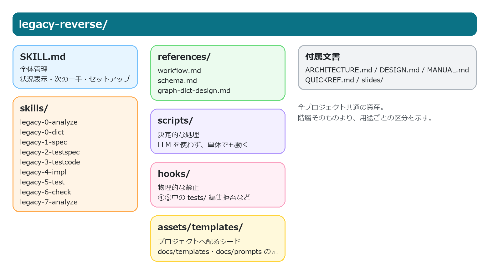
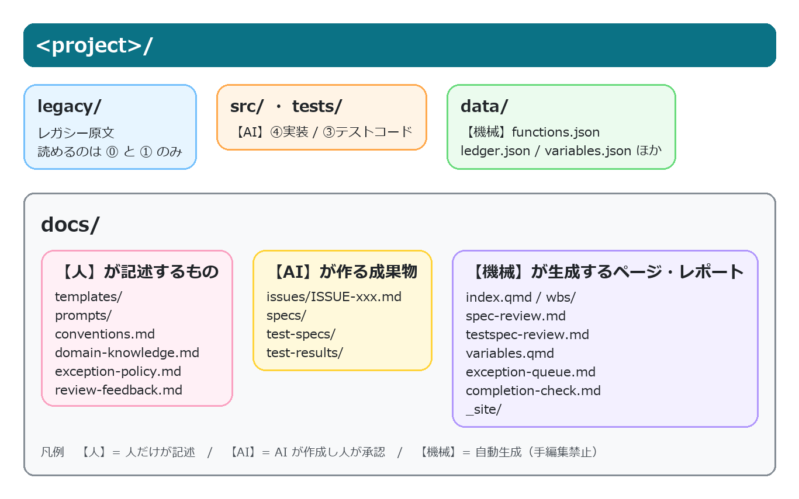
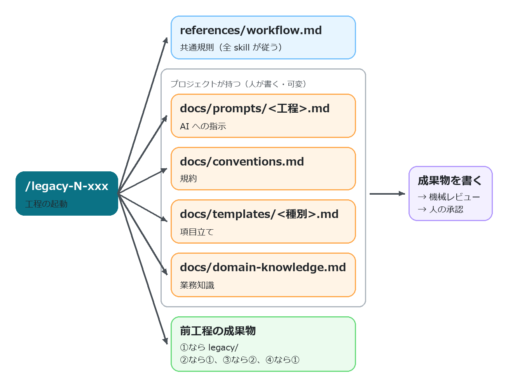

# 1. ツール概要

レガシーコード（Fortran / C / C++ ほか）を Python へ**仕様ベースで移植**する Claude Code skill 群である。

> ⓪解析 → ⓪変数辞書 → ①仕様書 → ②テスト仕様 → ③テストコード → ④実装 → ⑤テスト → ⑥完了検証 → ⑦分析・改善

以下の事項は**全プロジェクト共通であり、プロジェクト側からは変更できない**。

| 項目 | 中身 |
|---|---|
| クリーンルーム分業 | ②③はレガシーを見ない。③は②だけ、④は①だけを入力に作り、⑤で突き合わせる。仕様書の穴はテスト失敗として必ず表面化する |
| ハッシュ連鎖 | ①→②→③が上流のハッシュを持つ。上流を直すと下流が自動で「要再生成（stale⚠）」になる |
| 人の承認ゲート | 仕様の確定・テスト仕様の承認・⑤の裁定は人。AI は「仮説＋Yes/No の問い」で聞き、勝手に確定しない |

: 全プロジェクト共通の固定方針 {#tbl-manual-fixed-policies}

人が担う作業は、**トリガの実行 / 質問への回答 / 承認 / 裁定** の4種である。
そのうえで、**プロジェクト固有の記述方針**を対象プロジェクト側の Markdown に記述して調整する（§4）。
本書は主として、これらの文書群の役割と参照タイミング（§3）を整理する。

| 目的 | 参照先 |
|---|---|
| 初めて使う（操作を順番に） | [slides/index.html](slides/index.html) |
| コマンド即引き | [QUICKREF.md](QUICKREF.md) |
| **構成・参照関係・人が書く MD** | 本書 |
| 層の分け方とスクリプトの責務 | [ARCHITECTURE.md](ARCHITECTURE.md) |
| そう設計した理由 | [DESIGN.md](DESIGN.md) |
| skill が従う規則・データの正 | [references/workflow.md](references/workflow.md) / [references/schema.md](references/schema.md) |

: 文書の役割と参照先 {#tbl-manual-doc-guide}

以降 `<LR>` = skill の置き場所（`<project>/.claude/skills/legacy-reverse`）、
`ledger` = `python <LR>/scripts/ledger.py` の略記とする。

# 2. ディレクトリ構成

## 2.1 skill 側 — 全プロジェクト共通の共通部



- `skills/` 配下の各 skill は工程と1対1に対応する（対応表は §3.1）。レガシー原文を読めるのは
  ⓪と①だけであり、②は①だけ、③は②だけ、④は①だけを入力とする
- `references/` は全 skill が従う共通規則である。`workflow.md` が参照範囲の制約・ハッシュ連鎖・
  承認・ISSUE・共通部とプロジェクト固有部の分離を定める**規則の正**、`schema.md` が
  プロジェクト構成とデータスキーマの**データの正**、`graph-dict-design.md` がグラフ層・
  変数辞書・例外ポリシーの設計である
- `scripts/` は LLM を使わない決定的な処理であり、単体でも実行できる。`hooks/` は物理的な禁止
  （④⑤の実行中は `tests/` の編集を拒否するなど）を担う
- `assets/templates/` はプロジェクトへ配るシードであり、§4 で扱う `docs/templates/`・
  `docs/prompts/` の元になる

各 skill が何を読み・何を呼ぶかは §3.1、スクリプト1本ずつの責務は
[ARCHITECTURE.md](ARCHITECTURE.md) §2 にある。

## 2.2 プロジェクト側 — プロジェクト固有部



各ファイルの内容と、記述の担当は次のとおりである。

| 担当 | パス | 内容 |
|---|---|---|
| — | `legacy/` | レガシー原文（読めるのは⓪と①だけ） |
| 【AI】 | `src/` `tests/` | ④実装 / ③テストコード |
| 【機械】 | `data/` | functions.json・ledger.json・variables.json ほか |
| 【人】 | `docs/templates/` | 仕様書の「項目立て」（spec.md / test-spec.md）← §4.4 |
| 【人】 | `docs/prompts/` | 工程別の「AI への指示」（1-spec / 2-testspec / 3-testcode / 4-impl .md）← §4.5 |
| 【人】 | `docs/conventions.md` | 規約（型対応・丸め・命名・docstring ほか）← §4.2 |
| 【人】 | `docs/domain-knowledge.md` | 業務知識・語彙・ISSUE 回答の蓄積 ← §4.3 |
| 【人】 | `docs/exception-policy.md` | 例外の決定（EP-xxx。`add-policy` コマンドで追記） |
| 【人】 | `docs/review-feedback.md` | 修正依頼（AI が次回起動時に拾う） |
| 【AI】 | `docs/issues/ISSUE-xxx.md` | 本文。「回答（人が記入）」欄だけ【人】 |
| 【AI】 | `docs/specs/` `docs/test-specs/` | ①仕様書 / ②テスト仕様 |
| 【AI】 | `docs/test-results/` | ⑤結果報告書 |
| 【機械】 | `docs/index.qmd` `docs/wbs/` | WBS（進捗のホーム） |
| 【機械】 | `docs/spec-review.md` | ①の一斉レビュー表 |
| 【機械】 | `docs/testspec-review.md` | ②の一斉レビュー表（ケース数・⚠未確定つき） |
| 【機械】 | `docs/variables.qmd` | 変数辞書ページ |
| 【機械】 | `docs/exception-queue.md` | 未決定 hazard の質問キュー |
| 【機械】 | `docs/completion-check.md` | ⑥完了検証レポート |
| 【機械】 | `docs/_site/` | HTML 出力 |

: プロジェクト側の主要ファイルと記述の担当 {#tbl-manual-project-files}

**【人】のファイルに AI は書き込まない**（提案文の提示までにとどまる）。利用者の意思の一次記録を
AI の文章と混ぜないためであり、両者が混在すると「誰が決めたのか」を後から追えなくなる。

# 3. 参照関係 — どの skill が何を読み、何を呼ぶか

## 3.1 skill 一覧（フェーズ・起動のされ方・呼ぶ機械）

skill は工程と1対1である。**どれも起動するのは人**（またはその代理である無人バッチ）であり、
skill が次の skill を自動的に呼ぶことはない。

| skill | フェーズ | 起動のされ方 | 主に呼ぶスクリプト |
|---|---|---|---|
| `legacy-reverse`（親） | 全体管理 | `/legacy-reverse`（迷ったとき・再開時） | `ledger status` `next` |
| `legacy-0-analyze` | ⓪ 解析 | `/legacy-0-analyze` | `extract_fortran` / `extract_c`・`graph`・`hazards`・`variables`・`ledger init-templates` `skeletons` `wbs` |
| `legacy-0-dict` | ⓪ 変数辞書 | `/legacy-0-dict` | `variables.py`（build / list-targets / verify-interp / approve / revise / propagate / page / conflicts） |
| `legacy-1-spec` | ① 仕様書 | `/legacy-1-spec F-xxxx`／`pipeline.py spec`／spec-gap ISSUE を受けた**改訂** | `review_checks spec`・`hazards match`・`ledger skeletons` `verify` `wbs` |
| `legacy-2-testspec` | ② テスト仕様 | `/legacy-2-testspec F-xxxx`／`pipeline.py testspec` | `review_checks testspec`・`ledger hash` `wbs` |
| `legacy-3-testcode` | ③ テストコード | `/legacy-3-testcode F-xxxx`／`pipeline.py testcode` | `pytest`・`collect_results`・`ledger freeze-tests` |
| `legacy-4-impl` | ④ 実装 | `/legacy-4-impl F-xxxx`／`pipeline.py impl` | `check_stubs`・`ledger phase-start` `phase-end` |
| `legacy-5-test` | ⑤ テスト | `/legacy-5-test F-xxxx`／`pipeline.py test` | `pytest`・`collect_results`・`ledger verify` `unblock` |
| `legacy-6-check` | ⑥ 完了検証 | `/legacy-6-check` | `ledger check`・`review_checks all`・`pdf_book` |
| `legacy-7-analyze` | ⑦ 分析・改善 | `/legacy-7-analyze` | `quant_analyze`・`profile_run`・`ledger sphinx-index` |

: 各 skill の起動方法と主な機械処理 {#tbl-manual-skill-phases}

- **フェーズをまたぐ唯一の例外が①の改訂である**。④が「①だけでは実装を決められない」と
  判断すると spec-gap ISSUE を立てて停止し、人が①へ回す（レガシー原文を読めるのは
  ⓪と①だけであり、他の工程は自力で調べに行けない）
- **どの skill も最後に `ledger wbs` と HTML の更新**を行う（§7.1）
- 無人バッチ（`pipeline.py`）は skill の中身を持たず、**`claude -p "/legacy-1-spec F-xxxx"`
  のように skill を1関数ずつ起動する**方式である。チャットで同じ skill を起動した場合と
  同一の実行形態になる

## 3.2 何を読み、何を書くか

工程を起動すると、skill は毎回この順で読む。



| 工程 | 読む（前工程の成果物・共通で `references/workflow.md`） | 読む（人が書いた可変ファイル） | 書く |
|---|---|---|---|
| ⓪ 解析 | legacy/ 全部 | —（この工程で人が conventions.md・語彙・例外ポリシーを書く） | functions.json・骨子・WBS |
| ⓪ 辞書 | 機械が集めた根拠のみ | domain-knowledge.md | variables.json |
| ① 仕様書 | legacy/ 該当関数・functions.json | prompts/1-spec.md・conventions.md・templates/spec.md・domain-knowledge.md | docs/specs/ |
| ② テスト仕様 | ①(reviewed) | prompts/2-testspec.md・conventions.md・templates/test-spec.md・domain-knowledge.md | docs/test-specs/ |
| ③ テストコード | ②(approved) | prompts/3-testcode.md・conventions.md | tests/ |
| ④ 実装 | ①(reviewed) | prompts/4-impl.md・conventions.md | src/ |
| ⑤ テスト | 実行結果・①② | — | docs/test-results/ |
| ⑥ 完了検証 | 全成果物 | — | docs/completion-check.md |
| ⑦ 分析・改善 | src/・計測結果 | conventions.md | docs/analysis.md・施策票 |

: 工程ごとの入力、参照先、出力 {#tbl-manual-phase-io}

読むときの規則は3つである。

- **参照範囲の制約**: 表に無いものは読まない（②③④はレガシー原文を見ない、③は①を見ない、
  ④は②と tests/ を見ない）。参照が必要になった時点でそれは仕様の穴であるため、
  ISSUE を立てて停止する
- **毎回読み直す**: 作り直し・改訂・バッチ実行・無人実行でも同じである。
  「骨子を作ったときの内容」で固定されないため、**あとから可変ファイルを直すと、
  次に動かした関数から反映される**
- **優先順位は 共通要件 ＞ skill の手順 ＞ プロジェクト個別指示**である。
  可変ファイルに土台（§1の3つ・必須項目・禁止事項）を覆す指示があっても、
  AI は従わずに利用者へ報告する

# 4. 人が書くファイル

## 4.1 どこに書くか（置き場所の使い分け）

同じ「AI にどう書かせるか」の指示でも、**作用範囲によって記述先が異なる**。配置先を誤ると、対象工程に反映されない。

| 書きたいこと | 置き場所 | 効く範囲 | いつ書くか |
|---|---|---|---|
| 型の対応・丸め・命名・docstring などの規約 | `docs/conventions.md` | ①②③④ | **⓪で決め切る** |
| 業務知識・略語・区分値・過去の判断 | `docs/domain-knowledge.md` | ⓪①② | **⓪で語彙を先行投入**、以後随時 |
| 0割など例外の扱いの決定 | `docs/exception-policy.md`（`hazards.py add-policy`） | ①②（機械レビューが突合） | **⓪で全件決める** |
| 節を足したい・消したい（仕様書の構成） | `docs/templates/spec.md` `test-spec.md` | ①② | **①（②は②）を始める前**。既定のままでも可だが、後から節を足すと既存の成果物が全件❌になる |
| 重点・書き方の癖・繰り返したくない指摘 | `docs/prompts/<工程>.md` | その工程 | **その工程のバッチを流す前**（次の実行から効く＝書き終えた分には遡らない） |
| この関数のこの箇所だけ直したい | チャット or `docs/review-feedback.md` | その1件 | 気づいたとき |

: 人が記述する指示の配置先と作用範囲 {#tbl-manual-human-docs}

**上の3つは⓪のうちに埋める**（AI が質問リストと記入文を出すので、それを貼って確定するのが
人の作業である）。後続工程への影響は次のとおり。

| ファイル | 後回しにすると |
|---|---|
| `conventions.md` | ②以降の全ケースの期待値の前提なので、覆すと②〜⑤が作り直し |
| `domain-knowledge.md` | ⓪.5 の変数辞書で**一括承認が効かなくなり**、1件ずつ確認する量が増える |
| `exception-policy.md` | 未決定のままだと**①に進めない**（機械レビューが止める） |

: 主要な可変ファイルを後回しにした場合の影響 {#tbl-manual-delay-impact}

これらは**⓪の最初に `ledger init-templates` が雛形をまとめて作る**（既存は上書きしない）。
各ファイルには記入ガイドをコメントで埋め込んであるため、雛形を基点に編集できる。
記入状況は `ledger authored` で一覧できる。

```
✗ 未作成   まだファイルが無い（init-templates で作る）
・ 未記入   雛形のまま（異常ではない。prompts なら「個別指示なし」の意味）
▲ 記入途中 {{…}} のプレースホルダが残っている
✏ 記入あり 人が書いた
```

## 4.2 conventions.md — 規約

⓪で AI が質問リストを出すので、**人が記入して確定する**。節は次のとおり。

型対応表 / 数値の丸め・比較規則 / 単位・スケール / 日付・時刻 / 文字コード・外部ファイル /
既知レガシーバグの扱い / ディレクトリ・命名 / モックの書き方 / テストケースIDの対応付け /
docstring 規約 / 禁止事項

- **後戻りが高くつくのは「丸め・許容誤差・単位・日付・文字コード・既知バグの扱い」である**。
  ②以降で全ケースの期待値の前提になるため、覆すと作り直しになる。⓪で決め切ること
- 判断に迷う場合は、「関数ごとに異なる」ではなく**全体の既定を1つ**先に決める。例外は
  domain-knowledge.md に関数単位で記述し、その記述を優先する

## 4.3 domain-knowledge.md — 業務知識

- ⓪で「語彙・略語集」を先に埋めると、変数辞書の精度が上がる（略語が既知語と
  一致した変数は一括承認候補に回り、1件ずつ確認する量が減る）
- ISSUE に答えた内容は、AI が転記文を提案するので**人が貼って確定する**。
  蓄積により同種の再問い合わせを抑制できる

## 4.4 docs/templates/ — 仕様書の項目立て

`spec.md`（①）と `test-spec.md`（②）は**節の構成と、各節の記入ガイド**である。
骨子生成でこの本文が写され、機械レビューは「テンプレートにある `# 見出し`」を必須節として検査する。
**節を足す・改名する・削除するのは自由**だが、次の**共通要件**だけは変更できない。

| 対象 | 要件 |
|---|---|
| ① 置換マーカー | `LR:IO-TABLES`・`LR:CALLS-TABLE`・`LR:HAZARD-TABLE`（機械が表を差し込む位置） |
| ① 必須見出し | `# 機能詳細` ／ `# 副作用・例外`＋`## 例外・数値特異点` ／ `# 未確定事項` |
| ② 必須見出し | `# トレーサビリティマトリクス` |

: テンプレートで維持する共通要件 {#tbl-manual-template-contract}

- **①（②）を始める前に確定させること**。必須節はテンプレートの `# 見出し` から導かれるため、
  書き始めたあとに節を足すと、既に書かれた成果物が一斉に「必須節がない」＝機械レビュー❌になる
  （承認できない状態。本文を捨てずに直す手段は `ledger migrate-specs` のような個別救済しかない）
- 節の見出し行末に `LR:OPTIONAL`（HTML コメント形式）を付けると**任意節**になる
- 直したら `python <LR>/scripts/review_checks.py template --root .` で要件を確認できる
  （骨子生成も要件違反なら停止する）
- 記入ガイドは HTML コメントで書く。AI は充填後にガイドを削除する

## 4.5 docs/prompts/ — 工程別のAIへの指示

①〜④に1ファイルずつ、**起動のたびに読み込まれる追加指示**である。用意されている節は次のとおり。

**重点** / **用語・表記の約束** / **繰り返さないでほしい指摘** / **手本にする成果物**

```bash
ledger init-templates    # 雛形を配置（⓪の最初。既存は上書きしない）
ledger authored          # 人が書くファイルの記入状況を一覧
```

- **雛形のまま（案内コメントだけ）なら「個別指示なし」**として扱われる。
  必要な工程だけ書けばよい
- 記述対象は「**どう書くか**」に限られる。工程の順序・読んでよい入力・必須項目・
  承認の要否は変更できない（各ファイルの冒頭に「ここに書いても効かないもの」を明記している）
- **手本にする成果物**の指定が最も効果的である。「粒度はこの仕様書に揃える」と1行書くほうが、
  抽象的な指示を冗長に記述するより整合しやすい

> **使い方のコツ**: レビューで**2回同じ指摘をしたら**、その内容を「繰り返さないでほしい指摘」に
> 1行追記する。3回目以降の再指摘を抑制できる。
> 逆に、単発の修正はチャットで伝えれば十分である（恒久化しすぎると指示が肥大化する）。

## 4.6 共通のルール

- **AI は【人】のファイルを書き換えない**。修正したほうがよいと判断した場合は提案文を出すため、
  採否は人が決める
- 修正した内容は**次にその工程を動かした関数から**適用される。既に完成した成果物は
  自動では書き換わらない（作り直すと反映される）
- 何をどこに書いたかは、`ledger authored` と `git diff` で追える。
  可変ファイルはすべてプロジェクトの git 管理下に置くこと

# 5. skill 側を触る人へ

「どのプロジェクトでも同じようにしたい」ものだけが skill 側の対象である。
1つのプロジェクトの都合は §4 に記述する。

| 直したいこと | 直す場所 |
|---|---|
| 工程の手順・禁止事項 | `skills/legacy-*/SKILL.md` |
| 全工程に効く規則（参照範囲の制約・承認・ISSUE 運用） | `references/workflow.md` |
| データの形・ディレクトリ構成 | `references/schema.md` |
| 機械の判定（検査・台帳・抽出） | `scripts/*.py` |
| 配布する雛形の初期内容 | `assets/templates/`（`prompts/` 含む） |

: skill 側で修正すべき対象の切り分け {#tbl-manual-skill-scope}

守るべき約束が2つある。

1. **skill に「規約の実体」を書かない**。「docstring は Google スタイル」のような
   プロジェクトごとに変わる内容を skill に書くと、conventions.md を直しても反映されなくなる。
   skill からは**節の名前で参照する**にとどめる
2. **直したら機械レビューを通す**。文書とスクリプトの食い違い（削除したスクリプトへの参照、
   実在しないコマンド・オプション）を検出する

```bash
python <LR>/scripts/check_skill.py          # 指摘は file:line と直し方つき
python <LR>/scripts/check_skill.py --json   # AI に直させるとき
```

NG が出たら**ゼロになるまで直す**。原則は「スクリプトの argparse が正、文書を合わせる」である。
回帰テストは `scripts/selftest/` にある。

# 6. 工程ごとの要点

起動はすべて人である（AI が自動的に次の工程へ進むことはない）。

| 工程 | 起動 | 人が行う作業 | 完了条件（機械判定） |
|---|---|---|---|
| ⓪ 解析 | `/legacy-0-analyze` | ヒアリングに答え、**conventions.md・domain-knowledge.md（語彙）・exception-policy.md** を埋める（§4.1） | 抽出の完全性突合＋例外ポリシー全件決定 |
| ⓪ 辞書 | `/legacy-0-dict` | 語義を承認（A/B は一括、C/D は直して承認） | 全変数 approved |
| ① 仕様書 | `/legacy-1-spec F-xxxx` | 内容をレビューして OK / 修正指示 | status: reviewed |
| ② テスト仕様 | `/legacy-2-testspec F-xxxx` | ⚠未確定に答えて承認 | status: approved |
| ③ テストコード | `/legacy-3-testcode F-xxxx` | （基本なし） | ケースIDとテストの突合 |
| ④ 実装 | `/legacy-4-impl F-xxxx` | （基本なし） | スタブ検知ゼロ |
| ⑤ テスト | `/legacy-5-test F-xxxx` | fail が3回続いたら裁定 | 実装率100%・失敗0 |
| ⑥ 完了検証 | `/legacy-6-check` | 不足の埋め戻しを指示 | 全関数 pass |
| ⑦ 分析・改善 | `/legacy-7-analyze` | `bench.py` を用意し、施策を承認 | テスト全pass維持 |

: 工程ごとの起動方法、人の作業、完了条件 {#tbl-manual-phase-summary}

## 6.1 無人バッチ（pipeline.py）の挙動

複数の関数を連続処理する場合は `pipeline.py` を使用する。利用者向けの主なサブコマンドは 7 つである。

**工程別の実行サブコマンドは `spec` / `testspec` / `testcode` / `impl` / `test` の5つ**であり、①〜⑤を個別に処理できる。これに工程横断の `run` と優先度制御の `priority` を加えた構成である。

| コマンド | 対象 | 使いどころ |
|---|---|---|
| `pipeline.py spec` | ①だけを全件 | ①を全部 draft にして、一斉レビュー表でまとめて承認する |
| `pipeline.py testspec` | ②だけを全件 | ①の承認が済んだ関数の②を全部作り、まとめて承認する |
| `pipeline.py testcode` | ③だけを全件 | ②の承認が済んだ関数の③を全部書く |
| `pipeline.py impl` | ④だけを全件 | ③が終わった関数の④を全部書く |
| `pipeline.py test` | ⑤だけを全件 | ④が終わった関数のテストを全部流す |
| `pipeline.py run` | ①〜⑤を工程横断 | 承認済みの関数から②③④⑤へ**自動で次工程へ進む**。承認待ち・裁定待ちはスキップ |
| `pipeline.py priority` | ⭐優先の設定・一覧 | **実行中でも**割り込み順を変えられる（次の1件から効く） |

: `pipeline.py` の主要サブコマンドと用途 {#tbl-manual-pipeline-subcommands}

工程別コマンドと `run` の使い分けは、「**承認をまとめるか、連続処理するか**」である。
承認ゲートのある①②は工程別で回して溜まったところで一斉承認し、③④⑤は `run` に任せて
連続処理する、という運用が基本形になる。

②〜⑤の工程別コマンドは `run --only <工程>` と等価である（実体は同じエンジン）。
①の `spec` だけは2000関数規模向けの専用ドライバであり、**書きかけ（機械レビューNGの draft）の
修復を先に**行い、対象の再走査をチャンク境界に間引く（`run` は1件ごとに全関数を
再走査するため、実行中の承認・⭐を即座に拾える代わりに大規模では重くなる）。

以下は実行系サブコマンド（`spec` / `testspec` / `testcode` / `impl` / `test` / `run`）に共通する性質である。

- **1関数 = 1つの新しい headless プロセス**（`claude -p "/legacy-1-spec F-xxxx"`）である。
  各試行のコンテキストが独立するため、何千関数でも1件あたりのトークン量は一定である
- **完了判定は AI の申告ではなくファイルの状態**（status が draft になったか、機械レビューが
  NG ゼロか）である。NG ならリトライし、それでも解消しない場合はそのセッション中はスキップする
- **中断・再開は同じコマンド**である。Ctrl-C でも電源断でも、進捗はファイル側にあるため続きから進む
- **レート制限は失敗に数えず**指数バックオフで待つ（既定の待ち上限は合計6時間）。
  1関数のタイムアウトは既定30分であり、**連続3件失敗したら環境異常とみなして停止する**
- 進捗は `/pipeline.html`（閲覧サイト）でライブに確認できる。実行中でも人は並行して承認できる
- ログは `.legacy-reverse/agent-logs/<fid>.txt`（応答全文）と
  `.legacy-reverse/pipeline-log.jsonl`（1行1試行）である。失敗の一次情報はここにある

```bash
python <LR>/scripts/pipeline.py run      --root . --dry-run        # 対象と実行順の確認だけ
python <LR>/scripts/pipeline.py spec     --root . --max-funcs 200  # ①を200件まで
python <LR>/scripts/pipeline.py testspec --root .                  # ②だけ全件
python <LR>/scripts/pipeline.py impl     --root . --flow 月次バッチ  # ④をそのフローだけ
python <LR>/scripts/pipeline.py priority F-0012 --root .           # F-0012 に割り込ませる
```

AI が生成した成果物は、人が確認する前に機械の検査を通る。

| 検査 | 落とすもの |
|---|---|
| ① の機械レビュー | 実在しない行番号の引用・根拠なしの🟢・書きかけ・必須節の欠落・例外の検討漏れ |
| ② の機械レビュー | 🟢仕様項目のケース漏れ・存在しない仕様IDの参照・⚠未確定の残り |
| ③ の突合 | テストケースIDとテスト関数の過不足 |
| ④ のスタブ検知 | 空実装・NotImplementedError・TODO |
| ⑤ 実行前の検証 | 上流改訂の伝搬漏れ（stale）・freeze 後のテスト改変 |

: 生成成果物に対する主要な機械検査 {#tbl-manual-quality-gates}

# 7. 操作の入口と画面

**画面（HTML サイト）は閲覧専用である**。実行・承認のボタンは無い。
返答チャネルは3つで、いずれも同一の状態遷移を引き起こす。

| チャネル | やり方 |
|---|---|
| チャット | 「F-0012 OK」「F-0012 修正: 〜」「ISSUE-004 は Yes」 |
| ファイル記入 | ISSUE の「回答（人が記入）」欄・`docs/review-feedback.md` に書く（次回起動時に AI が拾う） |
| CLI | `review_actions.py approve` / `request-changes` / `adjudicate`、`variables.py approve` / `revise`、`hazards.py add-policy`、`ledger unblock` |

: 操作結果を返す 3 つのチャネル {#tbl-manual-response-channels}


## 7.1 HTML の作られ方（render_site.py）

`docs/` の Markdown を Quarto で HTML サイト（`docs/_site/`）にする。トップは WBS である。

```bash
python <LR>/scripts/render_site.py --root .            # 差分レンダ（既定）
python <LR>/scripts/render_site.py --root . --full     # 全ページ＋サイト内検索の索引を作り直す
python <LR>/scripts/serve_site.py --root .             # 閲覧（127.0.0.1 のみ・GET だけ）
python <LR>/scripts/build_viewer.py --root .           # レビューアへ配る単体EXE（相手に環境不要）
```

- **実行タイミングは自動である**。各 skill が工程の最後に、無人バッチはチャンクの区切りと
  終了時に実行する。利用者が手動で実行するのは、直ちに確認したい場合に限られる
- **差分レンダが既定である**（変わったページだけ。数十秒）。ただし差分では検索索引が更新されないため、
  節目で `--full` を1回流す
- **`quarto render docs` を直接実行しないこと**。図（Mermaid）が描画されない。
  render_site.py は `_sitework/` に `.qmd` の影コピーを作ってからレンダリングする
- 人の対応が要るページには、**案内パネル**（機械レビューの結果と「どう返答するか」）を
  本文の先頭に焼き込む。ボタンではなく案内だけであるため、画面は閲覧専用のままである
- **render_site.py が作るのは HTML だけ**である。WBS（`docs/index.qmd`）は `ledger wbs`、
  一斉レビュー表（`docs/spec-review.md` / `docs/testspec-review.md`）は
  `review_checks.py report` が作る。元の Markdown が古ければ HTML も古いまま出る
- `docs/templates/` と `docs/prompts/` は掲載しない（成果物ではなく設定のため）
- ④の docstring は Sphinx で「新コード詳細(API)」として `docs/_site/api` に、
  種別ごとの合本 PDF は `pdf_book.py` で別に作る（§8.7）
- 配信範囲はローカル PC 内に限定される。ポートはプロジェクトごとに固定であるため
  ブックマークできる

# 8. 人が直接実行するスクリプト

スクリプトは `<LR>/scripts/` にあり、**対象プロジェクトのルートで実行する**（`--root` で対象を
変更できる）。いずれも LLM を使わない決定的な処理であり、実行してもトークンを消費しない。
工程の中では skill が自動的に呼ぶが、**同じものを人が直接叩いてもよい**。画面に出る情報は
すべて CLI からも取れる（§7 の「CLI」チャネル）。

| スクリプト | 何をするもの | 人が叩く場面 | 詳細 |
|---|---|---|---|
| `pipeline.py` | 無人バッチ実行ドライバ | ①〜⑤をまとめて回す | §6.1 |
| `ledger.py` | 台帳（状態・対象・ハッシュ連鎖） | 進捗確認、次の関数、対象の増減 | §8.1 |
| `review_actions.py` | 承認・修正依頼・裁定 | チャットを使わず CLI で返答する | §8.2 |
| `review_checks.py` | 機械レビュー・一斉レビュー表 | 承認前に自分で検査する、テンプレートを直した後 | §8.3 |
| `variables.py` | 変数辞書 | 語義の承認・修正 | §8.4 |
| `hazards.py` | 例外ポリシー | 0割などの決定を登録する | §8.4 |
| `graph.py` | コールグラフの照会 | 影響範囲・到達不能関数を調べる | §8.5 |
| `extract_fortran.py` / `extract_c.py` | ⓪の機械抽出 | レガシー原文が増えた、抽出をやり直す | §8.6 |
| `render_site.py` | HTML サイトの生成 | 直ちに画面を最新にする | §7.1 |
| `serve_site.py` / `build_viewer.py` / `pdf_book.py` | 閲覧・配布・合本 PDF | 画面を開く、レビューアへ配る | §8.7 |
| `quant_analyze.py` / `profile_run.py` | ⑦の定量計測 | 改善の前後を測る | §8.8 |
| `check_skill.py` | skill 自身の整合性チェック | skill を直したとき | §5 |

: 人が直接実行するスクリプトの一覧 {#tbl-manual-scripts}

`check_stubs.py`・`collect_results.py`・`tc_report_plugin.py` は工程の途中で skill が呼ぶ部品であり、
人が直接叩く場面は基本的に無い。

## 8.1 ledger.py — 台帳（状態の確認と対象の管理）

`data/functions.json`・`data/ledger.json` と各成果物のフロントマターを正として、WBS・骨子・
ハッシュ連鎖・ブロック状態・⑥完了検証を扱う。**触るのは状態であり、成果物の本文は書き換えない**。

```bash
ledger status --summary                     # 全体の進捗を数行で
ledger status F-0012 --json                 # 1関数のフェーズ状況（機械可読）
ledger next --limit 5                       # 次に着手すべき関数（トポロジカル順）
ledger next --flow 月次バッチ --skip-draft   # フローに絞り、人のレビュー待ちを除く
ledger authored                             # 人が書くファイルの記入状況（§4.1）
ledger verify F-0012                        # ハッシュ連鎖（①→②、③）の検証
ledger wbs                                  # docs/index.qmd を作り直す
ledger audit                                # ①の対象件数が WBS と合わないときの内訳
```

- **対象の増減**: `ledger add <名前>` で後追い追加、`ledger exclude F-0012 --reason "…"` で
  移植対象から外す（物理削除はしない。`ledger include F-0012` で戻す）。エントリから
  到達不能な関数をまとめて外すなら `ledger exclude --dead`
- **作業スコープ**: `ledger flow add <名前> --entry F-0001` でフローを定義すると、
  `ledger next --flow` と `pipeline.py --flow` の対象がその到達集合に限定される
- **停止と再開**: ⑤で裁定待ちになった関数は `ledger unblock F-0012` で再開する
- **数が合わないとき**: `ledger audit` が全関数を「なぜ①の対象に入らないか」で
  分類して数える（骨子なし・dict-gate・blocked・draft 待ち・reviewed）。
  判定はバッチと同じ実装を呼ぶので、内訳とバッチの見え方は必ず一致する。
  WBS の「関数数」は excluded を**引いた後**の数なので、除外分を足すと二重に数えることになる
- `ledger check` が⑥完了検証で、不備があれば exit 1 を返す
- テンプレートを直した後の既存仕様書の救済は `ledger migrate-specs --dry-run` で影響を
  確かめてから実行する（本文と記入済みの欄は触らない）

## 8.2 review_actions.py — 承認・修正依頼・裁定

①②の承認と⑤の裁定を行う。**どの入口から来ても、承認の前に機械レビューを再検証する**ため、
NG が残る成果物は CLI からも承認できない。承認・裁定の後は WBS・一斉レビュー表・サイトの
再生成まで自動で行う。

```bash
python <LR>/scripts/review_actions.py approve spec F-0012 --by 山田 --root .
python <LR>/scripts/review_actions.py approve testspec F-0012 --by 山田 --root .
python <LR>/scripts/review_actions.py request-changes spec F-0012 --by 山田 --comment "単位の根拠が無い" --root .
python <LR>/scripts/review_actions.py adjudicate F-0012 --issue ISSUE-004 --by 山田 --comment "レガシー側のバグ。新実装を正とする" --root .
```

- `--by` は必須である（誰が決めたかを成果物に残すため）
- 検査を増やした版へ移行するときは `demote-ng spec` で、機械レビューNGの承認済み成果物だけを
  承認前の状態に戻せる
- 変数辞書の承認は `variables.py` が同じ役割を担う（§8.4）

## 8.3 review_checks.py — 機械レビューと一斉レビュー表

LLM が書いた①②を、LLM を使わずに検証する関門。exit 0 = 問題なし / 1 = 問題あり。
`--json` で機械可読出力になる。

```bash
python <LR>/scripts/review_checks.py spec F-0012 --root .      # ①を1件
python <LR>/scripts/review_checks.py testspec F-0012 --root .  # ②を1件
python <LR>/scripts/review_checks.py all --root .              # 全関数を状態に応じて
python <LR>/scripts/review_checks.py report --root .           # 一斉レビュー表を作り直す
python <LR>/scripts/review_checks.py template --root .         # テンプレートの共通要件（§4.4）
```

- `report` は人の承認待ちを1枚にまとめる（① → `docs/spec-review.md`、
  ② → `docs/testspec-review.md`）。バッチ実行後にまとめてレビューするときの入口である
- **この表は `render_site.py` では更新されない**。render は Markdown を HTML にするだけで、
  表の中身を作るのは `report` である（ほかに `review_actions.py` の承認・修正依頼と
  `pipeline.py` が自動で呼ぶ）。仕様書を1件書いてレンダリングしただけでは表は古いまま残る
- 落とす内容は §6.1 の表のとおりで、根拠 `file:lines` の実在検証、🟢 の根拠の有無、
  必須節の欠落、hazard の検討漏れ、②のトレーサビリティなどを見る

## 8.4 variables.py / hazards.py — 変数辞書と例外ポリシー

どちらも**機械が正、人が承認**という形をとる。列挙・根拠収集・突合はスクリプトが決定的に行い、
意味づけと決定だけが人（と AI の提案）の仕事である。

```bash
python <LR>/scripts/variables.py build --root .                        # 辞書を生成/マージ
python <LR>/scripts/variables.py approve V-0001,V-0002 --by 山田 --root .
python <LR>/scripts/variables.py revise V-0003 --desc "流量" --unit "m3/s" --by 山田 --root .
python <LR>/scripts/variables.py propagate --root .                    # 承認済みを functions.json へ転記
python <LR>/scripts/variables.py conflicts --root .                    # 仕様書と辞書の矛盾候補
```

- 再 `build` は常にマージであり、`V-xxxx` は不変、承認済みの語義も保たれる
- 未承認の語義が残る関数は①に進めない（dict-gate）。外すなら `ledger next --no-dict-gate`

```bash
python <LR>/scripts/hazards.py status --root .    # 決定済み/未決定の件数
python <LR>/scripts/hazards.py match --root .     # 突合し、未決定を docs/exception-queue.md へ
python <LR>/scripts/hazards.py add-policy --kind div_by_var --func F-0012 --decision guard_raise --note "分母0は入力誤り" --by 山田 --root .
```

- 適用範囲は 全体既定 → 関数 → 個別 hazard の順で、より個別なものが勝つ
- `add-policy` は `docs/exception-policy.md` に EP 行を追記し、そのまま再突合する。
  `docs/exception-policy.md` は【人】のファイルなので、AI ではなくこのコマンドか人が書く

## 8.5 graph.py — コールグラフの照会

`data/functions.json` から毎回グラフを構築して答える導出層である。外部依存なし・LLM 不使用で、
グラフを保存しないため「古いグラフを見ていた」が起きない。

```bash
python <LR>/scripts/graph.py callers F-0012 --transitive --root .   # 影響範囲（逆方向）
python <LR>/scripts/graph.py reachable F-0001 --root .              # 到達可能集合
python <LR>/scripts/graph.py between F-0001 F-0120 --root .         # 最短経路
python <LR>/scripts/graph.py dead --root .                          # 到達不能な関数の候補
python <LR>/scripts/graph.py cycles --root .                        # 循環（SCC）
python <LR>/scripts/graph.py summary --root .                       # 規模・到達率・dead 件数
```

- `dead` は候補を挙げるだけで、除外そのものは行わない（実行は `ledger exclude`）
- `--json` を付けると機械可読出力になる

## 8.6 extract_fortran.py / extract_c.py — ⓪の機械抽出

レガシー原文を静的解析して `data/functions.json` を生成・更新する。**再実行は常にマージ**で、
`F-xxxx` は不変、既に人や AI が直した記述も保持される。2000関数規模でも「途中でやり直したら
採番が変わった」が起きない。

```bash
python <LR>/scripts/extract_fortran.py --root . --package newpkg           # ドライラン（要約のみ）
python <LR>/scripts/extract_fortran.py --root . --package newpkg --write   # functions.json に反映
python <LR>/scripts/extract_c.py --root . --package newpkg --write
```

- **`--write` を付けないと反映されない**。既定はドライランである
- 件数を2系統（状態機械パースと単純行カウント）で突合した結果は
  `data/extract-report.json` に残る。`completeness_mismatches` と `unresolved_calls` は
  人が確認する項目である
- Fortran の `CALL FOO` と C の `foo` / `foo_` は突合器が自動でリンクする。
  片方の抽出時点で未解決だった呼び出し名は、もう片方が走った時点でリンクされる

## 8.7 serve_site.py / build_viewer.py / pdf_book.py — 閲覧と配布

サイトそのものの生成は `render_site.py`（§7.1）が担う。ここで扱うのは見せ方と配布である。

```bash
python <LR>/scripts/serve_site.py --root . --watch                 # 変更を監視して作り直しつつ配信
python <LR>/scripts/build_viewer.py --root . --name wbs            # 単体EXE（相手に環境不要）
python <LR>/scripts/pdf_book.py specs --root . --output pdf/関数仕様書.pdf --title 関数仕様書
```

- `serve_site.py` は **GET だけ**を返す（既定は 127.0.0.1 に bind。LAN へ出すなら `--host 0.0.0.0`）。
  ポートはプロジェクト名から固定されるためブックマークできる
- `build_viewer.py` はサイトを同梱した単体実行ファイルを作る。Python も Quarto も無い相手に
  レビューを頼むときに使う
- `pdf_book.py` の対象は `specs` / `test-specs` / `test-results` の3種である。
  `quarto-typst-pdf` skill を `<LR>` の隣に置く必要がある（HTML だけなら不要）

## 8.8 quant_analyze.py / profile_run.py — ⑦の定量計測

⑦で使う計測系で、いずれも LLM を使わず既存ツール（cProfile・radon・ruff・bandit・pip-audit）を回す。

```bash
python <LR>/scripts/quant_analyze.py --root .                        # 静的指標をまとめる
python <LR>/scripts/profile_run.py --root . --script bench.py --top 30
```

- `--script` を省くと `pytest tests` を代表ワークロードとして計測する
- 出力は計測値だけであり、施策の採否は人が決める（§6 の⑦の行）

# 9. セットアップ

1. Claude Code CLI・Python 3.10+・git・Quarto を用意する
2. skill を配置する（2行とも必要。2行目は `/legacy-1-spec` を認識させるため）
   ```bash
   cp -r legacy-reverse          <project>/.claude/skills/
   cp -r legacy-reverse/skills/* <project>/.claude/skills/
   ```
3. `hooks/settings-example.json` を `<project>/.claude/settings.json` にマージする（安全装置）
4. `ledger init-templates` で人が書くファイル一式の雛形を置く（⓪の中でも実行される）
5. `/legacy-reverse` で状態を確認し、`/legacy-0-analyze` から始める

MCP サーバ（`mcp-servers/legacy-reverse-mcp`）の登録は任意である。登録すると
スクリプトが型付きツールとして呼ばれ、許可プロンプトとシェルの事故が減る。

# 10. トラブルシューティング

パイプラインの構造を前提に、運用中に遭遇しやすい症状を列挙する
（多くは正常動作に起因する表示である）。

| 症状 | 意味 | 対処 |
|---|---|---|
| ⛔ ISSUE-xxx が付いた | ④⑤ループが上限に達し、裁定待ちで停止 | ISSUE に答える → `ledger unblock F-xxxx` → ⑤を再トリガ |
| stale⚠ が出た | 上流（①）が改訂され、下流（②）が古い | ②を再生成して再承認。ハッシュ連鎖の正常動作 |
| ⚠改変 が出た | freeze 後にテストコードが変わった | 意図した変更なら③で再 freeze。心当たりが無ければ調査 |
| tests/ の編集が拒否された | hook が正常動作している（④⑤中はテストを守る） | テスト側の疑義は ISSUE → 人の承認 → ②③の再生成が正規経路 |
| 機械レビューNGと言われて承認できない | ハルシネーション・省略を検知（正常動作） | NG の理由を読み、AI に自己修正させてから承認する。承認はどの入口でも同じく拒否される |
| 無人バッチで、応答はあるのにファイルが更新されない | headless がツールの実行許可を得られていない | `settings.json` の permissions.allow を広げるか、閉じた環境なら `--skip-permissions` を付ける |
| バッチが「データ異常のため停止」 | `data/*.json` が壊れている | `git diff data/functions.json` で直前の変更を確認して修復。hook（guard_json.py）を入れておくと、壊れる前に AI へ差し戻される |
| 連続実行が「連続3件失敗」で止まった | 環境異常の疑いで安全停止 | ログで API キー・レート・claude の解決を確認してから再開 |
| 図がソースのまま表示される | `quarto render docs` を直接叩いた | `render_site.py` で出し直す（Mermaid は影コピー経由でのみ描画される） |
| サイト内検索に新しいページが出ない | 差分レンダは検索索引を更新しない | 節目で `python <LR>/scripts/render_site.py --root . --full` を1回 |

: 代表的な運用上の症状と対処 {#tbl-manual-troubleshooting}

# 付録: 用語

| 語 | 意味 |
|---|---|
| func-id（F-xxxx） | 関数の通し番号。全成果物がこれで紐づく |
| SPEC-xxxx-NN | 仕様書の機能詳細1項目の見出しID。②のケースがこれを参照する |
| Confidence 🟢🟡🔴 | 確認済み / 推測 / 仮定。🟢 にはレガシー行番号の根拠が必須 |
| stale⚠ | 上流が改訂されて下流が古くなった状態。再生成が要る |
| ⛔ blocked | 人の裁定待ちで停止中。ISSUE に答えて `ledger unblock` で再開 |
| EP-xxx | 例外ポリシーの登録番号（0割などの扱いの決定） |
| V-xxxx | 変数辞書の語義ID。仕様書の IO 表に `[V-xxxx]` として転記される |
| dict-gate | 語義が未承認の関数の①を止める仕組み |

: 本書で用いる主要な用語 {#tbl-manual-terms}
