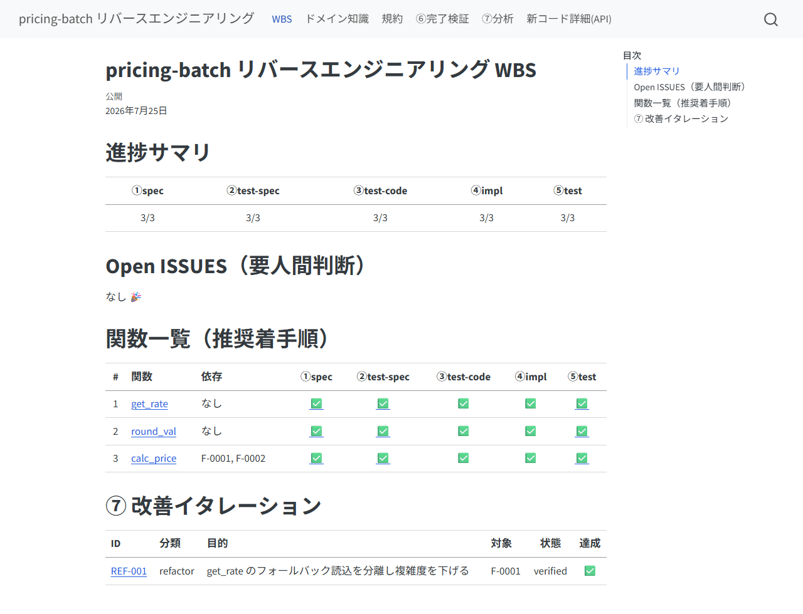
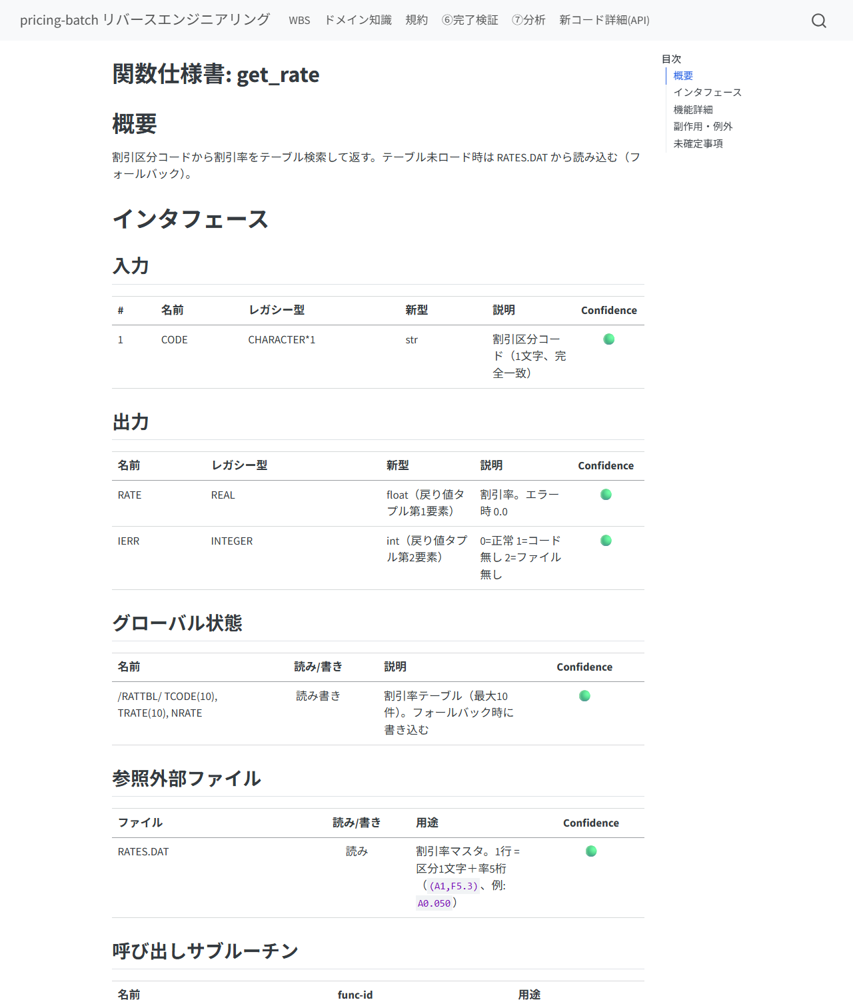
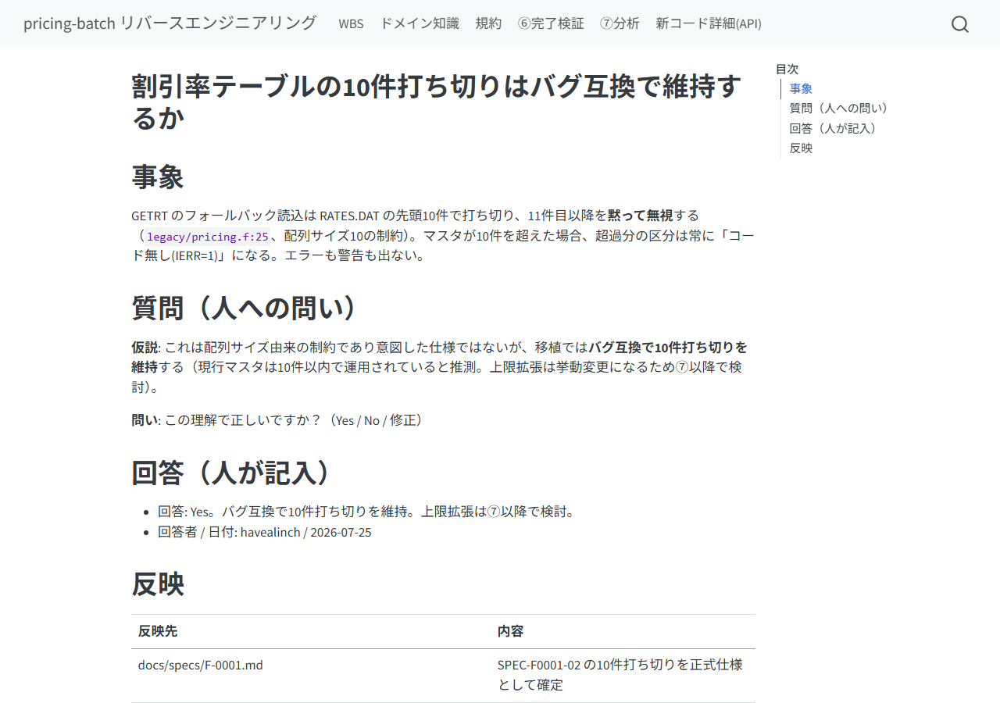
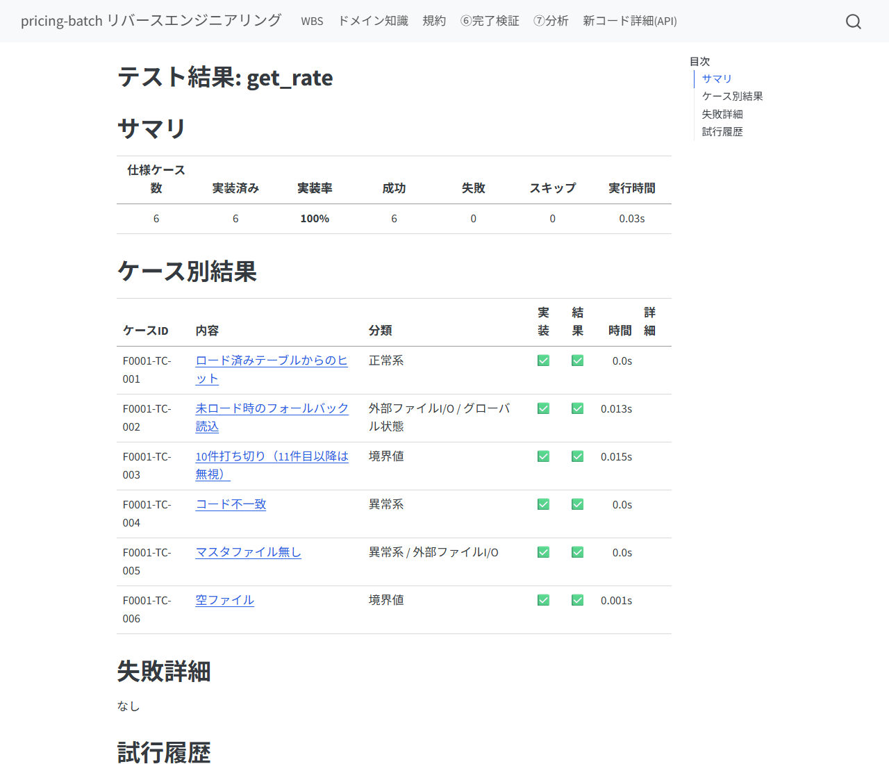
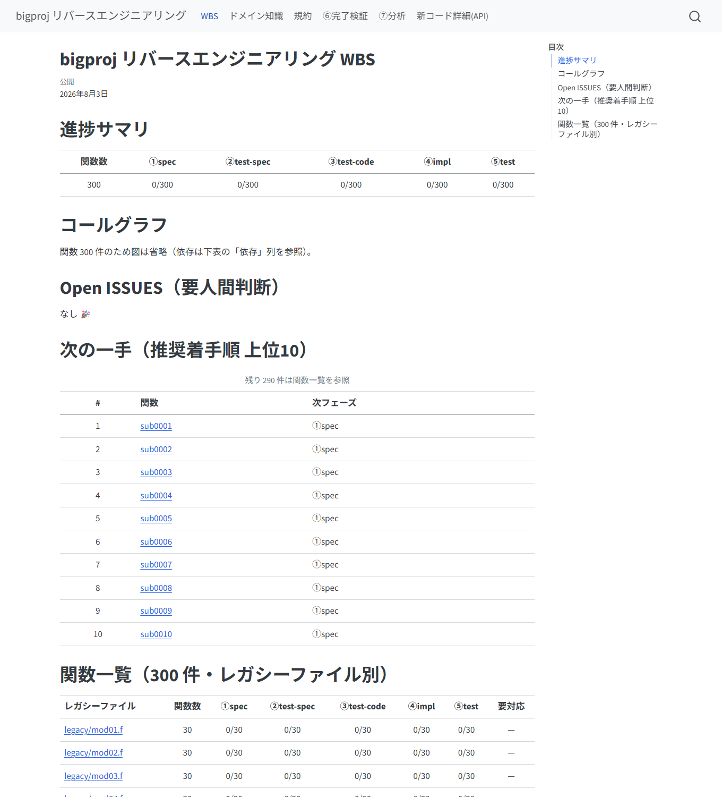
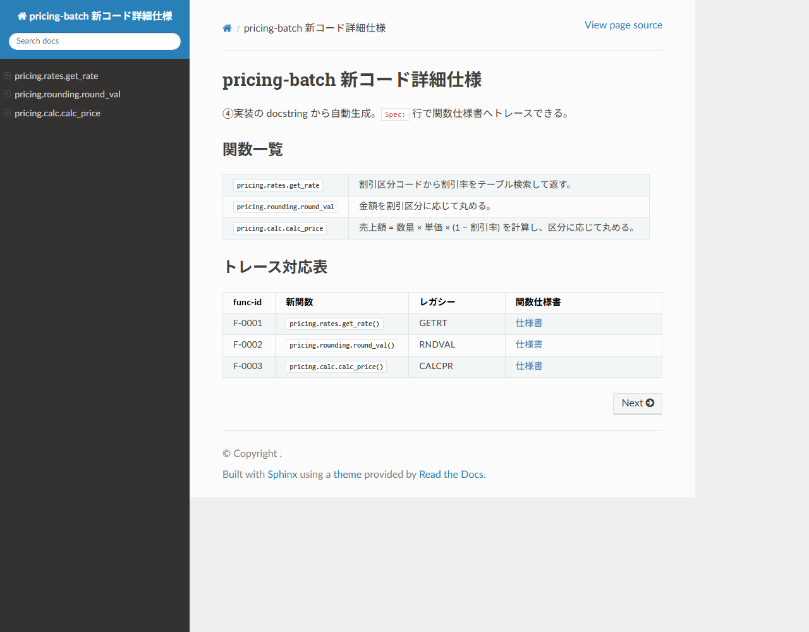
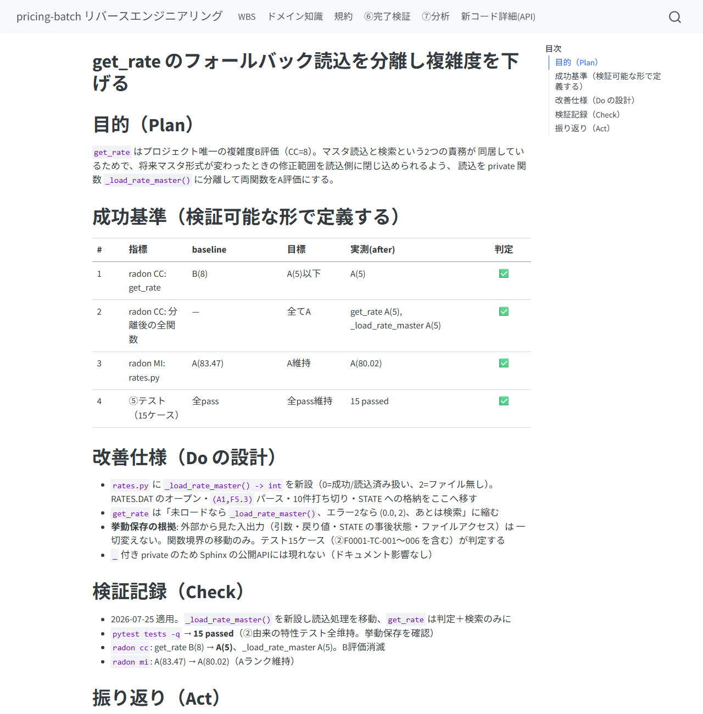

# このパイプラインは何か

レガシーコード（Fortran / C# など）を Python へ**仕様ベースで移植**するための、
Claude Code skill 群です。関数を1つずつ、次の流れで進めます。

> ⓪リポジトリ解析 → ①関数仕様書 → ②テスト仕様書 → ③テストコード → ④実装
> → ⑤テスト → ⑥完了検証 → ⑦分析・改善

設計の柱は5つあります。

1. **クリーンルーム分業** — ②③はレガシー原文を見ない。③は「②＋規約」だけ、
   ④は「①＋規約」だけを入力に作られる。独立に作ったテストと実装を⑤で突き合わせる
   ことで、仕様書の穴が機械的に炙り出される。
2. **ハッシュ連鎖** — ①→②→③の各成果物は上流のハッシュを記録している。
   上流が改訂されると下流が自動的に「要再生成（stale⚠）」になり、伝搬漏れが起きない。
3. **人の承認ゲート** — 仕様の確定・テスト仕様の承認・裁定は必ず人が行う。
   AIは「仮説＋Yes/Noの問い」の形で判断材料を出し、勝手に確定しない。
4. **機械が正、AIは意味づけ** — 関数の列挙（⓪）は静的解析プログラムが行い、
   AIの成果物（①②）は人に届く前に機械レビュー（根拠引用の実在検証・省略検知・
   トレーサビリティ突合）を通る。「もっともらしいが根拠のない記述」は
   あなたの目に触れる前に機械が落とす（詳細は「品質ゲート」の章）。
5. **挙動保存の改善（⑦）** — 移植完了後の高速化・リファクタリングは、
   ③のテスト資産を安全網に「テスト全pass維持」を絶対条件として行う。

**あなた（人）の仕事は「トリガを引く」「質問に答える」「承認する」「裁定する」の4つ**です。
コードや文書を直接書く必要は基本的にありません（書いてもよい場所は後述）。

> 初めての人は [slides/index.html](slides/index.html)（スライド版・ブラウザで開くだけ）で
> ⓪→⑦を順に体験しながら覚えるのが早道です。作業中に手元へ置くコマンド一覧は
> [QUICKREF.md](QUICKREF.md)（1枚）。本書は背景と操作の意味を説明する「ドキュメント版」です。



# セットアップ

## 1. skill の配置

対象プロジェクトに skills リポジトリから次をコピーします。

```bash
cp -r skills/legacy-reverse        <project>/.claude/skills/
cp -r skills/legacy-reverse/skills/* <project>/.claude/skills/
```

## 2. hook の登録（必須）

`legacy-reverse/hooks/settings-example.json` の内容を `<project>/.claude/settings.json` に
マージします。これは④⑤フェーズ中の `tests/` 編集を機械的に拒否する安全装置で、
「AIがテストを書き換えて通す」事故をプロンプトではなく仕組みで防ぎます。

## 3. MCP サーバの登録（推奨）

`<project>/.mcp.json` に次を追加すると、台帳操作・テスト実行などの機械処理が
型付きツールになり、許可プロンプトが減って安定します（未登録でも動作は同じ）。

```json
{
  "mcpServers": {
    "legacy-reverse": {
      "command": "python",
      "args": ["<skillsリポジトリ>/mcp-servers/legacy-reverse-mcp/server.py"]
    }
  }
}
```

## 4. ツール類

- **Quarto**（HTML/PDF出力）: 未導入なら quarto-typst-pdf skill の
  `qtpdf.py install` でポータブル導入（管理者権限不要）
- **Chromium 系ブラウザ**（Chrome/Edge 等）: PDF に Mermaid 図を焼き込むのに使います。
  HTML だけなら不要（`qtpdf.py doctor` で有無を確認できます）
- **Python パッケージ**: `pip install pytest sphinx sphinx-rtd-theme`
  （⑦では追加で `radon ruff bandit pip-audit`）

## 5. 開始

Claude Code で `/legacy-reverse` を実行すると、セットアップ状態を確認して
次の一手を案内します。新規なら `/legacy-0-analyze` へ。

# フェーズ別ガイド — 各フェーズで人がやること

すべてのフェーズは**人がスラッシュコマンドで起動**します。AIが勝手に次のフェーズへ
進むことはありません。

| フェーズ | コマンド | 人がやること |
|---------|---------|-------------|
| ⓪ 解析 | `/legacy-0-analyze` | レガシーの場所・言語・新パッケージ名を答える。型対応表・規約を一緒に確定（Fortran と C/C++ の関数列挙は静的解析プログラムが行い、AIは説明の充填と抽出レポートの確認のみ。Fortran↔C の呼び出しも自動でリンクされる） |
| ① 仕様書 | `/legacy-1-spec F-xxxx`（「まとめて10件」でバッチ） | レビューして OK を出す（reviewed 化）。🟡🔴項目の質問に答える。バッチ時は一斉レビュー表でまとめて |
| ② テスト仕様 | `/legacy-2-testspec F-xxxx` | ケース一覧と質問を見て承認（approved 化）。期待値の不明点に答える |
| ③ テストコード | `/legacy-3-testcode F-xxxx` | 基本は見守り（完了時に freeze される） |
| ④ 実装 | `/legacy-4-impl F-xxxx` | 基本は見守り。spec-gap ISSUE が来たら①改訂を指示 |
| ⑤ テスト | `/legacy-5-test F-xxxx` | fail 時の裁定（後述）。pass ならWBSで✅を確認 |
| ⑥ 完了検証 | `/legacy-6-check` | 全関数完了後に1回。不備リストが出たら該当フェーズへ差し戻し |
| ⑦ 分析・改善 | `/legacy-7-analyze` | 代表ワークロードを教える。施策票を承認する |

「次にどの関数をやるべきか」は WBS の推奨着手順（依存の葉から）に従います。
迷ったら `/legacy-reverse` に聞けば `next` を提案します。

## 関数リストはあとから調整できる（追加・対象外）

⓪で作った関数リストは固定ではありません。進めている途中で
「この関数も追加して」「この関数は移植しない」と AI に指示すれば調整できます:

- **追加**: 「XXX という関数を追加して（legacy/tax.f の 120〜240行）」
  → `ledger add` で採番され、骨子と WBS に載り、以後は他の関数と同じ①〜⑤を回せます
- **対象外**: 「F-0123 は使われていないから外して」
  → `ledger exclude` で①〜⑥・WBS の対象から外れます。消えるのではなく、
  WBS 末尾の「対象外の関数」に理由つきで残ります（監査で「なぜ移植していないのか」に
  答えられる形）。あとで `include` で復帰もできます

functions.json からエントリを**手で消してはいけません**。⓪の再解析でソースから
別IDとして復活してしまい、作りかけの仕様書との紐付けが切れます。必ず上の操作で。

## ①②の承認とは何をすることか

AIは承認を求めるとき、**変更点サマリ・Confidence（🟢確認済/🟡推測/🔴仮定）の内訳・
未回答の質問一覧**をチャットに提示します。あなたは:

- 内容に問題なければ「OK」と返す → AIがフロントマターの status を更新する
- 質問には **Yes / No / 修正内容** で答える（AIは必ず仮説を添えて聞いてくるので、
  白紙から考える必要はない）
- 答えられない質問は「保留」でよい。ISSUE として残り、WBS の最上部に出続ける



**チャットを開かなくても、ブラウザだけで承認・修正依頼が完結します。** ①draft・②generated
の間、仕様書ページの本文の一番上に承認ウィジェットが出ます。機械レビューの結果（✅か、
❌なら理由の全文）がその場に書いてあるので、「一斉レビュー表の❌4件が何なのか分からない」
と別の場所を探しに行く必要はありません。ボタンは2つだけです:

- **承認する**: 機械レビューがNGの間はグレーアウトして押せません（サーバ側でも再検証するので、
  無理に押させても弾かれます）。押すと WBS・一斉レビュー表・サイトが数秒で更新されます
- **修正依頼…**: コメント欄に直したい内容を書いて送ると、次にAIが①/②を実行したときに
  自動で拾われて反映されます（チャットで「F-xxxxは修正: 〜」と言うのと同じことが起きます）

一斉レビュー表（spec-review.md）の「機械レビュー」列も、❌の件数リンクを押せば
その関数のウィジェット（理由の全文）へ直接飛びます。

ISSUE は必ず「仮説＋Yes/Noの問い」の形で来ます。白紙の質問は来ません。



## ①〜⑥の実行・承認・裁定はブラウザで完結できます（試作機能）

①仕様書ページに、状況に応じて **「①〜④を実行する」** ボタンが出ます
（①未着手→①、①reviewed済みで②未着手→②、②approved済みで③未freeze→③、
③freeze済みで④未実装→④、と1関数の中で自動的に切り替わっていきます）。
押すとチャットで `/legacy-N-xxx F-xxxx` と打つのと同じ処理（headless Claude を
1回起動して成果物を作る）がバックグラウンドで走り、進捗はページ上と `/pipeline.html`
の両方で見えます。終わると自動でページが更新され、①②は承認ウィジェットに切り替わり、
③④は次のボタン（④・完了表示）に切り替わります。

- **チャット駆動の従来フローはそのまま**です。ブラウザ実行は追加の入口であって置き換えでは
  ありません。1関数ずつ様子を見ながら進めたいときに使い、数百件をまとめて流したいときは
  従来どおり `pipeline.py`（無人バッチ）を使ってください
- 無人バッチ（pipeline.py）が実行中のときは、ブラウザからの実行は開始できません。
  逆にブラウザ実行中はバッチの起動が断られます（同じ実行枠＝`.legacy-reverse/run.lock`
  を双方向で取り合う設計）。実行が異常終了してロックや「実行中」表示が残っても、
  次の実行時に自動で残骸と判定して回復します（手で消す必要はありません）
- **実行中は「中止」ボタンで止められます**。押し間違いやレート待ち（最大15分）を
  待ちたくないときに使ってください。中止すると失敗として記録され、同じボタンから
  やり直せます
- ③④は hook ガード（tests/ 編集拒否など）を気にせず動きます——`ledger phase-start`/
  `phase-end` はスキル自身が自分の手順として呼ぶので、headless実行でもチャットと同じに効く
- ④が完了すると `docs-sphinx` があれば「新コード詳細(API)」も自動で作り直します
  （`ledger sphinx-index` → Sphinx build。無ければ何もしない）
- **⑤テストも同じ流れで実行できます**。④が終わると「⑤を実行する」ボタンが出ます。
  fail時、(a)実装バグはAIが自分で直して再実行するところまで1回の実行内で完結します。
  (b)(c)（テストコード側／仕様側が怪しい）は人の裁定が必須の設計のため、その場合は
  「裁定待ち」と表示され、ボタンは出なくなります（再実行しても
  空振りするだけなので）。ISSUEに回答して `unblock` した後、再度ボタンで実行できます
- **進行は関数ごとです。①が全件終わるのを待つ必要はありません**——ある関数の①を
  承認すれば、その関数はすぐ②へ進めます（連続実行も承認済みの関数から順に
  ②以降を進めます）。「①をまとめて流して一斉レビュー」は効率のための運用であって、
  順序の制約ではありません
- **⑥完了検証は、全関数の⑤が完了するとWBSトップに現れます**（それまでボタンは
  出ません。途中の不足はWBSの進捗表と spec-review.md で確認します）。
  LLMを呼ばないので数十秒で終わります
- **修正依頼した①②もブラウザから作り直せます**。「修正依頼…」を送ると、そのページに
  「修正依頼を反映して再実行」ボタンが出ます。機械レビューNGが残っている場合も
  「AIに自己修正させて再実行」ボタンが出ます（どちらもチャットに戻る必要はありません）
- **⑤の裁定もブラウザで完結します**。裁定待ち（⛔）の関数の仕様書ページに
  ISSUE の質問がそのまま表示され、回答を書いて「回答して裁定を完了（unblock）」を
  押すと、回答が ISSUE に記録されて裁定待ちが解除されます。その後に出る
  「⑤を実行する」ボタンで、AI が回答を反映して再テストします
- **連続実行（まとめて回す）**: `/pipeline.html` の「連続実行」から開始すると、
  全関数を走査して「次に着手できる工程」（①〜⑤・修正依頼の反映を含む）を
  自動で1件ずつ実行し続けます。件数（全部／1件だけ／10件…）を選んで開始でき、
  「停止」でいつでも止められます。画面には**残タスクが実行順**で並び、
  検索して「⭐優先」を押すと次の走査で先頭に割り込みます。承認待ち・裁定待ちは
  スキップされますが、同じ画面の「人待ち」タブから承認・修正依頼・裁定ができ、
  次の走査で自動的に拾われます。長引いている1件は「この件をスキップ」で
  諦めてバッチを先へ進められます（スキップした工程は⭐優先で再実行できます）
- **⑦の「分析」もブラウザから実行できます**。⑥がpassするまでボタンは出ません。
  passすると、WBSトップに「⑦分析を実行する」ボタンが現れ、押すと cProfile＋静的解析
  （radon / ruff / bandit / pip-audit）で**定量評価を機械的に実測**し
  （結果は quant / perf ページに載ります）、その実測値に基づいて AI が施策候補
  （OPT-性能 / REF-保守性 / SEC-セキュリティ）を analysis.md に提案します。
  **提案まで**で、コードには一切触りません。ルートに `bench.py`
  （代表ワークロード）を置いておくと本命の計測になります（無ければテスト負荷の
  スモーク計測と明記されます）
- ⑦の「改善の適用」（施策票の承認→適用→再計測→達成判定のイタレーション）は
  形が大きく異なるため別途設計します。⓪（骨子生成）と serve_site.py の起動は
  これまで通りチャット/ターミナルです（ブラウザ自体がこのサーバの上で動くため）
- `/pipeline.html` の「直近の結果」で機械レビューNGを開くと、理由が箇条書きで
  全部読めます（以前は件数だけで内容が分からず、かつ2.5秒ごとの自動更新で
  開いてもすぐ閉じる不具合がありました。修正済み）

## ①はまとめて進めて、まとめてレビューできる

1件ずつ「実行→レビュー」を回す必要はありません。「仕様書をまとめて10件進めて」と
頼むと、AIが推奨着手順に沿って複数関数を機械レビュー通過済みの draft まで連続で
仕上げ、**一斉レビュー表**（docs/spec-review.md。WBSの「要対応」からリンク）に
概要・Confidence 内訳・質問を並べて持ってきます。表は「承認できる行」が上に
並び（次いで ISSUE あり、最後に AI 修正待ち）、チップと検索で絞り込めます。
各行の**承認／修正依頼…ボタンでその場で完結**できます（serve_site.py で
開いている場合。チャットで「全部OK」／「F-xxxx は修正: 〜」と返す運用も同じです）。

- 気に入らない仕様書は**何度でも書き直しを頼めます**（draft のうちは自由。
  reviewed 済みを書き直す場合は②の再承認が必要になる旨を先に確認されます）
- 承認が人であることは変わりません。粒度が「1件ずつ」か「まとめて」かの違いだけです

**数百〜2000件の全件実行は無人ドライバ**（`scripts/pipeline.py spec`）で行います。
チャットのAIと違いトークン上限がなく（1関数ごとに新しいAIプロセスを起動する方式）、
夜間に回して翌朝一斉レビュー表を見る、という運用ができます。途中で止めても
同じコマンドで続きから再開します。

実行中の様子は **ライブ進捗ページ**で見られます。WBS サイト（serve_site.py）を
立てた状態で `http://127.0.0.1:<ポート>/pipeline.html` を開くと、
「いま何番目のどの関数を実行中か・成功率・失敗の内訳・残り時間の見込み・累計コスト」が
2〜3秒ごとに自動更新され、失敗行を開くとエージェントの応答（原因の一次情報）が
そのまま読めます。URL はバッチ起動時にターミナルにも表示されます。

## ⑤で fail したときの裁定

テストが落ちたとき、原因は3種類あります。**(a) だけはAIが自走**し、(b)(c) は
あなたの承認が要ります。

| 分類 | 意味 | あなたの操作 |
|------|------|-------------|
| (a) 実装バグ | 実装が①を満たしていない | 何もしない（AIが④修正→⑤再実行を回す） |
| (b) テストコードバグ | ③が②とズレている | ISSUE の証拠を見て承認 → ③再生成を指示 |
| (c) 仕様が誤り | ②①自体が間違い | ISSUE で裁定 → ①改訂を指示（伝搬は自動検知） |

(a) のループは**3回で自動停止**し、triage ISSUE が起票されて WBS に ⛔ が出ます。
このときの再開手順:

1. ISSUE を読んで (a)/(b)/(c) を裁定し、回答欄に記入（またはチャットで回答）
2. AIが反映（applied）したら `unblock`（AIに「F-xxxx をアンブロックして」でよい）
3. `/legacy-5-test F-xxxx` を再トリガ（試行回数は1からやり直し）



# 品質ゲート — AIの誤りを機械で検知する仕組み

AI がハルシネーション（存在しない根拠の引用・仕様の捏造）や手抜き（記入の省略・
スタブ実装）をしても、**人のレビューに届く前に機械が検知して差し戻す**仕組みが
各フェーズに入っています。あなたが受け取る成果物は、以下をすべて通過済みです。

| フェーズ | ゲート | 機械が検知するもの |
|---------|--------|-------------------|
| ⓪ | 抽出器内蔵の完全性突合 | 2系統のカウント差分（関数の数え漏れ）。結果は `data/extract-report.json` |
| ① | `review_checks.py spec` | **実在しないレガシー行への引用**、🟢（確認済）なのに根拠なし、記入の省略（プレースホルダ残存）、必須節の欠落、レガシー原本の変更 |
| ② | `review_checks.py testspec` | 🟢仕様項目のテストケース漏れ、**①に存在しない仕様IDの参照（捏造）**、宙に浮いたケース参照、期待値根拠の規定外表記 |
| ③ | マーカー突合 | ②のケースIDとテスト関数の過不足 |
| ④ | `check_stubs.py` | 空実装・NotImplementedError・TODO/FIXME（スタブ化） |
| ⑤ | `ledger verify` | ②の陳腐化・freeze後のテスト改変・裁定待ちの見落とし |
| ⑥ | `review_checks.py all` | 上記①②の全関数総点検 |

したがって**あなたのレビューは「意味が正しいか」に集中できます**。
「引用された行は実在するか」「トレーサビリティは揃っているか」の照合作業は不要です。
機械で取れないのは「式は書いてあるがレガシーの意図と違う」という意味レベルのずれで、
これは①のレビューと⑤の突き合わせ（独立に作ったテスト vs 実装）が受け持ちます。

# 大規模プロジェクト（数百〜2000関数）と中断・再開

## WBS は自動でダッシュボードになる

200関数を超えると、WBS のトップページは全関数表をやめて**ダッシュボード**に切り替わります
（進捗サマリ・要対応・あなたへの質問・次の一手・レガシーファイル別の進捗表）。
全関数の明細はファイル別のサブページに分かれ、リンクで行き来できます。
2000関数でも「いま何が問題で、次に何をやるか」はトップの1画面で分かります。



## 中断しても1からやり直しにならない

進捗の正はすべてファイル（functions.json・ledger.json・成果物のフロントマター）にあり、
AI の会話コンテキストには置きません。セッションが切れても、日をまたいでも:

- **再開はいつでも `/legacy-reverse` を打つだけ**。要約（数行）と着手可能リストを
  読んで次の一手を提案してきます。全関数の再列挙はしません
- ⓪の解析を途中でやり直しても、抽出器は**マージ動作**（関数IDは不変・手修正は保持・
  新規だけ追加）なので、採番のやり直しや成果物の宙吊りは起きません
- 「どこまで進んだか分からなくなった」ときは WBS を開くのが最短です。
  ⛔・⚠・❌ が「要対応」として最上部にまとまっています

# 日常の関わり方 — ブラウザと直接入力

## WBS サイト

進捗はすべて HTML サイトで確認します（各フェーズの最後に自動更新されます）。
次のコマンドで自分の PC のローカルホストに立ち上がり、ブラウザが開きます。

```bash
python <LR>/scripts/serve_site.py --root .
```

- 表示される URL（`http://127.0.0.1:8xxx/`）は**プロジェクトごとに固定**なのでブックマークできます。
  複数の移植プロジェクトを同時に立ち上げてもポートはぶつかりません
- 自分の PC の中だけで配信します（社内 LAN にも出ません）。
  誰かに見せたいときは後述の「レビュアーへの配布」を使ってください
- 立てたまま作業して構いません。フェーズが進んだらブラウザを更新するだけで最新になります
- `--watch` を付けると、`docs/` のファイルを編集した時点で自動的に作り直されます
  （ドメイン知識や ISSUE 回答を書きながら見るとき用）

- **トップ = WBS**: 進捗サマリ、コールグラフ図（緑=完了/黄=着手中/灰=未着手/赤=判断待ち。
  ノードをクリックで仕様書へ）、Open ISSUE（あなたへの質問が常に最上部）、
  関数一覧（各✅から成果物へリンク）、⑦改善イタレーションの達成状況
- ナビバー: ドメイン知識 / 規約 / ⑥完了検証 / ⑦分析 / 新コード詳細(API)
- API ページ（Sphinx）: 関数一覧 → 個別ページ。`Spec:` 行で仕様書へ、
  トレース対応表で func-id ↔ 新関数 ↔ レガシー名 ↔ 仕様書が相互に辿れる



## レビュアーへの配布（実行するだけの EXE）

進捗を上司やレビュアーに見せるのに、サーバを用意したり社内公開したりする必要はありません。
サイトを丸ごと入れた実行ファイルを渡し、**各自が自分のローカルホストで開く**形にします。

```bash
pip install pyinstaller                        # 初回のみ
python <LR>/scripts/build_viewer.py --root .   # → dist/<プロジェクト>-wbs.exe
```

渡された人はダブルクリックするだけです（黒い画面が出たまま、ブラウザに WBS が開きます。
見終わったら黒い画面を閉じるか Ctrl+C）。

- **相手の PC に Python も Quarto も要りません。** ファイルは 10MB 程度
- ネットワークに繋がっていない PC でも開けます（外部フォントの参照は除去済み）
- 中身は**ビルドした時点のスナップショット**です。進捗が動いたら作り直して渡し直してください
- Windows 用の `.exe` は Windows 上でビルドしてください（他OSからは作れません）
- 会社の設定で「発行元不明の実行ファイル」が止められる場合は `--onedir` を付けると
  フォルダ形式（中の実行ファイル＋データ）で出力できます

## あなたが直接書いてよいファイル

| ファイル | 手編集 | 説明 |
|---------|:---:|------|
| `docs/domain-knowledge.md`・`docs/conventions.md` | ⭕ | あなたが著者。業務知識・規約はここへ |
| ISSUE の「回答（人が記入）」欄 | ⭕ | じっくり書きたい裁定はファイルで |
| `docs/specs/`（仕様書） | △ | 編集可。ハッシュ連鎖が下流を stale にして再確認が走る（設計どおり） |
| WBS・テスト結果・完了検証レポート | ❌ | 自動生成。次の再生成で消える |

**ファイルに直接書いた内容は、次にどのフェーズを起動したときにAIが自動で拾います**
（全skillは起動時に「回答済みISSUE・規約変更」をスキャンしてから本処理に入ります）。
チャットで「DKに追加して: ○○」と言うだけでも構いません。

# ⑦ 分析・改善の回し方

⑥が pass した後、`/legacy-7-analyze` で開始します。1施策 = 1票 = 1イタレーションの
DevOps ループです。

1. **計測・走査**: AIが profile / radon / bandit を実行し、候補を `analysis.md` に列挙。
   このとき**代表ワークロード（実データ規模の入力）を聞かれるので用意する**。
   単体テスト負荷だけではホットスポットを断定しません
2. **項目確定**: 着手する候補が施策票（`docs/improvements/OPT-001.md` など）に昇格。
   票には目的・**検証可能な成功基準（baseline→目標）**・改善仕様が書かれる。
   **あなたはこの票を承認する**
3. **イタレーション**: AIが適用（1施策=1コミット）→ テスト全pass確認 → 再計測 →
   票に実測と判定を記録。全基準達成なら achieved ✅、未達なら巻き戻して振り返り
4. WBS の「⑦改善イタレーション」表で全施策の達成状況（✅/❌/—）がトレースできる

Rust(PyO3) 化のような大きな施策も、AIが4段階基準（CPUバウンドか → NumPyで足りないか →
純粋関数か → 保守コスト明記）で根拠付きの提案を出すので、票の承認で判断してください。



# トラブルシューティング

| 症状 | 意味 | 対処 |
|------|------|------|
| WBS に ⛔ ISSUE-xxx | ④⑤ループが上限到達、裁定待ち | ISSUE に回答 → unblock → ⑤再トリガ |
| WBS に stale⚠ | 上流（①）が改訂され②が古い | `/legacy-2-testspec` で再生成→再承認 |
| WBS に ⚠改変 | freeze 後にテストコードが変わった | 意図した変更なら③で再freeze。心当たりがなければ調査 |
| tests/ 編集が拒否された | hook が正常動作している | テスト側の疑義は ISSUE 経由で（正規経路） |
| 再レンダリングが失敗する | 配信サーバが _site をロック | `serve_site.py` で配信する（cwd を動かさないのでロックしない）。素の `http.server` を使うなら cwd を _site の外にして `--directory` 指定 |
| ブラウザが古い内容のまま | ブラウザのキャッシュ | `serve_site.py` はキャッシュを無効にして配る。素の `http.server` の場合は強制リロード（Ctrl+F5） |
| 配布した EXE が古い進捗を表示する | EXE の中身はビルド時点のスナップショット | `build_viewer.py` で作り直して渡し直す |
| 図がソースのまま表示される | `quarto render docs` を直接叩いた | `render_site.py` で出し直す（Mermaid は影コピー経由でのみ描画される） |
| サイト更新に時間がかかる | 全体レンダになっている（初回・テーマ変更・変更ページ多数） | 2回目以降は差分レンダ（変わったページだけ）で数十秒。放置でよい |
| サイト内検索に新しいページが出ない | 差分レンダは検索索引を更新しない | `render_site.py --root . --full` を1回実行（夜間バッチ後などの節目で） |
| WBS の関数名が何行にも折れる | `docs/wbs.css` が無い／index.qmd を手編集した | `ledger wbs` で作り直す。CSS はテンプレ（assets/templates/wbs.css）から docs/ にコピー |
| PDF だけ図が出ない | Mermaid の画像化に Chromium 系ブラウザが要る | `qtpdf.py doctor` で確認。HTML 側はブラウザが描くので影響なし |
| ⓪で「完全性突合NG」 | 抽出器の2系統カウントが不一致（変則的なソース） | extract-report.json の該当ファイルをAIに調査させる。判断がつかなければ ISSUE |
| ①②の機械レビューNGが報告された | ハルシネーション・省略を機械が検知（正常動作） | AIが自分で直してから再提出してくる。NG付きの成果物を承認しない |
| 承認ウィジェットの「承認する」を押しても反応がない | serve_site.py を経由せず開いている（file:// 直接・配布EXEのスナップショット） | `serve_site.py --root .` で配信して開き直す。承認・修正依頼はローカルで配信中のときだけ動く |
| PowerShell では claude が動くのに pipeline.py から動かない/全件失敗する | claude が PowerShell のプロファイルでしか解決できない・実体が .ps1・Python を起動したシェルの PATH が違う | pipeline.py は起動前に claude を実測チェックして原因を表示する。PowerShell で `(Get-Command claude).Source` を調べ、`--claude-cmd "<実体パス>"` で明示するのが確実 |
| WBS のファイル別ページが出ない | 旧テンプレの `_quarto.yml` に `wbs/*.qmd` が無い | render_site.py が自動追記するのでそのまま再実行。恒久対応はテンプレから `_quarto.yml` を差し替え |

# PDF 出力

種別ごとの合本 PDF は次で生成します（フォールバック含め自動処理）。

```bash
python <LR>/scripts/pdf_book.py specs        --root . --output pdf/関数仕様書.pdf     --title 関数仕様書
python <LR>/scripts/pdf_book.py test-specs   --root . --output pdf/テスト仕様書.pdf   --title テスト仕様書
python <LR>/scripts/pdf_book.py test-results --root . --output pdf/テスト結果報告書.pdf --title テスト結果報告書
```

生成後は `qtpdf.py check <pdf>` で豆腐・はみ出しの機械チェックができます。

# 付録: 成果物とデータの全体像

```
docs/
  index.qmd            WBS（自動生成・手編集禁止）
  wbs/                 200関数超で自動生成されるファイル別明細ページ（手編集禁止）
  conventions.md       プロジェクト規約（⓪で確定・人が編集可）
  domain-knowledge.md  裁定の蓄積（人が編集可）
  specs/F-xxxx.md          ① 関数仕様書（skeleton→draft→reviewed）
  test-specs/F-xxxx.md     ② テスト仕様書（generated→approved）
  test-results/F-xxxx_日時.md  ⑤ 結果報告書（毎回新規・自動生成）
  issues/ISSUE-xxx.md      質問と裁定（回答欄はあなたが記入可）
  improvements/XXX-nnn.md  ⑦ 施策票（proposed→approved→applied→verified）
  completion-check.md      ⑥ 完了検証（自動生成）
data/
  functions.json       ⓪の解析結果（正データ。Fortran は機械抽出が生成・マージ）
  extract-report.json  ⓪機械抽出の監査ログ（完全性突合・推定呼出・未解決名）
  ledger.json          ハッシュ・ブロック状態（スクリプト専用）
src/ , tests/          ④実装 / ③テスト（④⑤中は hook が tests/ を保護）
```

ステータスの意味: ✅=完了 / ▲=作業中（draft等） / ☐=未着手 / ⛔=裁定待ち / ⚠=要再確認
