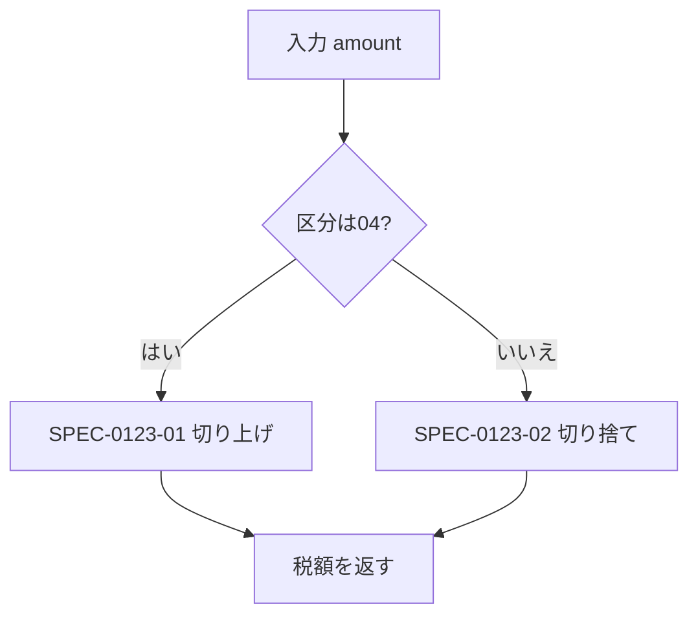

# 概要

<!-- この関数の目的を1〜3行で。①で充填 -->

# 処理フロー

<!--
分岐が3本以上ある場合のみ図にする（表や箇条書きで足りるものは書かない）。不要なら節ごと削除。
図は GitHub 流の ```mermaid で書く。```{mermaid} と書くとサイト全体の render が落ちる。
ラベルに丸括弧などの記号を含める場合は A["IARG(1)=0?"] のように必ず "…" で囲む
（囲まないと mermaid が Syntax error になり図が表示されない。機械レビューでNGになる）。
ノードには機能詳細の見出しID（SPEC-xxxx-01 等）を添えて本文と対応づけること。書き方:


-->

# インタフェース

## 入力

| # | 名前 | レガシー型 | 新型 | 説明 | Confidence |
|---|------|-----------|------|------|:---:|
| 1 | | | | | |

## 出力

| 名前 | レガシー型 | 新型 | 説明 | Confidence |
|------|-----------|------|------|:---:|
| | | | | |

## グローバル状態

<!-- 引数・戻り値以外の入出力。COMMON・グローバル変数・ワークエリア等。レガシー移植では最重要項目 -->

| 名前 | 読み/書き | 説明 | Confidence |
|------|:---:|------|:---:|
| | | | |

## 参照外部ファイル

| ファイル | 読み/書き | 用途 | Confidence |
|---------|:---:|------|:---:|
| | | | |

## 呼び出しサブルーチン

| 名前 | func-id | 用途 |
|------|---------|------|
| | | |

# 機能詳細

<!--
機能1つにつき見出し1つ。見出しIDは SPEC-<func-id連番部>-<2桁連番> で固定（②が参照する）。
記述は「条件 → 結果」の形。各項目に必ず Confidence と根拠（レガシーの file:lines）を付ける。
  🟢 VERIFIED: コードから確認済み / 🟡 INFERRED: 文脈からの推測 / 🔴 ASSUMED: 仮定
-->

## SPEC-{{func_num}}-01: {{機能名}} {#spec-{{func_num_lower}}-01}

<!-- 挙動の記述 -->

**Confidence: 🔴** — 根拠: `{{legacy_file}}:{{lines}}`

# 副作用・例外

<!-- 画面出力・ログ・DB・異常終了条件など。なければ「なし」と明記（空欄と区別する） -->

## 例外・数値特異点

<!--
data/functions.json の hazards（⓪の機械検知: 0割・SQRT/LOG の定義域・変数添字…）を
**1件も落とさず**この表に書く。行が足りない・hz_id が違うと機械レビューでNGになる。

- 「適用EP」は docs/exception-policy.md に実在する EP-ID だけを書く（捏造はNG）。
  まだ決まっていない hazard は書けない ——
  `python hazards.py match --root .` → docs/exception-queue.md を人に見せて決めてもらい、
  `hazards.py add-policy` で登録してから①を書く（未決定のまま仕様化するとNG）
- 「仕様記述」は決定を新実装の言葉にしたもの。guard_raise なら送出する例外と条件、
  guard_value なら代替値、caller_guarantees なら保証の根拠（SPEC-ID や上流の関数）
- ②はこの節から境界ケース（0・0近傍・負値・添字の下限上限）を導出する
- **hazards が1件も無い関数は、表を空にせず「該当なし」と1行書く**（検討の省略と区別するため）

| hazard | 種別 | 箇所 | 適用EP | 仕様記述 |
|--------|------|------|--------|----------|
| H-{{func_num}}-01 | div_by_var | `{{legacy_file}}:152` | EP-001 | 分母 RATE が 0 のとき ZeroDivisionError |
-->

| hazard | 種別 | 箇所 | 適用EP | 仕様記述 |
|--------|------|------|--------|----------|
| 該当なし | | | | |

# 未確定事項

| ISSUE | 内容 | 状態 |
|-------|------|------|
| | | |
