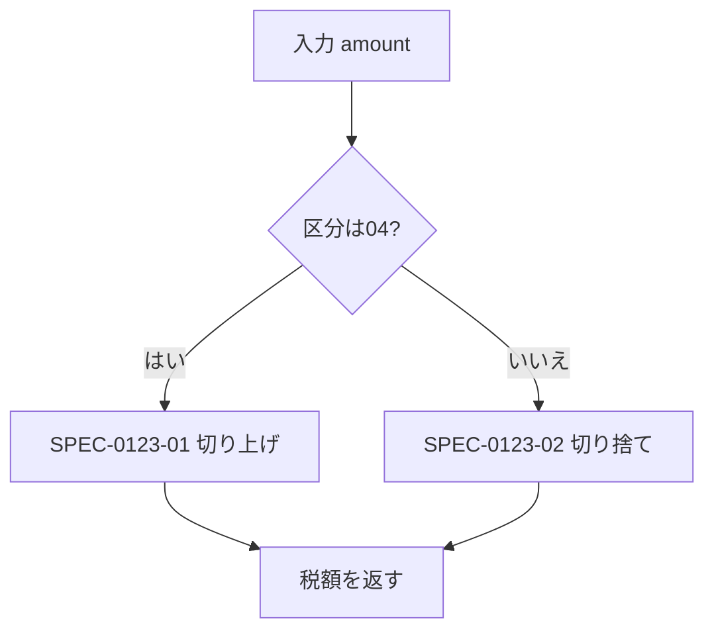

# 概要

<!-- この関数の目的を1〜3行で。①で充填 -->

# 処理フロー

<!--
分岐が3本以上ある場合のみ図にする（表や箇条書きで足りるものは書かない）。不要なら節ごと削除。
図は GitHub 流の ```mermaid で書く。```{mermaid} と書くとサイト全体の render が落ちる。
ノードには機能詳細の見出しID（SPEC-xxxx-01 等）を添えて本文と対応づけること。書き方:


-->

# インタフェース

## 入力

| # | 名前 | レガシー型 | 新型 | 説明 | Confidence |
|---|------|-----------|------|------|:---:|
| 1 | | | | | |

## 出力

| 名前 | レガシー型 | 新型 | 説明 | Confidence |
|------|-----------|------|------|:---:|
| | | | | |

## グローバル状態

<!-- 引数・戻り値以外の入出力。COMMON・グローバル変数・ワークエリア等。レガシー移植では最重要項目 -->

| 名前 | 読み/書き | 説明 | Confidence |
|------|:---:|------|:---:|
| | | | |

## 参照外部ファイル

| ファイル | 読み/書き | 用途 | Confidence |
|---------|:---:|------|:---:|
| | | | |

## 呼び出しサブルーチン

| 名前 | func-id | 用途 |
|------|---------|------|
| | | |

# 機能詳細

<!--
機能1つにつき見出し1つ。見出しIDは SPEC-<func-id連番部>-<2桁連番> で固定（②が参照する）。
記述は「条件 → 結果」の形。各項目に必ず Confidence と根拠（レガシーの file:lines）を付ける。
  🟢 VERIFIED: コードから確認済み / 🟡 INFERRED: 文脈からの推測 / 🔴 ASSUMED: 仮定
-->

## SPEC-{{func_num}}-01: {{機能名}} {#spec-{{func_num_lower}}-01}

<!-- 挙動の記述 -->

**Confidence: 🔴** — 根拠: `{{legacy_file}}:{{lines}}`

# 副作用・例外

<!-- 画面出力・ログ・DB・異常終了条件など。なければ「なし」と明記（空欄と区別する） -->

# 未確定事項

| ISSUE | 内容 | 状態 |
|-------|------|------|
| | | |
