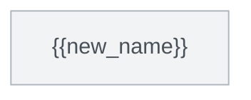

<!--
本書は data/functions.json ＋ 各成果物のフロントマターから自動生成する。手編集禁止。
✅の判定は「ファイルが存在し、かつ status が完了値」:
  ①spec: status == reviewed
  ②test: status == approved
  ③code: tests/ にファイルが存在し hash が台帳と一致
  ④impl: src/ にファイルが存在
  ⑤result: result == pass
-->

# 進捗サマリ

| フェーズ | ①spec | ②test-spec | ③test-code | ④impl | ⑤test |
|:---:|:---:|:---:|:---:|:---:|:---:|
| 完了/全体 | {{n1}}/{{N}} | {{n2}}/{{N}} | {{n3}}/{{N}} | {{n4}}/{{N}} | {{n5}}/{{N}} |

**⑥ 完了検証**: 未実施（全関数の①〜⑤完了後に [completion-check](completion-check.md) を実行）

# コールグラフ

<!--
functions.json の calls から自動生成。緑=⑤pass / 黄=着手中 / 灰=未着手 / 赤=⛔blocked。
図は GitHub 流の ```mermaid で書く（```{mermaid} と書くと .md の render が落ちる）。
-->

::: {.column-screen-inset}

:::

# Open ISSUES（要人間判断）

<!-- open のものだけをここに出す。人が見るべきものを常に最上部に -->

| ID | 種別 | 関数 | 質問 | 起票日 |
|----|------|------|------|--------|
| [ISSUE-001](issues/ISSUE-001.md) | | | | |

# 関数一覧（推奨着手順）

<!--
推奨順はコールグラフのトポロジカルソート（葉から）。循環がある場合は同一グループとして明示し、ISSUE起票。
⑤列は pass=✅ / fail=❌(試行回数) を表示。
-->

::: {.wbs-funcs .column-screen-inset}
| # | 関数 | 依存 | ①spec | ②test-spec | ③test-code | ④impl | ⑤test |
|:-:|------|------|:---:|:---:|:---:|:---:|:---:|
| 1 | [{{new_name}}](specs/{{func_id}}.md) | なし | [✅](specs/{{func_id}}.md) | [✅](test-specs/{{func_id}}.md) | ✅ | ✅ | [❌ 2回目](test-results/{{func_id}}.md) |
| 2 | | | ☐ | ☐ | ☐ | ☐ | ☐ |
:::
